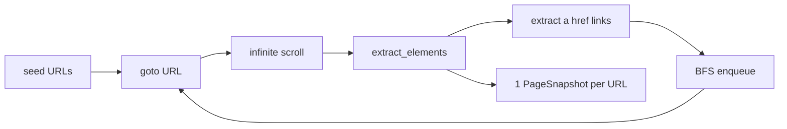
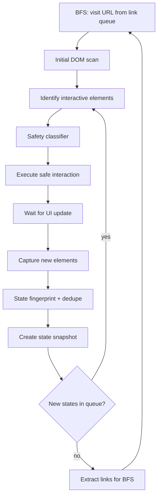

# Controlled Interaction Crawler (CIC) — Implementation Plan

> **Status:** Planning — not implemented  
> **Last updated:** 2026-06-18  
> **Scope:** Evolve the existing Playwright BFS discovery worker into a hybrid Controlled Interaction Crawler

---

## Executive Summary

The current discovery worker follows links and extracts visible interactive elements once per URL. A **Controlled Interaction Crawler (CIC)** adds safe UI interaction (tabs, menus, dialogs, dropdowns) to discover hidden states and produce richer metadata for test generation, Playwright automation, and workflow discovery.

**Recommended approach:** **Hybrid crawler** — keep BFS for cross-page URL discovery; run a CIC loop on each visited page before extracting links.

**Rollout:** Feature-flagged via `enable_cic` (default `false`) so existing behavior is preserved until you opt in.

**Coverage expectation:** CIC significantly improves discovery of hidden UI, but **does not guarantee 100% coverage** of every widget type on every app. See [UI Element Coverage Matrix](#ui-element-coverage-matrix) below.

---

## Current vs Target

### What exists today

The discovery worker in [`workers/discovery_worker/aqa_discovery/`](../workers/discovery_worker/aqa_discovery/) is a **link-BFS crawler**:



Key constraints in current code:

| Constraint | Location | Impact |
|------------|----------|--------|
| One snapshot per URL | `crawler.py` `_visit_page()` | Opens page, extracts once, closes — no UI interaction beyond scroll |
| No UI state model | `types.py` `PageSnapshot` | Keyed by URL only |
| One DB row per URL | `pages` table `UniqueConstraint(app_id, url)` | Cannot store multiple states on same route |
| Navigate-only flows | `flows.py` | Steps are `{ action: navigate }` grouped by URL path module |
| URL-level safety only | `safety.py` | Filters URLs and link text, not interactive elements |

### Target CIC workflow (hybrid)



**Hybrid model:** BFS still discovers cross-page URLs via `<a href>`. CIC runs **inside each BFS visit** before link extraction, exploring in-page states (tabs, menus, dialogs, dropdown panels) and optionally SPA route changes triggered by safe clicks.

---

## Impact Map — What Changes in Existing Code

| Area | File(s) | Change type | Summary |
|------|---------|-------------|---------|
| Crawl orchestration | `crawler.py` | **Major refactor** | `_visit_page()` becomes a CIC session; BFS loop stays but consumes multiple state snapshots per URL |
| New modules | `cic/session.py`, `planner.py`, `executor.py`, `fingerprint.py`, `recovery.py`, `interaction_safety.py` | **New** | Interaction planning, execution, state dedupe, recovery |
| Types | `types.py` | **Extend** | `UIStateSnapshot`, `InteractionAction`, `StateTransition`, extended `CrawlStats` |
| Settings | `crawl_settings.py`, `apps.py` schemas | **Extend** | CIC budgets, timeouts, feature flag, interaction policies |
| Safety | `safety.py` + `interaction_safety.py` | **Extend** | Element-level deny rules (destructive buttons, submit, file upload) |
| Extraction | `extractors.py` | **Extend** | DOM diff, dialog/overlay detection, visibility filter |
| Persistence | `persist.py` | **Major** | Persist states, transitions, state-scoped elements |
| DB schema | `models.py` + Alembic migration | **Migration required** | New `page_states`, `state_transitions`, `page_discoveries` tables; `elements.state_id` |
| Worker / SSE | `worker.py` | **Minor** | Progress: `states_discovered`, `interactions_executed` |
| Celery bridge | `agent_runner.py` | **Minor** | Pass through new stats/metrics |
| Flow builder | `flows.py` | **Major** | Build click/select paths from transition graph |
| AppMap | `appmap.py`, API schemas | **Extend** | Serialize states, transitions; schema v2 |
| Metrics | `metrics.py` | **Minor** | CIC counters |
| Tests / verify | `scripts/verify_*` | **New/extend** | CIC fixtures (tabs, modal, SPA) |
| Docs | `SPEC.md`, Week 3–4 guide | **Update** | CIC rules, limits, safety policy |

**Mostly unchanged:** `auth.py`, `robots.py`, URL utils, API discover endpoint shape, Celery queue wiring.

---

## Phase Naming — CIC vs Project

**The “Phase 1 / 2 / 3 / 4+” columns in the coverage matrix and phased rollout are CIC-specific implementation phases** defined only in this document. They are **not** the same as:

| Name in this doc | What it is NOT |
|------------------|----------------|
| **CIC Phase 1** | Not Week 1–2, not SPEC “Phase 1 MVP” |
| **CIC Phase 2** | Not Week 5–6, not `PHASE-2-SPEC.md` |
| **CIC Phase 3–5** | Not project roadmap phases |

### Project timeline (for reference)

| Project milestone | Status | What it covers |
|-------------------|--------|----------------|
| **Week 1–2** (Days 1–10) | Done | Scaffold, API, Celery, agent stubs |
| **Week 3–4** (Days 11–20) | Done | BFS discovery, AppMap v1, SSE — **current crawler** |
| **Week 5–6** (Days 21–30) | Planned | TestDesign + ScriptGeneration from AppMap |
| **SPEC Phase 1 MVP** | Weeks 1–12 | Full automation platform MVP |
| **PHASE-2-SPEC** | Post-MVP | API/a11y/security plugins, Docker full stack |

### Where CIC fits in the project

CIC is an **enhancement to Week 3–4 discovery** (DiscoveryWorker). It can be scheduled as a **post–Week 3–4 add-on** or **parallel track** before/during Week 5–6:

| CIC phase | Suggested project slot | Delivers |
|-----------|------------------------|----------|
| **CIC Phase 1** | After Week 3–4 (or Days 21–24) | Tabs, accordions, states, `page_discoveries`, `enable_cic` flag |
| **CIC Phase 2** | +1–2 weeks | SPA URL discovery, modal recovery, wizard nav |
| **CIC Phase 3** | +1–2 weeks | Dropdowns, dynamic forms, hover menus |
| **CIC Phase 4** | +1–2 weeks | Tables/grids, date pickers, AppMap v2 flows |
| **CIC Phase 5** | Future | Widget plugins (AG Grid, etc.) |

**Week 5–6 test generation does not need to wait for CIC** — it can start with the current AppMap. CIC makes generated tests richer when enabled.

---

## UI Element Coverage Matrix

**Can implementing this plan cover all of these?** Partially — by **CIC phase**. The plan targets **safe, broad discovery**, not exhaustive interaction with every widget library.

| UI pattern | Covered? | CIC Phase | How |
|------------|----------|-------|-----|
| **Tabs** | Yes | 1 | Click `[role=tab]`; capture new panel elements as new state |
| **Accordions** | Yes | 1 | Click `[aria-expanded=false]` / `summary`; rescan after expand |
| **Dialogs / Modals** | Mostly | 1–2 | Detect `[role=dialog]`, `[aria-modal=true]`; open via safe triggers; close via Escape/recovery |
| **Menus** | Partial | 1–3 | Click `[role=menuitem]`; **hover-open menus** need Phase 3 hover + nested handling |
| **Dropdowns (native `<select>`)** | Partial | 3 | `select_option()` on first safe option; not every option if list is huge |
| **Dropdowns (custom / combobox)** | Partial | 3 | Click combobox → wait → extract `[role=option]` / `[role=listbox]` items |
| **Dropdown options (hidden)** | Partial | 3 | Options appear only after open — captured in post-click state snapshot |
| **Tables** | Partial | 1–4 | Extract interactive cells (links, buttons, checkboxes) when visible; **no row/column iteration** in MVP |
| **Data grids (virtualized)** | Limited | 4+ | Needs scroll-into-view + pagination controls; not full virtual scroll |
| **File upload** | **No (by design)** | — | Blocked in `interaction_safety.py` — detect control only, no interaction |
| **Date pickers** | Limited | 4+ | Detect input; optional safe fill in Phase 3; **calendar popup** needs dedicated handler (future) |
| **Wizard steps** | Partial | 2–3 | Click Next/Continue if safe; **blocked** if step submits form or triggers destructive action |
| **Dynamic forms** | Partial | 3 | Fields revealed after click/select captured via DOM diff; conditional logic not fully simulated |
| **Lazy-loaded content** | Partial | 1–2 | Existing infinite scroll + `dom_stable` wait; interaction may trigger more lazy loads |
| **Hidden elements (general)** | Mostly | 1–3 | Anything that becomes visible after safe interaction is captured in new state |

### What “covered” means

| Level | Meaning |
|-------|---------|
| **Detect** | Element exists in AppMap with locator (may be hidden in baseline state) |
| **Reveal** | Interaction opens UI; elements stored in new `page_state` |
| **Traverse** | Systematically explores all options/rows/steps (not in MVP) |

### Explicitly out of scope (safety or complexity)

- **File upload** — detect only; never click or set files
- **Payment / checkout / delete** — hard safety block
- **Canvas / WebGL / shadow-DOM-heavy widgets** — limited without component-specific handlers
- **Cross-origin iframes** — same-origin only in Phase 3
- **Every dropdown option** — budget caps; sample first safe option unless configured otherwise
- **Infinite combobox lists** — scroll sampling, not exhaustive

### If full coverage is required later

Add **widget-specific handlers** (plugin pattern) on top of generic CIC:

| Widget | Extra handler |
|--------|----------------|
| AG Grid / MUI DataGrid | Scroll viewport, paginate, extract row actions |
| React DatePicker / flatpickr | Open calendar, select non-destructive date |
| Multi-step wizard | Step detector + safe Next/Back only |
| Custom dropdown | `[role=listbox]` option iteration with budget |

These are **not** in the initial plan scope but the CIC state model supports adding them without schema changes.

---

## Schema Design (decide before implementation)

Both options support **multiple UI states per URL**.

### Option A — `page_states` table (recommended)

```
pages (app_id, url)                    — URL shell, 1 row per URL
page_states (state_id, page_id, state_key, fingerprint, title, screenshot_path, depth)
elements (element_id, state_id, ...)   — elements belong to a state
state_transitions (from_state_id, to_state_id, action_json)
page_discoveries (app_id, url, discovered_via, source_page_id, source_state_id, trigger_action)
```

`page_discoveries` records URLs first seen via **interaction** (or link, for audit). When BFS visits the URL, a `pages` row is created/updated as today.

**Pros:** Clean separation; BFS `pages` count stays intuitive; easy transition graph.  
**Cons:** More joins; migration adds `elements.state_id`.

### Option B — `state_key` on `pages`

```
pages (app_id, url, state_key)  — composite unique (app_id, url, state_key)
elements stay on page_id
transitions in JSONB or separate table
```

**Pros:** Smaller diff to current persist path.  
**Cons:** Ambiguous `max_pages` semantics; AppMap/API naming confusion.

**Recommendation:** Option A; expose `page_count` (URLs) and `state_count` separately in stats/SSE.

---

## Proposed Module Architecture

```
aqa_discovery/
├── crawler.py              # BFS + delegates to CICSession per URL
├── cic/
│   ├── session.py          # CIC loop: scan → interact → wait → snapshot
│   ├── planner.py          # Priority queue of candidate interactions
│   ├── executor.py         # Playwright click/hover/select with recovery
│   ├── fingerprint.py      # State hash for deduplication
│   └── recovery.py         # Escape, close dialog, reload baseline
├── interaction_safety.py   # Element-level safety (extends safety.py)
├── extractors.py           # + diff_elements(), detect_overlays()
├── types.py                # + UIStateSnapshot, StateTransition
├── crawl_settings.py       # + CIC budgets
└── persist.py              # + states/transitions
```

---

## CIC Step-by-Step Design

### 1. Visit Page

**Current:** `page.goto()` in `_visit_page()`, new page per URL.  
**Change:** Keep single Playwright page open for the full CIC loop; close only after all states explored (or budget exhausted). Reuse SPA waits (`wait_until`, `wait_for_selector`, scroll).

### 2. Initial DOM Scan

Reuse `extract_elements()`. Add:

- Overlay/dialog detection (`[role=dialog]`, `[aria-modal=true]`)
- Visibility filter (`is_visible()` only)
- Baseline element set as `state_0`

### 3. Identify Interactive Elements (planner)

| Priority | Element types | Action |
|----------|---------------|--------|
| 1 | `[role=tab]`, `[role=menuitem]` | click |
| 2 | `[aria-expanded=false]` (dropdowns, accordions) | click |
| 3 | `[role=combobox]`, `select` | open / select first safe option |
| 4 | `[role=button]`, `button`, non-navigating links | click |
| 5 | `a[href]` | defer to BFS unless hash-route SPA |

Skip: hidden, disabled, off-screen, already-interacted (by stable locator key).

### 4. Execute Safe Interactions

**Always block:** logout/delete/deactivate text, `type=submit` on non-login forms, file inputs, `target=_blank`, download links, payment/checkout patterns.

**Safe defaults:**

- Canned test values only (`test@example.com`) when `safe_form_fill=true`
- No form submits to destructive endpoints in Phase 1
- Cap: ~5 interactions per state, ~30 per URL

**Execution pattern:**

1. Snapshot pre-interaction URL + element count
2. `locator.click()` / `select_option()` / `hover()`
3. Wait (networkidle / dom_stable / fixed_ms)
4. Run CAPTCHA/MFA check (existing logic)

### 5. Wait for UI Updates

| Setting | Default (fast) | Options |
|---------|----------------|---------|
| `cic_mode` | `fast` | `fast`, `full` |
| `interaction_wait_strategy` | `fixed_ms` | `network_idle`, `dom_stable`, `fixed_ms` |
| `interaction_wait_ms` | `350` | 50–5000 |
| `cic_dom_stable_rounds` | `4` | 2–10 (when using `dom_stable`) |

DOM stability: poll element count until stable for 2 consecutive rounds (capped rounds in fast mode).

### 5b. Performance (application-agnostic)

CIC defaults to **`cic_mode: fast`** when `enable_cic=true`. BFS still handles cross-page navigation; CIC focuses on in-page widgets.

| Optimization | Behavior |
|--------------|----------|
| **In-page only planner** | `cic_in_page_only=true` — tabs, accordions, `aria-expanded`, `<summary>` only; skips nav links (BFS) |
| **Smart recovery** | `page.goto()` only when URL left baseline; same-URL reset uses Escape/close |
| **No-op skip** | Same fingerprint after click → skip reload, continue queue |
| **Tighter budgets** | fast: 12 interactions/URL, 10 states/URL, 4/state |
| **Lightweight snapshots** | No `page.content()` per state; screenshots baseline only unless `cic_screenshot_all_states` |
| **Faster waits** | `fixed_ms` @ 350ms default vs 800ms `dom_stable` |

Use `cic_mode: full` (or override individual settings) for deeper exploration on complex SPAs.

### 6. Capture New Elements

`diff_elements(before, after)` → newly visible elements feed next interaction queue.

### 6b. Interaction-Discovered URLs and Pages (new)

**Yes — when an interaction reveals a new URL, we store it.** This is a core benefit of CIC over link-only BFS (e.g. SPA routes opened by button click with no `<a href>`).

After every safe interaction, compare `page.url` to the pre-interaction URL:

| Outcome | Same URL | New URL (in scope) | New URL (out of scope / safety block) |
|---------|--------|--------------------|---------------------------------------|
| UI state | New `page_state` row + snapshot | New `page_state` on current page **and** enqueue URL for full crawl | Skip enqueue; log in stats |
| Page / route | — | Enqueue BFS + record discovery metadata | Skip; increment `skipped_off_domain` or `skipped_safety` |
| Persist timing | Immediate (same visit) | **Discovery record** immediately; **full `pages` row** when BFS visits that URL | Not stored |

**Discovery metadata** (stored on first detection, before BFS visit):

```python
DiscoveredUrl:
  url: str
  discovered_via: Literal["link", "interaction"]
  source_page_url: str              # page where interaction happened
  source_state_key: str | None
  trigger_interaction: InteractionAction
  discovered_at: datetime
```

**Where it is stored:**

1. **In-memory during crawl** — `PageSnapshot.discovered_urls: list[DiscoveredUrl]` on the visit that found it; merged into BFS queue.
2. **Database** — new optional table `page_discoveries` (recommended) or JSONB on `pages` when the URL is first visited:

```
page_discoveries (app_id, url, discovered_via, source_page_id, source_state_id, trigger_action, discovered_at)
```

When BFS later visits that URL, upsert the normal `pages` row and run CIC on it. The discovery row links **how** the page was found (click path), which feeds interaction-aware flows:

```python
{"action": "navigate", "url": "https://app/settings"}
{"action": "click", "semantic_selector": "getByRole('button', { name: 'Users' })"}
{"action": "navigate", "url": "https://app/settings/users"}  # discovered_via: interaction
```

**Link extraction union:** Collect `<a href>` links from **all states** on a URL (not only the final post-interaction state), so tab-only links are not missed.

**Recovery before next BFS step:** After interaction branches, recover to baseline URL on the same page so BFS link extraction and the next queued URL start from a known state — but **retain** all `discovered_urls` collected during the CIC loop.

### 7. Create State Snapshot

```python
UIStateSnapshot:
  state_key: str
  parent_state_key: str | None
  trigger_interaction: InteractionAction | None
  url: str
  title: str
  elements: list[ElementSnapshot]
  screenshot_path: str | None
  interaction_depth: int
```

Record `StateTransition(from_state, to_state, action)` for flow building.

### 8. Repeat Until No New States

**Fingerprint inputs:** normalized URL, active dialog title, visible tab labels, `aria-expanded` states, sorted interactive element signatures (role + name + tag).

**Stop conditions:**

- Queue empty
- `max_states_per_url` reached
- `max_interactions_per_url` reached
- Global `max_pages` (URL count) hit
- Safety halt / CAPTCHA

**Recovery after each branch:** `Escape` → close dialog button → navigate back to baseline URL if SPA drifted.

---

## Downstream Changes

### Flow builder (`flows.py`)

**Today:**

```python
{"action": "navigate", "url": "...", "page_id": "..."}
```

**After CIC:**

```python
{"action": "navigate", "url": "..."}
{"action": "click", "element_id": "...", "semantic_selector": "..."}
{"action": "select", "element_id": "...", "value": "..."}
```

Group flows by URL module + longest common interaction prefix.

### AppMap JSON (`appmap.py`)

Add:

- `schema_version: 2`
- `states[]` with `state_key`, `page_id`, `parent_state_key`, `trigger`
- `transitions[]`
- `stats.state_count`, `stats.interaction_count`

Backward compatibility: flatten to unique URLs for legacy consumers.

### Week 5–6 test generation

CIC improves:

- **form-interaction** templates (elements behind tabs/dialogs)
- **navigation** for SPA routes without `<a href>`
- ScriptGenerationAgent gets real click sequences from flows

---

## New Crawl Settings

| Setting | Default | Purpose |
|---------|---------|---------|
| `enable_cic` | `false` | Toggle CIC; `false` = current BFS-only |
| `cic_mode` | `fast` | `fast` = speed-optimized; `full` = deeper exploration |
| `max_states_per_url` | `10` (fast) / `20` | Cap in-page state exploration |
| `max_interactions_per_url` | `12` (fast) / `50` | Total clicks/opens per URL |
| `max_interaction_depth` | `4` (fast) / `5` | Nesting (tab → menu → dialog) |
| `cic_in_page_only` | `true` | Tabs/accordions only; nav links defer to BFS |
| `interaction_wait_strategy` | `fixed_ms` | Post-click wait |
| `interaction_wait_ms` | `350` | Fallback wait |
| `cic_dom_stable_rounds` | `4` | DOM stability poll cap |
| `cic_screenshot_all_states` | `false` | Baseline screenshot only in fast mode |
| `safe_form_fill` | `false` | Enable dummy textbox fill (Phase 3) |
| `blocked_interaction_patterns` | `[]` | User-defined text/selector globs |

---

## Phased Rollout (CIC implementation phases)

> These are **CIC phases**, not Week or SPEC phases. See [Phase Naming — CIC vs Project](#phase-naming--cic-vs-project).

### CIC Phase 1 — Foundation (MVP CIC)

- Schema migration (Option A recommended) including `page_discoveries`
- `cic/session.py` — click-only on tabs, accordions, `[aria-expanded]`
- State fingerprint + dedupe
- Persist states + transitions
- **URL-change detection after interaction** → enqueue BFS + persist `page_discoveries`
- Link union from all states on a URL
- `enable_cic` default `false`

### CIC Phase 2 — SPA + link hybrid ✅

- Hash-route SPA support (`#/`, `#!/`) in planner + normalized discovery URLs
- Modal-aware recovery stack (Escape, close, wait for dialog hidden)
- Wizard navigation (safe Next / Continue / Back buttons)
- Interaction-aware flow steps: `navigate → click → navigate(discovered URL)`
- Fixtures: `modal.html`, `hash_spa.html`, `wizard.html`
- Verify: `pnpm verify:cic-phase2`

### CIC Phase 3 — Rich interactions ✅

- Native `<select>` via `select_option()` (first safe option per budget)
- Custom combobox — click to open → capture `[role=option]` in state snapshot
- `safe_form_fill` — canned values for textboxes (password blocked)
- Hover-open menus (`hover` + `menuitem` discovery)
- Same-origin iframe-scoped CIC (`cic_enable_iframes`)
- Fixtures: `dropdown.html`, `hover_menu.html`, `dynamic_form.html`, `iframe_form.html`
- Verify: `pnpm verify:cic-phase3`

### CIC Phase 4 — Flow + test quality ✅

- Transition-graph flow builder (BFS paths with correct `action_type`)
- AppMap v2 API — `schema_version`, `states`, `transitions` on `GET /appmap`
- Table/grid — pagination + row action discovery
- Date pickers — open calendar, detect `gridcell` day cells
- Fixtures: `table.html`, `date_picker.html`
- Verify: `pnpm verify:cic-phase4`

### CIC Phase 5 — Optional widget plugins (future, not in initial scope)

- Virtualized grid handlers (AG Grid, MUI DataGrid)
- Full wizard traversal with step fingerprinting
- Exhaustive dropdown option sampling (configurable budget)

---

## Recommendations

1. **State fingerprint over raw HTML** — hash visible interactive signatures, not full DOM
2. **Separate budgets** — `max_pages` (URLs) vs `max_states` (total states)
3. **Baseline-first exploration** — capture root state before any click; recover to baseline after branches
4. **Locator-stable interaction keys** — dedupe by `semantic_selector` + role + name
5. **Two-tier safety** — hard blocklist + soft scoring; log skips in `CrawlStats.skipped_interaction_safety`
6. **DOM diff-driven queue** — only enqueue newly visible elements
7. **Optional trace artifacts** — Playwright trace zip per URL when debugging
8. **Idempotent persistence** — replace states/transitions per `(app_id, url)` on re-crawl
9. **Keep auth isolated** — login stays pre-crawl in `auth.py`; CIC never re-submits login
10. **Metrics for tuning** — `aqa_cic_states_total`, `aqa_cic_interactions_total`, `aqa_cic_safety_skips_total`

---

## Risks and Mitigations

| Risk | Mitigation |
|------|------------|
| State explosion on complex SPAs | Strict budgets; fingerprint dedupe; BFS within page |
| Destructive clicks | URL + element + dialog text safety; no form submit in Phase 1 |
| `(app_id, url)` unique constraint | Migration before CIC persist |
| Crawl time 3–10x longer | `enable_cic` flag; conservative defaults |
| Flaky state detection | DOM stability polling; retry once; mark `partial` |
| AppMap consumers break | `schema_version: 2`; flatten compat layer |

---

## Testing Strategy

- **Unit:** fingerprint stability, safety classifier, element diff, planner priority
- **Integration:** Playwright against static HTML fixtures (tabs, modal, dropdown)
- **Regression:** `verify_smoke_discovery.py` passes with `enable_cic=false`
- **New:** `verify_cic_discovery.py` — proves `state_count > page_count` on tabbed fixture
- **E2E:** OrangeHRM or similar — compare element counts before/after CIC

---

## Database persistence (production path)

Report-only scripts (`orangehrm_cic_full_run.py`, `orangehrm_cic_report.py`) run crawls **in memory** and write JSON artifacts — they do **not** persist to Postgres.

**Production path** (same as `POST /apps/{id}/discover`):

1. Create `pipeline_run`
2. `crawl_application(..., pipeline_run_id=..., persist=True)` → `pages`, `page_states`, `state_transitions`, `elements`, `page_discoveries`, screenshot `artifacts`
3. `build_and_persist_appmap()` → `flows` + AppMap v2 JSON (`schema_version: 2`)

**Local CLI:**

```bash
pnpm cic:persist:smoke          # quick verify (3 pages)
pnpm cic:persist:orangehrm      # full CIC persist for OrangeHRM demo app
pnpm verify:cic-persist         # check DB counts + AppMap v2
```

Script: [`scripts/cic_persist_discovery.py`](../scripts/cic_persist_discovery.py)

---

## Success Criteria

- [ ] With `enable_cic=true`, crawl discovers elements not visible in initial DOM
- [ ] Same URL persists multiple states with distinct element sets
- [ ] **Interaction-discovered URLs** are stored in `page_discoveries` and crawled via BFS
- [ ] AppMap flows include click/select steps, not only navigate
- [ ] Zero interactions with logout/delete/submit-destructive in automated tests
- [ ] `enable_cic=false` preserves current BFS-only behavior
- [ ] **Phase 1:** tabs, accordions, basic modals discover hidden elements vs BFS-only baseline
- [ ] **Phase 3:** custom dropdown options visible after combobox open are stored in state snapshots
- [ ] File upload controls are **detected but never interacted** with

---

## Implementation Checklist (when approved)

| # | Task | Depends on |
|---|------|------------|
| 1 | Choose schema (A vs B); Alembic migration + SQLAlchemy models (incl. `page_discoveries`) | — |
| 2 | Extend `types.py`, `crawl_settings.py`, API `CrawlConfigInput` | 1 |
| 3 | Add `cic/` package (session, planner, executor, fingerprint, recovery) | 2 |
| 4 | Add `interaction_safety.py` | 2 |
| 5 | Extend `extractors.py` (diff, overlays, visibility) | 2 |
| 6 | Refactor `crawler.py` hybrid BFS + CIC | 3, 4, 5 |
| 7 | Update `persist.py` for states/transitions | 1, 6 |
| 8 | Rebuild `flows.py` from transition graph; AppMap v2 | 7 |
| 9 | SSE progress + metrics | 6 |
| 10 | Tests + `verify_cic_discovery.py` | 6–8 |
| 11 | Update `SPEC.md` and Week 3–4 guide | 10 |

---

## Open Questions for Review

1. **Schema:** Confirm Option A (`page_states` table) vs Option B (`state_key` on `pages`).
2. **Default:** Keep `enable_cic=false` until validated, or enable by default after Phase 1?
3. **Budgets:** Are defaults (`max_states_per_url=20`, `max_interactions_per_url=50`) acceptable for your target apps?
4. **Phase 1 scope:** Click-only (tabs/accordions) sufficient for first release, or include combobox/select?
5. **AppMap API:** Add optional `states`/`transitions` fields to `GET /appmap`, or new endpoint?

---

*Review this document and confirm scope before implementation begins.*
