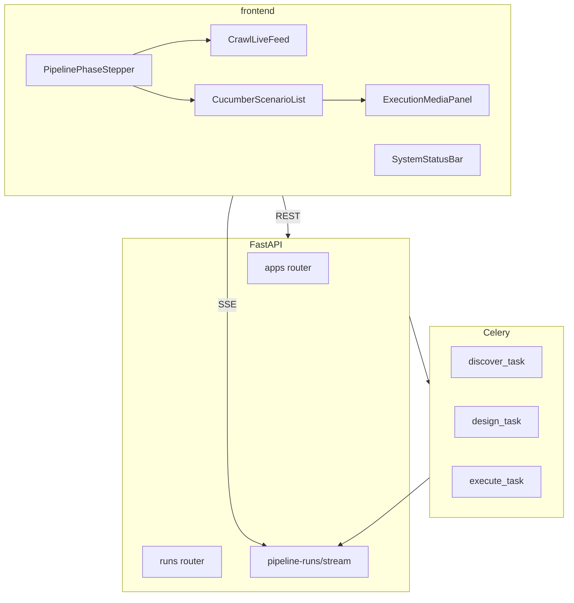

# QA Dashboard — Product & Technical Specification

| Field | Value |
|-------|-------|
| **Version** | 1.0.0 |
| **Status** | Implementation Blueprint |
| **Last updated** | 2026-06-19 |
| **Parent spec** | [SPEC.md](./SPEC.md) §24 (Frontend MVP) |
| **Application** | `frontend/` — Next.js 14+ dashboard on port **3000** |
| **API base** | `http://localhost:3001/api/v1` (dev proxy from Next.js) |

---

## 1. Executive Summary

This specification defines the **QA Dashboard**: a web UI where a user registers any web application (URL + credentials), watches live crawl progress, views generated tests as **Cucumber scenarios**, selects scenarios to run, and watches execution with **live step highlighting**, **recorded video**, and **artifact management**.

The dashboard completes the Phase 1 MVP loop described in [SPEC.md](./SPEC.md):

```
Register → Crawl → Generate Tests (Cucumber) → Execute → Video / Results
```

**Design principles:**

- **Domain-agnostic** — works for any registered app with AppMap v2; no hardcoded tenant URLs or demo app IDs in core UI or verify gates.
- **Cucumber-first presentation** — every generated test case is auto-converted to Gherkin; the dashboard never shows raw JSON steps in the main UI.
- **Playwright-native execution** — Gherkin is a human-readable view; the executor runs linked machine steps (`navigate`, `click`, `fill`, `assertVisible`).
- **Phase-gated workflow** — a three-step stepper (Crawl → Generate → Execute) uses gray / yellow / green / red states; each phase unlocks the next on success.

---

## 2. Goals

| # | Goal | Success criteria |
|---|------|------------------|
| G1 | Register an app from the browser | User submits URL, username, password; app appears in list |
| G2 | Visual pipeline progress | Phase stepper turns yellow while running, green when complete |
| G3 | Live crawl visibility | SSE feed shows `current_url` and page count as discovery runs |
| G4 | Cucumber test presentation | All generated tests shown as Feature / Scenario / Given-When-Then |
| G5 | Selective execution | User checks scenarios and runs only those |
| G6 | Live execution feedback | Active scenario and step highlighted; completed steps green/red |
| G7 | Execution video | One `.webm` per scenario; in-app playback; user can delete |
| G8 | Operational reliability | Cancel long jobs; clear error messages; system health indicator |

---

## 3. User Stories

| ID | Story | Acceptance |
|----|-------|------------|
| US-D01 | As a QA engineer, I register an app with URL and login credentials | Form submits; redirect to app detail; credentials encrypted at rest |
| US-D02 | As a QA engineer, I see which pipeline phase is active | Stepper shows yellow for running phase, green when done |
| US-D03 | As a QA engineer, I watch pages being discovered in real time | Live feed updates via SSE during crawl |
| US-D04 | As a QA engineer, I view generated tests as Cucumber scenarios | Scenarios list with Feature, tags, Given/When/Then steps |
| US-D05 | As a QA engineer, I filter scenarios by priority or tag | Filters narrow list; Run selected respects filter |
| US-D06 | As a QA engineer, I run selected scenarios and see live progress | Active scenario/step highlighted during execution |
| US-D07 | As a QA engineer, I watch a recording of a scenario run | Video player loads artifact; trace timeline jumps to steps |
| US-D08 | As a QA engineer, I delete execution videos I no longer need | Delete removes file and DB row |
| US-D09 | As a QA engineer, I stop a long crawl or run | Stop cancels job; partial results remain visible |
| US-D10 | As a QA engineer, I re-run only failed scenarios | Re-run failed from run detail page |
| US-D11 | As a QA engineer, I know when workers are offline | Health bar shows API/DB/Redis status before I start |

---

## 4. Architecture

### 4.1 Stack

| Layer | Technology | Location |
|-------|------------|----------|
| Frontend | Next.js 14+, TypeScript, React, Tailwind, shadcn/ui | `frontend/` |
| Data fetching | TanStack Query | `frontend/lib/` |
| Live updates | SSE (`EventSource`) | `frontend/lib/sse.ts` |
| API | FastAPI (existing) | `apps/api/` |
| Workers | Celery + Playwright | `workers/celery_app/`, `workers/playwright-executor/` |
| Real-time broker | Redis pub/sub + replay | `packages/aqa_shared/aqa_shared/sse/` |

### 4.2 Dev topology

```
Browser :3000  →  Next.js (frontend)
                    └─ rewrite /api/* → :3001
FastAPI :3001  →  PostgreSQL, Redis
Celery worker  →  discover, design, execute queues
```

**Scripts (root `package.json`):**

```bash
pnpm dev:api              # API on 3001
pnpm dev:web              # Dashboard on 3000 (to be added)
pnpm dev:worker:celery    # Celery consumer
```

### 4.3 Component diagram



---

## 5. Pipeline Phase Stepper

### 5.1 Phases

| Order | Phase | API trigger | Complete when |
|-------|-------|-------------|---------------|
| 1 | **Crawl** | `POST /apps/{id}/discover` | SSE `stage_completed` stage=`discover` |
| 2 | **Generate Tests** | `POST /apps/{id}/generate-tests` | SSE `stage_completed` for `generate_tests` and `generate_scripts` |
| 3 | **Execute** | `POST /apps/{id}/execute` | SSE `stage_completed` stage=`execute` |

### 5.2 Visual states

| State | Color (Tailwind) | Meaning |
|-------|------------------|---------|
| Pending | `bg-muted`, gray border | Not started; prior phase not green |
| Running | `bg-yellow-400/20`, `border-yellow-500` | Job in progress |
| Done | `bg-green-500/20`, `border-green-600` | Phase succeeded |
| Failed | `bg-red-500/20`, `border-red-600` | `stage_failed` or terminal error |
| Cancelled | `bg-orange-500/20`, `border-orange-600` | User cancelled |

### 5.3 Gating rules

- **Generate Tests** disabled until Crawl is green (`last_crawl_at` set and last discover run succeeded).
- **Run scenarios** disabled until Generate is green (≥1 persisted test case).
- **Stop** visible only while any phase is Running (yellow).

### 5.4 Component

**File:** `frontend/components/PipelinePhaseStepper.tsx`

**Inputs:** `appId`, optional `activePipelineRunId`, SSE stream hook `usePhaseStatus`.

---

## 6. Cucumber Scenario Model

### 6.1 Conversion rule (mandatory)

Every test case produced by `TestDesignAgent` / `generate_test_cases()` is **automatically converted** to Cucumber format at persist time. One DB row (`test_cases`) = one Cucumber Scenario.

| Layer | Format |
|-------|--------|
| UI display | Gherkin only (Feature, Scenario, tags, Given/When/Then) |
| Execution | Machine steps (`action`, `target`) linked 1:1 to Gherkin steps |
| Export | Optional `.feature` file download |

**Not in scope:** Cucumber-JS/Java runner inside the platform; Gherkin hand-editing in UI (future).

### 6.2 Gherkin mapping

| Machine action | Gherkin keyword | Example text |
|----------------|-----------------|--------------|
| First `navigate` | Given | "I am on the login page" |
| `click`, `fill`, `select`, `hover` | When | "I click the Settings menu" |
| `assertVisible` | Then | "I should see the Settings page" |

**Tags (auto-generated):**

- `@critical`, `@high`, etc. from `priority`
- `@flow-replay` for flow-derived scenarios
- `@destructive` for logout/delete/submit scenarios (`execution_order: last`)

### 6.3 Persisted JSON shape (`test_cases.steps`)

```json
{
  "gherkin": {
    "feature": "User navigates application flows",
    "scenario": "Replay flow: Dashboard to Settings",
    "tags": ["@critical", "@flow-replay"],
    "steps": [
      {
        "keyword": "Given",
        "text": "I am on the login page",
        "action": "navigate",
        "target": "https://example.com/app/login"
      },
      {
        "keyword": "When",
        "text": "I click the Settings menu",
        "action": "click",
        "target": "getByRole('link', { name: 'Settings' })"
      },
      {
        "keyword": "Then",
        "text": "I should see the Settings page",
        "action": "assertVisible",
        "target": "getByRole('heading', { name: 'Settings' })"
      }
    ]
  },
  "steps": [
    { "action": "navigate", "target": "https://example.com/app/login" },
    { "action": "click", "target": "getByRole('link', { name: 'Settings' })" },
    { "action": "assertVisible", "target": "getByRole('heading', { name: 'Settings' })" }
  ]
}
```

**Implementation:** extend `packages/agents/aqa_agents/test_design/templates.py` with `to_gherkin(test_case)`.

### 6.4 UI component

**File:** `frontend/components/CucumberScenarioList.tsx`

- Renders grouped by Feature
- Checkbox per Scenario for selection
- Expand/collapse steps
- During execution: yellow highlight on active scenario/step; green ✓ / red ✗ on completed steps
- Orange **Destructive** badge when `@destructive` tag present
- Confirm dialog if user runs destructive scenario alone

### 6.5 Filters

**File:** `frontend/components/ScenarioFilters.tsx`

| Control | Filters by |
|---------|------------|
| Search input | Scenario name, step text |
| Priority chips | `critical`, `high`, `medium`, `low` |
| Tag chips | `@critical`, `@destructive`, etc. |
| Feature dropdown | `gherkin.feature` |

---

## 7. Live Execution UI

### 7.1 Layout (`ExecutionMediaPanel`)

```
┌──────────────────────────────────────────────────────────────┐
│  PipelinePhaseStepper  [ Crawl ✓ ] [ Generate ✓ ] [ Exec ● ] │
├─────────────────┬──────────────────┬───────────────────────┤
│ Cucumber        │ Live screenshot  │ Video player          │
│ scenarios       │ (step_screenshot)│ + trace timeline      │
│ (highlighted)   │                  │ + Delete video        │
└─────────────────┴──────────────────┴───────────────────────┘
```

### 7.2 Highlight behavior

| Event | UI |
|-------|-----|
| `scenario_started` | Scenario row: yellow border + pulse; auto-scroll into view |
| `step_started` | Step row: yellow background |
| `step_completed` outcome=passed | Step row: green, show duration |
| `step_completed` outcome=failed | Step row: red, show error |
| `scenario_completed` | Scenario border green or red; enable video link |

**Hook:** `useExecutionHighlight(pipelineRunId)` in `frontend/lib/sse.ts`.

### 7.3 Video and trace

| Artifact | Format | Path pattern |
|----------|--------|--------------|
| Video | `.webm` | `artifacts/videos/{app_id}/{run_id}/{testcase_id}.webm` |
| Trace | `.zip` | `artifacts/traces/{app_id}/{run_id}/{testcase_id}.zip` |
| Step screenshot | `.png` | `artifacts/screenshots/{app_id}/{run_id}/{testcase_id}_step_{n}.png` |

**Trace timeline:** `Result.summary.step_timestamps_ms[]` maps step index → offset in video; scrubber markers are clickable.

**Default:** `capture_video: true` in execute request.

---

## 8. Pages & Routes

| Route | Purpose | Key components |
|-------|---------|----------------|
| `/` | Global dashboard: app count, recent runs | `MetricsPanel`, `SystemStatusBar` |
| `/apps` | List registered applications | App table, health badges |
| `/apps/new` | Register app | `AppRegistrationForm` |
| `/apps/[id]` | App hub | `PipelinePhaseStepper`, tabs below |
| `/apps/[id]` tab Overview | Actions, timestamps | Discover / Generate / Run buttons |
| `/apps/[id]` tab Pages | Crawled pages | `PageGrid`, screenshot proxy |
| `/apps/[id]` tab Scenarios | Cucumber list | `ScenarioFilters`, `CucumberScenarioList`, `RunLauncher` |
| `/apps/[id]` tab Runs | Run history | `RunResultsTable`, storage used |
| `/runs/[id]` | Run detail | Results, video gallery, Re-run failed |
| `/settings` | Preferences | Notifications, video retention days |

---

## 9. Registration Form

**File:** `frontend/components/AppRegistrationForm.tsx`

### 9.1 Fields

| Field | Maps to API | Required |
|-------|-------------|----------|
| App name | `name` | Yes |
| Base URL | `base_url` | Yes |
| Username | `auth_config.credentials.email` | If form auth |
| Password | `auth_config.credentials.password` | If form auth |
| Login URL | `auth_config.login_url` | No (default: base URL) |
| Email selector | `auth_config.email_selector` | No |
| Password selector | `auth_config.password_selector` | No |
| Submit selector | `auth_config.submit_selector` | No |

### 9.2 Defaults

```json
{
  "auth_config": { "type": "form" },
  "crawl_config": {
    "enable_cic": true,
    "max_pages": 50
  }
}
```

`enable_cic: true` satisfies `requireAppmapV2` for generate-tests.

### 9.3 Submit flow

1. `POST /api/v1/apps` → receive `app_id`
2. Redirect to `/apps/{app_id}`
3. Optional: auto-start discover (product decision — default **manual** with prominent "Start crawl" CTA)

---

## 10. API Specification (new & extended)

Extends [SPEC.md §16](./SPEC.md). All paths prefixed with `/api/v1`.

### 10.1 Existing endpoints (used by dashboard)

| Method | Endpoint | Purpose |
|--------|----------|---------|
| POST | `/apps` | Register app |
| GET | `/apps` | List apps |
| GET | `/apps/{id}` | App detail |
| POST | `/apps/{id}/discover` | Start crawl |
| GET | `/apps/{id}/appmap` | AppMap JSON |
| POST | `/apps/{id}/generate-tests` | Generate + convert to Cucumber |
| GET | `/pipeline-runs/{id}` | Poll status |
| GET | `/pipeline-runs/{id}/stream` | SSE |
| GET | `/health` | System health |

### 10.2 New endpoints

#### `GET /apps/{appId}/test-cases`

List scenarios with Gherkin summary.

**Response 200:**

```json
{
  "items": [
    {
      "testcase_id": "uuid",
      "name": "Replay flow: Dashboard to Settings",
      "priority": "critical",
      "status": "draft",
      "flow_id": "uuid-or-null",
      "feature": "User navigates application flows",
      "tags": ["@critical", "@flow-replay"],
      "step_count": 5,
      "created_at": "2026-06-19T10:00:00Z"
    }
  ],
  "total": 12
}
```

#### `GET /test-cases/{testcaseId}`

Full scenario including `steps.gherkin` and machine `steps`.

#### `GET /apps/{appId}/test-cases/export.feature`

**Response 200:** `Content-Type: text/plain` — valid Gherkin for all scenarios.

#### `POST /apps/{appId}/execute`

**Request:**

```json
{
  "testcase_ids": ["uuid", "uuid"],
  "capture_video": true,
  "capture_trace": true,
  "retry_from_run_id": null,
  "retry_mode": "failed_only"
}
```

**Response 202:**

```json
{
  "pipeline_run_id": "uuid",
  "application_id": "uuid",
  "test_run_id": "uuid",
  "status": "pending",
  "current_stage": "execute",
  "started_at": "2026-06-19T10:30:00Z"
}
```

#### `GET /apps/{appId}/runs`

Paginated test run history.

#### `GET /runs/{runId}`

Run detail with per-scenario results and artifact IDs.

**Response 200 (excerpt):**

```json
{
  "run_id": "uuid",
  "app_id": "uuid",
  "status": "completed",
  "summary": { "total": 5, "passed": 4, "failed": 1 },
  "results": [
    {
      "testcase_id": "uuid",
      "name": "Replay flow: Dashboard to Settings",
      "outcome": "passed",
      "duration_ms": 4200,
      "artifact_ids": ["video-uuid", "trace-uuid"],
      "step_results": [
        { "index": 0, "keyword": "Given", "outcome": "passed", "duration_ms": 800 }
      ]
    }
  ]
}
```

#### `GET /artifacts/{artifactId}`

Stream artifact (supports `Range` for video seek). Authenticated proxy — never expose raw filesystem paths.

#### `GET /artifacts/{artifactId}/meta`

```json
{
  "id": "uuid",
  "type": "video",
  "size_bytes": 1048576,
  "testcase_id": "uuid",
  "run_id": "uuid",
  "created_at": "2026-06-19T10:35:00Z"
}
```

#### `DELETE /artifacts/{artifactId}`

Delete file on disk and DB row. **Response 204.**

#### `GET /apps/{appId}/pages/{pageId}/screenshot`

Proxy crawl screenshot for UI thumbnails.

#### `POST /pipeline-runs/{pipelineRunId}/cancel`

Cancel active discover or execute job. **Response 202.**

```json
{ "pipeline_run_id": "uuid", "status": "cancelled" }
```

### 10.3 Extended auth config (registration)

**`auth_config.credentials` (new, optional):**

```json
{
  "type": "form",
  "login_url": "/login",
  "email_selector": "input[name=username]",
  "password_selector": "input[name=password]",
  "submit_selector": "button[type=submit]",
  "credentials": {
    "email": "user@example.com",
    "password": "secret"
  }
}
```

Encrypted at rest via `packages/aqa_shared/aqa_shared/crypto/auth_config.py`. Discovery worker reads inline credentials when `credentials_secret_ref` is absent.

---

## 11. SSE Event Contract

Extends [SPEC.md §16.7](./SPEC.md) and `packages/aqa_shared/aqa_shared/sse/events.py`.

### 11.1 Existing events

| Event | Stage |
|-------|-------|
| `stage_started` | Any |
| `stage_progress` | Discover (pages_discovered, current_url) |
| `stage_completed` | Any |
| `stage_failed` | Any |
| `pipeline_completed` | Any |

### 11.2 New events (execution)

| Event | Payload fields | When |
|-------|----------------|------|
| `scenario_started` | `testcase_id`, `name`, `index`, `total` | Before scenario steps |
| `step_started` | `testcase_id`, `step_index`, `keyword`, `text` | Before each step |
| `step_screenshot` | `testcase_id`, `step_index`, `artifact_id` | After step screenshot captured |
| `step_completed` | `testcase_id`, `step_index`, `outcome`, `duration_ms`, `error` | After each step |
| `scenario_completed` | `testcase_id`, `outcome`, `video_artifact_id`, `trace_artifact_id` | After scenario |
| `pipeline_cancelled` | `stage`, `reason` | User or system cancel |

### 11.3 Client usage

```typescript
const es = new EventSource(`/api/v1/pipeline-runs/${id}/stream`);
es.addEventListener("step_started", handler);
// Reconnect with Last-Event-ID header on disconnect
```

Fallback: poll `GET /pipeline-runs/{id}` and `GET /runs/{id}` every 3s.

---

## 12. Playwright Executor

**Package:** `workers/playwright-executor/aqa_executor/`

### 12.1 Responsibilities

1. Load app auth (decrypt inline credentials or env ref)
2. For each selected `testcase_id` (destructive scenarios last):
   - New browser context with `record_video_dir`
   - Optional `context.tracing.start()`
   - Run machine steps via `step_handlers.py`
   - Emit SSE per step
   - Capture step screenshot
   - Close context → persist video artifact
3. Write `TestRun`, `Result`, `Artifact` rows
4. Poll Redis cancel key between steps

### 12.2 Step handlers

| Action | Playwright |
|--------|------------|
| `navigate` | `page.goto(target)` |
| `click` | Resolve locator from target string → `click()` |
| `fill` | `locator.fill(value)` |
| `assertVisible` | `expect(locator).toBeVisible()` |

### 12.3 Cancel semantics

- `POST /pipeline-runs/{id}/cancel` sets Redis key `aqa:cancel:pipeline:{id}`
- Worker checks key between pages (crawl) and steps (execute)
- Partial AppMap / partial run results remain valid

---

## 13. Error & Empty States

**Component:** `frontend/components/PhaseErrorPanel.tsx`

| Condition | Message | Action button |
|-----------|---------|---------------|
| Auth failed | Login failed — check credentials and selectors | Edit app |
| 0 pages | No pages discovered | Re-crawl |
| AppMap v2 missing (422) | CIC states required | Re-crawl with CIC enabled |
| No scenarios | No flows found in AppMap | Adjust crawl settings (future) |
| Workers offline | Celery unavailable | Link to dev docs |
| Execute precondition | Generate tests first | Go to Scenarios tab |

---

## 14. System Health Bar

**Component:** `frontend/components/SystemStatusBar.tsx`

| Indicator | Source | Poll interval |
|-----------|--------|---------------|
| API | `GET /health` → `status` | 30s |
| Database | `GET /health` → `db` | 30s |
| Redis | `GET /health` → `redis` | 30s |
| Celery (dev) | `GET /api/v1/queues/stats` | 30s |

**Behavior:** Disable **Start crawl** and **Run** when API or Redis is red. Show banner with remediation text.

---

## 15. Settings & Retention

**Route:** `/settings`

| Setting | Default | Backend |
|---------|---------|---------|
| Browser notifications | off until granted | Client-only |
| Notification sound | off | Client-only |
| Video retention days | 30 (0 = never) | App or global config row |
| Storage display | — | Sum `artifacts.size_bytes` per app |

**Job:** Celery beat `cleanup_artifacts` — delete artifacts older than retention; run nightly.

---

## 16. Additional Features

### 16.1 Retry failed

From `/runs/[id]`: **Re-run failed** → `POST /execute` with `retry_from_run_id` and `retry_mode: failed_only`.

### 16.2 Gherkin export

**Export .feature** button on Scenarios tab → download from `GET .../export.feature`.

### 16.3 Browser notifications

On phase complete: crawl, generate, execute (with pass/fail counts). Fallback: in-app toast if permission denied.

### 16.4 Destructive scenarios

- Tag `@destructive` on conversion
- Badge in UI; confirm before solo run
- Executor runs destructive scenarios last

---

## 17. Frontend File Structure

```
frontend/
├── app/
│   ├── layout.tsx              # SystemStatusBar
│   ├── page.tsx
│   ├── apps/
│   │   ├── page.tsx
│   │   ├── new/page.tsx
│   │   └── [id]/page.tsx
│   ├── runs/[id]/page.tsx
│   └── settings/page.tsx
├── components/
│   ├── PipelinePhaseStepper.tsx
│   ├── PhaseErrorPanel.tsx
│   ├── AppRegistrationForm.tsx
│   ├── CrawlLiveFeed.tsx
│   ├── PageGrid.tsx
│   ├── ScenarioFilters.tsx
│   ├── CucumberScenarioList.tsx
│   ├── ExecutionMediaPanel.tsx
│   ├── RunLauncher.tsx
│   ├── RunResultsTable.tsx
│   ├── ArtifactViewer.tsx
│   ├── VideoPlayer.tsx
│   ├── TraceTimeline.tsx
│   └── SystemStatusBar.tsx
├── lib/
│   ├── api-client.ts
│   ├── sse.ts
│   ├── notifications.ts
│   └── types.ts
└── next.config.ts              # rewrites: /api → localhost:3001
```

---

## 18. Backend File Structure (new/changed)

```
apps/api/aqa_api/
├── routers/
│   ├── test_cases.py      # NEW
│   ├── runs.py            # NEW
│   └── artifacts.py       # NEW
├── services/
│   ├── test_cases.py      # NEW
│   ├── test_execution.py  # NEW
│   ├── artifacts.py       # NEW
│   └── gherkin_export.py  # NEW
└── schemas/
    ├── test_cases.py      # NEW
    ├── execute.py         # NEW
    └── runs.py            # NEW

workers/playwright-executor/   # NEW package
packages/agents/aqa_agents/test_design/
└── gherkin.py               # NEW — to_gherkin()

packages/aqa_shared/aqa_shared/sse/
└── events.py                # ADD execution event types
```

---

## 19. Verification Gates

All verify scripts use **ephemeral synthetic apps** — no hardcoded tenant UUIDs.

| Script | Proves |
|--------|--------|
| `pnpm verify:test-cases` | Gherkin block on persisted cases |
| `pnpm verify:execute` | Video artifact + step SSE events |
| `pnpm verify:artifacts` | GET stream + DELETE |
| `pnpm verify:gherkin-export` | Valid `.feature` syntax |
| `pnpm verify:retry-failed` | Failed-only re-run |
| `pnpm verify:cancel-pipeline` | Cancel mid-crawl |
| `pnpm verify:web-smoke` | Next.js registration flow (optional) |

---

## 20. Implementation Phases

| Phase | Duration | Deliverables |
|-------|----------|--------------|
| **1 — Backend** | ~4–5 days | Credentials, Gherkin persist, new APIs, cancel, CORS |
| **2 — Executor** | ~5–6 days | Playwright runner, video/trace, step SSE, cancel |
| **3 — Dashboard** | ~8 days | Stepper, Cucumber UI, highlight, video panel, filters, health |
| **4 — Polish** | ~4 days | AppMap graph, metrics, pipeline auto-chain, retention job |

**Total:** ~4–5 weeks.

---

## 21. Deferred (out of scope v1)

| Item | Notes |
|------|-------|
| Approve / archive scenarios | Add after core run loop |
| Crawl settings UI (sliders) | Defaults sufficient for MVP |
| Dashboard login / RBAC | Single-user local dev; see SPEC §23.4 |
| Cucumber runner integration | Playwright-native execution only |
| Gherkin in-browser editor | Read-only Cucumber view |
| Dark mode | shadcn theming later |
| Run comparison charts | After metrics panel |

---

## 22. Risks

| Risk | Mitigation |
|------|------------|
| Large video files | Retention policy; delete API; `capture_video` toggle |
| Trace/video sync drift | Store `step_timestamps_ms` at execution time |
| SSE disconnect | `Last-Event-ID` replay + poll fallback |
| Unknown login selectors | Optional advanced fields; sensible defaults |
| AppMap v2 precondition | Default `enable_cic: true`; error panel with one-click fix |

---

## 23. References

- [SPEC.md](./SPEC.md) — Platform blueprint (§16 API, §24 Frontend, §23 Security)
- [WEEK-05-06-SCAFFOLD-GUIDE.md](./WEEK-05-06-SCAFFOLD-GUIDE.md) — Test generation sprint
- [CELERY-TASK-REGISTRY.md](./CELERY-TASK-REGISTRY.md) — Task names and queues
- `packages/agents/aqa_agents/test_design/templates.py` — Test case generation source
- `packages/aqa_shared/aqa_shared/db/models.py` — `TestCase`, `TestRun`, `Artifact`

---

## 24. Changelog

| Version | Date | Changes |
|---------|------|---------|
| 1.0.0 | 2026-06-19 | Initial dashboard spec from implementation plan |
