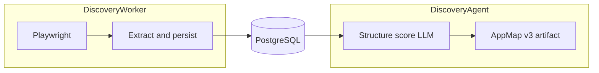
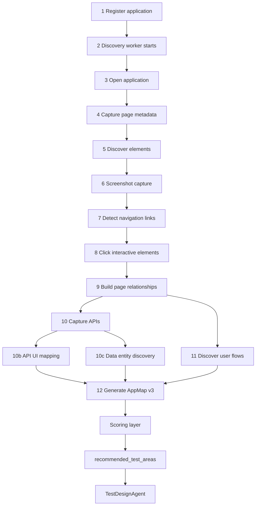
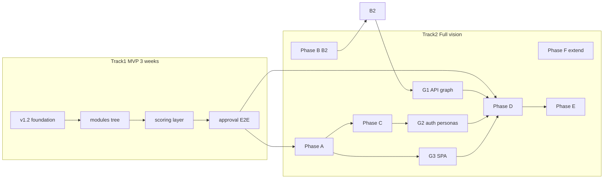
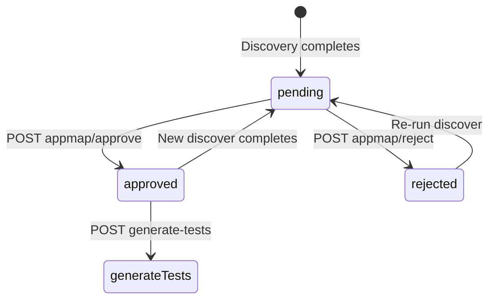
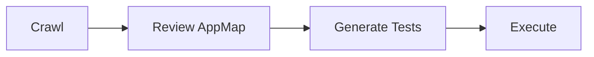

# Discovery Agent Vision — Product & Technical Specification

| Field | Value |
|-------|-------|
| **Version** | 1.4.0 |
| **Status** | Approved — two-track delivery (MVP + full vision) |
| **Last updated** | 2026-06-22 |
| **Parent spec** | [SPEC.md](./SPEC.md) §17.1 (DiscoveryAgent + DiscoveryWorker) |
| **Related** | [CIC-CRAWLER-PLAN.md](./CIC-CRAWLER-PLAN.md), [PHASE-2-SPEC.md](./PHASE-2-SPEC.md), [DASHBOARD-SPEC.md](./DASHBOARD-SPEC.md) |
| **Implementation plan** | `.cursor/plans/discovery_agent_vision_548fb27a.plan.md` |

---

## 1. Executive Summary

This specification extends the platform discovery pipeline so it behaves like a **Manual Tester + Business Analyst + Automation Engineer** exploring any registered web application.

Discovery must answer, without site-specific hardcoding:

| Question | Discovery output |
|----------|------------------|
| What pages exist? | `pages[]`, `navigation_graph`, hierarchical `modules[]` |
| What buttons exist? | `elements[]` with `element_kind: button`, `inventory.buttons` |
| What forms exist? | `forms[]` with grouped fields |
| What APIs are called? | `api_endpoints[]` (network + OpenAPI) |
| What user flows exist? | `flows[]` + module `features[]` |
| What business entities exist? | `data_entities[]` |
| Which UI actions trigger which APIs? | `api_ui_mappings[]` |
| What APIs depend on which APIs? | `api_dependency_graph` |
| What test data does the app expect? | `test_data_catalog[]` |
| How does authentication work? | `auth_intelligence` |
| What SPA routes exist beyond links? | `spa_routes[]` |
| What should be tested? | `recommended_test_areas[]` (DiscoveryAgent) → `test_cases[]` (TestDesignAgent) |
| How risky / critical / automatable is each area? | Scoring layer on modules, flows, endpoints |
| How complete was this discovery run? | `discovery_completeness_score` |

**Architecture constraint (hard rule):** **DiscoveryWorker** owns all Playwright extraction (crawl, CIC, network, screenshots, forms, SPA listeners, test-data signals). **DiscoveryAgent** owns post-crawl intelligence only (structure, score, LLM naming, graphs, catalogs, approval metadata) — see §3.1.

**Domain-agnostic rule:** All verify scripts and tests use ephemeral synthetic apps. No demo tenant UUIDs or URLs in core gates.

---

## 3.1 Worker vs Agent boundary (mandatory)

| Responsibility | Owner | Examples |
|----------------|-------|----------|
| Browser/session lifecycle | **DiscoveryWorker** | `CrawlSession`, auth login, BFS |
| DOM / a11y extraction | **DiscoveryWorker** | `extractors.py`, `forms.py` |
| CIC interactions | **DiscoveryWorker** | `cic/session.py` |
| Network / HAR capture | **DiscoveryWorker** | `network_capture.py` |
| SPA `pushState` listener | **DiscoveryWorker** | `spa_routes.py` |
| Raw test-data signals | **DiscoveryWorker** | field constraints, select options |
| Persist pages/elements/states | **DiscoveryWorker** | `persist.py` |
| Module tree / entity inference | **DiscoveryAgent** | `module_tree.py`, `entities.py` |
| API dependency graph | **DiscoveryAgent** | `api_dependency_graph.py` |
| Scoring & completeness | **DiscoveryAgent** | `scoring.py` |
| LLM structuring (grounded) | **DiscoveryAgent** | prompts + validators |
| `recommended_test_areas` | **DiscoveryAgent** | rule + LLM |
| AppMap JSON artifact | **DiscoveryAgent** | `appmap.py` |
| Confidence attachment | **DiscoveryAgent** | `confidence.py` (from worker signals) |

**DiscoveryAgent must not** launch Playwright or mutate the live application. **DiscoveryWorker must not** call OpenAI.



---

## 2. Goals

1. Produce **AppMap schema v3** — backward compatible with v1 (link-only) and v2 (CIC states/transitions).
2. Emit a **hierarchical module tree** (e.g. Application → Users → Create User) grounded in crawl data.
3. Capture **API traffic** during UI crawl and optionally merge **OpenAPI 3.x** documents.
4. Correlate **UI interactions ↔ API requests** with confidence scores.
5. Infer **data entities** and CRUD surfaces from UI + API signals.
6. Compute **risk**, **business criticality**, **testability**, and **automation complexity** scores — deterministic and explainable.
7. Emit **recommended test areas** ranked by composite priority; hand off to TestDesignAgent for concrete test cases.
8. Expose results via **GET /appmap** and **GET /apps/{id}/discovery-summary**.
9. Build an **API dependency graph** from observed call sequences and OpenAPI references.
10. Discover **test data** shapes, constraints, and safe synthetic values per form/entity/API.
11. Produce **authentication intelligence** — session model, token flow, protected routes, multi-persona visibility.
12. Discover **SPA routes** via `pushState`/`popstate`, hash routes, and router config heuristics (extend existing virtual views).
13. Compute **discovery completeness score** and support **AppMap diff** between pipeline runs.
14. Apply **HTML5 validation hints**, **button intent** tags, and optional **accessibility-tree** extraction for locator quality.
15. Attach **confidence scores** to modules, flows, entities, and test areas.
16. Enforce **per-stage LLM token budgets** in DiscoveryAgent.
17. Gate test generation on **AppMap approval** (configurable bypass).
18. Run **multi-role discovery** via sequential persona crawls merged in DiscoveryAgent.

---

## 3. Non-Goals

| Item | Reason |
|------|--------|
| Executing destructive actions during crawl | Safety policy — detect and score, test later with `destructive: true` |
| Inferring role-based business rules without config | Requires domain docs or `role_matrix` config (future) |
| 100% API coverage without crawl traffic or OpenAPI | Network capture is observation-bound |
| Perfect API↔UI mapping | Expose `confidence`; flag low-confidence for manual review |
| Replacing TestDesignAgent | Discovery proposes **areas**; TestDesignAgent produces **test_cases** |
| Neo4j / graph DB | PostgreSQL + JSONB remain source of truth (SPEC §6) |

---

## 4. Discovery Pipeline (12 Steps)



### Step ownership

| Step | Component | Status today | Target |
|------|-----------|--------------|--------|
| 1–2 | API + Celery `run_discovery` | Implemented | — |
| 3–4 | `CrawlSession`, `persist.py` | Implemented | Add `h1`, meta, breadcrumbs, load timing |
| 5 | `extractors.py` | Implemented | Add `forms.py`, `element_kind` |
| 6 | `save_page_screenshot` | Implemented | Default on for registered apps |
| 7 | `crawler.py` BFS | Implemented | Improve `pushState` SPA hooks (Phase E) |
| 8 | CIC `cic/session.py` | Implemented when `enable_cic` | Default `enable_cic: true` |
| 9 | `page_discoveries`, `state_transitions` | DB only | Export `navigation_graph` in AppMap |
| 10 | — | **Missing** | `network_capture.py`, `openapi_import.py` |
| 10b | — | **Missing** | `api_ui_mapper.py` |
| 10c | — | **Missing** | `entities.py` |
| 11 | `flows.py`, `flow_structure.py` | Partial | Multi-module BA journeys + grounding |
| 12 | `appmap.py` | v1/v2 flat | v3 hierarchy + intelligence fields |
| Scoring | — | **Missing** | `scoring.py`, `aqa_shared/scoring/` |
| Test areas | — | **Missing** | `recommended_test_areas` + TestDesign handoff |

---

## 5. Three-Role Model

| Role | Responsibility | Implementation |
|------|----------------|----------------|
| **Manual Tester** | Open app, scroll, click safely, observe states, capture screenshots | DiscoveryWorker + CIC |
| **Business Analyst** | Name modules/features, infer entities, assign criticality, recommend test areas | DiscoveryAgent LLM + `module_tree.py`, `entities.py`, `scoring.py` |
| **Automation Engineer** | Semantic locators, API inventory, API↔UI map, testability/complexity scores | `extractors.py`, `network_capture.py`, `api_ui_mapper.py`, `aqa_shared/testability/` |

---

## 6. AppMap Schema v3

### 6.1 Version matrix

| `schema_version` | Condition | New fields |
|------------------|-----------|------------|
| `1` | No CIC states | `pages`, `elements`, `flows` |
| `2` | CIC enabled (`states.length > 0`) | + `states`, `transitions` |
| `3` | Module tree or scoring present | + `modules`, `forms`, `api_endpoints`, `api_ui_mappings`, `data_entities`, `scoring_summary`, `inventory`, `navigation_graph`, `recommended_test_areas` |

v3 **must** include all v2 fields when CIC data exists. Clients check `schema_version` before reading new keys.

### 6.2 Target document shape (illustrative)

```json
{
  "schema_version": 3,
  "application_id": "uuid",
  "last_crawl_at": "ISO-8601",
  "modules": [
    {
      "module_id": "users",
      "name": "Users",
      "parent_module_id": null,
      "pages": ["page-uuid"],
      "features": [
        { "name": "Create User", "flow_id": "flow-uuid", "page_ids": ["page-uuid"] }
      ],
      "business_criticality": "high",
      "risk_score": 78,
      "testability_score": 82,
      "automation_complexity_score": 45,
      "risk_factors": ["mutating_api:POST /api/users", "pii_fields:email"],
      "recommended_test_areas": [
        {
          "area": "Create user validation",
          "priority": "high",
          "priority_index": 81.2,
          "rationale": "Form with 6 required fields; POST /api/users",
          "risk_score": 72,
          "signals": ["form:register", "api:POST:/api/users"]
        }
      ]
    }
  ],
  "data_entities": [
    {
      "entity_id": "user",
      "name": "User",
      "fields": ["email", "role", "status"],
      "business_criticality": "high",
      "risk_score": 75,
      "crud_surfaces": {
        "create": {
          "page_ids": ["page-uuid"],
          "form_ids": ["form-uuid"],
          "api_endpoint_ids": ["ep-uuid"]
        },
        "read": { "page_ids": ["page-uuid"], "api_endpoint_ids": ["ep-uuid-2"] }
      }
    }
  ],
  "api_endpoints": [
    {
      "endpoint_id": "ep-uuid",
      "method": "POST",
      "path": "/api/users",
      "path_pattern": "/api/users",
      "source": "network",
      "request_schema": {},
      "response_schema": {},
      "seen_on_page_ids": ["page-uuid"],
      "risk_score": 85
    }
  ],
  "api_ui_mappings": [
    {
      "mapping_id": "uuid",
      "api_endpoint_id": "ep-uuid",
      "page_id": "page-uuid",
      "form_id": "form-uuid",
      "element_id": "element-uuid",
      "flow_id": null,
      "trigger": {
        "action": "fill",
        "semantic_selector": "getByLabel(\"Email\")"
      },
      "confidence": 0.92,
      "correlation_method": "cic_interaction_window"
    }
  ],
  "forms": [
    {
      "form_id": "uuid",
      "page_id": "page-uuid",
      "state_id": null,
      "action": "/api/users",
      "method": "post",
      "field_element_ids": ["element-uuid"],
      "risk_score": 70
    }
  ],
  "navigation_graph": [
    { "from_page_id": "uuid", "to_page_id": "uuid", "via": "link", "label": "Users" },
    { "from_page_id": "uuid", "to_url": "https://example.com/users", "via": "interaction" }
  ],
  "inventory": {
    "pages": 12,
    "elements": 340,
    "buttons": 42,
    "forms": 8,
    "links": 120,
    "api_endpoints": 28,
    "entities": 5,
    "flows": 18
  },
  "scoring_summary": {
    "app_risk_score": 64,
    "app_testability_score": 71,
    "app_automation_complexity_score": 52,
    "discovery_completeness_score": 78,
    "high_risk_modules": ["users", "billing"]
  },
  "api_dependency_graph": {
    "nodes": [],
    "edges": []
  },
  "spa_routes": [],
  "test_data_catalog": [],
  "auth_intelligence": {},
  "recommended_test_areas": [],
  "pages": [],
  "elements": [],
  "flows": [],
  "states": [],
  "transitions": [],
  "stats": {
    "page_count": 12,
    "element_count": 340,
    "flow_count": 18,
    "state_count": 45,
    "interaction_count": 120
  }
}
```

### 6.3 Hierarchical tree example (presentation)

Dashboard and `discovery-summary` may render `modules[]` as a tree:

```text
Application
├── Login
├── Dashboard
├── Users
│   ├── Create User
│   ├── Edit User
│   └── Delete User
└── Settings
```

Tree structure is derived from `modules[].parent_module_id` + `features[]`; not a separate DB table in v1 of this spec.

---

## 7. Database Schema Extensions

### 7.1 New tables

#### `forms`

| Column | Type | Notes |
|--------|------|-------|
| `form_id` | UUID PK | |
| `app_id` | UUID FK | |
| `page_id` | UUID FK | |
| `state_id` | UUID FK nullable | CIC state scope |
| `action` | TEXT | Form `action` attribute |
| `method` | VARCHAR(16) | `get`, `post`, etc. |
| `attributes` | JSONB | `id`, `name`, `enctype`, etc. |
| `field_element_ids` | JSONB | Array of `element_id` |
| `discovered_at` | TIMESTAMP | |

#### `api_endpoints`

| Column | Type | Notes |
|--------|------|-------|
| `endpoint_id` | UUID PK | |
| `app_id` | UUID FK | |
| `method` | VARCHAR(16) | GET, POST, … |
| `path` | TEXT | Observed path |
| `path_pattern` | TEXT | Normalized template e.g. `/api/users/{id}` |
| `source` | VARCHAR(16) | `network`, `openapi`, `both` |
| `request_schema` | JSONB | From OpenAPI or inferred |
| `response_schema` | JSONB | |
| `first_seen_page_id` | UUID FK nullable | |
| `seen_count` | INTEGER | |
| `discovered_at` | TIMESTAMP | |

Unique: `(app_id, method, path_pattern)`.

#### `api_ui_mappings`

| Column | Type | Notes |
|--------|------|-------|
| `mapping_id` | UUID PK | |
| `app_id` | UUID FK | |
| `api_endpoint_id` | UUID FK | |
| `page_id` | UUID FK nullable | |
| `form_id` | UUID FK nullable | |
| `element_id` | UUID FK nullable | |
| `flow_id` | UUID FK nullable | |
| `trigger_action` | JSONB | CIC action snapshot |
| `confidence` | FLOAT | 0.0–1.0 |
| `correlation_method` | VARCHAR(32) | See §9.3 |
| `discovered_at` | TIMESTAMP | |

#### `data_entities` (optional table; may be AppMap-only in Phase C)

| Column | Type | Notes |
|--------|------|-------|
| `entity_id` | VARCHAR(64) PK per app | e.g. `user` |
| `app_id` | UUID FK | |
| `name` | VARCHAR(255) | Display name |
| `fields` | JSONB | Field name list |
| `crud_surfaces` | JSONB | Links to pages, forms, APIs |
| `business_criticality` | VARCHAR(16) | |
| `risk_score` | INTEGER | 0–100 |

### 7.2 Extended columns

| Table | Column | Notes |
|-------|--------|-------|
| `elements` | `attributes.testability_tier` | `action`, `assert_only`, `xpath_only`, `panel` |
| `elements` | `attributes.testability_score` | 0–100 |
| `elements` | `attributes.element_kind` | `button`, `input`, `link`, `select`, … |
| `flows` | `module_id` | VARCHAR(64) nullable |
| `flows` | `risk_score`, `testability_score`, `automation_complexity_score` | INTEGER nullable |
| `applications` | `crawl_config.business_criticality_overrides` | JSONB map `module_id → level` |

---

## 8. DiscoveryWorker Extensions

### 8.1 Crawl defaults

New applications default:

```json
{
  "enable_cic": true,
  "cic_mode": "fast",
  "capture_screenshots": true
}
```

Apps requiring nav-click discovery (SPAs) set `cic_mode: "full"` in `crawl_config`.

### 8.2 Form detection (`forms.py`)

- Evaluate DOM for `<form>` nodes during element extraction.
- Capture `action`, `method`, `id`, `name`, associated fields.
- Link child elements via `form_id` in `elements.attributes` or FK via `forms.field_element_ids`.
- **Do not submit** forms (existing CIC safety policy).

### 8.3 Network capture (`network_capture.py`)

Attach to Playwright page for duration of each BFS visit + CIC session:

```python
page.on("request", handler)
page.on("response", handler)
```

| Rule | Behavior |
|------|----------|
| Resource types | Include `xhr`, `fetch`; optional `document` for HTML navigations |
| Dedup key | `method + normalize_path(url)` |
| Store | `request_started_at`, `page_url`, `page_id`, headers (sanitized), body hash (no raw secrets) |
| Exclude | Static assets: `.js`, `.css`, `.png`, fonts, analytics domains (configurable) |
| Secrets | Strip `Authorization`, cookies from persisted payloads |

### 8.4 OpenAPI import (`openapi_import.py`)

Triggered when `discoverConfig.openapi_url` or `applications.crawl_config.openapi_url` is set.

- Fetch or read OpenAPI 3.x JSON/YAML.
- Normalize to `api_endpoints` rows with `source: openapi`.
- Merge with network-captured endpoints (`source: both` when matched).
- Schemas stored in `request_schema` / `response_schema`.

### 8.5 API ↔ UI mapper (`api_ui_mapper.py`)

Runs at end of each CIC page session; final merge in DiscoveryAgent.

See §9.3 for correlation algorithm.

### 8.6 Page metadata enrichment

Per page, capture when available:

- `h1`, `<meta name="description">`, breadcrumb text
- `dom_content_loaded_ms`, `response_status`
- Stored in `pages` extension JSONB or artifact sidecar (prefer JSONB column `metadata` on `pages` if added)

### 8.7 Testability enrichment (`aqa_shared/testability/`)

At element extraction time:

- Classify `testability_tier` and `testability_score`
- Enrich `attributes` with `link_scope` (`internal` | `external`) per PHASE-2-SPEC §7.6
- Tag `button_intent`: `navigate | submit | cancel | delete | toggle | filter | unknown`
- Capture HTML5 field constraints: `required`, `pattern`, `min`, `max`, `minlength`, `maxlength`, `type`

### 8.8 SPA route discovery (`spa_routes.py`)

Extends existing [`spa_views.py`](workers/discovery_worker/aqa_discovery/spa_views.py) virtual view URLs.

| Mechanism | Implementation |
|-----------|----------------|
| Hash routes (`#/`, `#!/`) | Already partially handled in link extraction — normalize and persist as `spa_routes[]` |
| `history.pushState` / `replaceState` | Inject lightweight listener during page load; record `{ from_url, to_url, title, timestamp }` |
| `popstate` | Same listener — capture back/forward navigations |
| CIC-triggered route changes | Correlate with `state_transitions` and virtual views |
| Router heuristics | Scan loaded JS bundles for common patterns (`createBrowserRouter`, `path:`) — **low confidence** only |

**Output per route:**

```json
{
  "route_id": "uuid",
  "path_pattern": "/users/:id",
  "url_examples": ["https://app.example.com/users/42"],
  "discovery_method": "pushstate_listener",
  "page_id": "uuid",
  "module_id": "users",
  "confidence": 0.85
}
```

Virtual views (`#__aqa_view__/{state_key}`) remain the canonical representation for same-URL UI states; `spa_routes[]` represents URL-path changes within the SPA shell.

### 8.9 Authentication intelligence (`auth_intelligence.py`)

Runs during and after crawl — does **not** store raw passwords or tokens.

| Signal | Capture |
|--------|---------|
| Login form detection | Username/email + password fields, submit control, OAuth buttons |
| Login API | `POST /auth/login`, `/api/session`, etc. from network capture |
| Session model | `cookie` names set post-login, `localStorage`/`sessionStorage` keys (names only) |
| Auth headers | Presence of `Authorization: Bearer` on API calls (not values) |
| Protected routes | Pages/APIs that return 401/403 before auth vs after |
| MFA/CAPTCHA gates | Existing halt detection — record in `auth_intelligence.blockers[]` |
| Token refresh | Observed refresh endpoint chains in network timeline |

**Multi-persona discovery (recommended):**

```json
{
  "personas": [
    { "persona_id": "admin", "auth_config_ref": "AUTH_ADMIN_JSON" },
    { "persona_id": "user", "auth_config_ref": "AUTH_USER_JSON" }
  ]
}
```

Run crawl once per persona (sequential browser contexts); merge AppMaps with `discovered_as_persona` on pages/flows. Compute `visibility_matrix`: which modules/pages exist per persona.

**Output (`auth_intelligence` on AppMap root):**

```json
{
  "session_type": "cookie | bearer | mixed",
  "login_flow_id": "flow-uuid",
  "login_api_endpoint_id": "ep-uuid",
  "protected_page_ids": ["..."],
  "protected_api_endpoint_ids": ["..."],
  "personas": [
    {
      "persona_id": "admin",
      "authenticated": true,
      "visible_module_ids": ["users", "settings"],
      "exclusive_module_ids": ["admin"]
    }
  ],
  "blockers": [{ "type": "mfa", "page_url": "..." }]
}
```

### 8.10 Test data discovery (`test_data_discovery.py`)

Infers what data the application expects — for TestDesignAgent and future IntelligenceAgent `testdata` mode.

| Source | Discovered artifact |
|--------|---------------------|
| HTML5 constraints | `required`, `pattern`, `type=email`, min/max |
| Form field names + labels | Candidate field semantics |
| API request schemas | OpenAPI / observed JSON body shapes |
| Select/combobox options | First N safe options from CIC `select` interactions |
| Table column headers | Entity field candidates |
| Placeholder text | Format hints ("e.g. john@company.com") |

**Output (`test_data_catalog[]`):**

```json
{
  "catalog_id": "uuid",
  "target_type": "form | api_endpoint | entity",
  "target_id": "form-uuid",
  "fields": [
    {
      "name": "email",
      "data_type": "email",
      "required": true,
      "constraints": { "pattern": "^[^@]+@[^@]+$" },
      "suggested_safe_value": "qa-test-{run_id}@example.com",
      "pii_class": "email"
    }
  ],
  "synthetic_strategy": "deterministic_fixture",
  "never_use_live_pii": true
}
```

Rules:

- Generate **synthetic safe values** only — never persist real user data from production.
- `suggested_safe_value` uses run-scoped tokens (`{run_id}`, `{timestamp}`) for uniqueness.
- Password fields: suggest placeholder only (`***` — never fill during discovery).
- Hand off catalog to TestDesignAgent `gap_fill` and ScriptGeneration for `step.value`.

### 8.11 Network artifacts

- Sanitized **HAR** per pipeline run (artifact type: `har`) for debugging API↔UI mapping.
- Optional Playwright **trace** for one representative flow per module (`discoverConfig.capture_traces: false` default).

---

## 9. DiscoveryAgent Extensions

### 9.1 Module tree (`module_tree.py`)

**Rule pass (deterministic):**

1. Extract nav landmarks: `nav`, `[role=navigation]`, sidebar link clusters.
2. Cluster pages by URL path segment (`flows._module_key` logic).
3. Attach flows and forms to nearest module by `page_id`.
4. Build `parent_module_id` from nav hierarchy (child nav items nest under parent).

**LLM pass (`prompts/module-structure.v1.txt`):**

- Input: compact pages, nav links, rule modules, flows, forms.
- Output: `{ "modules": [ ... ] }` with human-readable names.
- **Grounding validator:** every `page_id`, `flow_id`, `form_id` must exist in AppMap; reject or fall back to rule pass.

### 9.2 Data entities (`entities.py`)

**Rule inference sources:**

| Source | Pattern |
|--------|---------|
| REST paths | `/api/users/{id}` → `user` |
| OpenAPI | `#/components/schemas/User` |
| Form fields | `user_email`, `order_id` |
| Table headers | `<th>` text from CIC |
| Page title / H1 | "Create User" → `user` |
| Module name | "Users" → `user` |

Merge and dedupe by normalized entity slug. Build `crud_surfaces` from linked forms, pages, and `api_ui_mappings`.

**LLM pass (`prompts/entities.v1.txt`):** canonical names and field synonyms only; must reference grounded field names.

### 9.3 API ↔ UI correlation

| Method | `correlation_method` | `confidence` |
|--------|----------------------|--------------|
| Request within ±2s after CIC interaction on same page | `cic_interaction_window` | 0.7–1.0 by proximity |
| Form field names match JSON body keys | `form_body_field_match` | +0.1 bonus |
| OpenAPI path match only | `openapi_only` | 0.5 |
| Heuristic page title ↔ operationId | `heuristic` | 0.4 |

Low confidence (`< 0.6`): include in AppMap with `review_required: true` for dashboard.

### 9.4 User flows (Step 11)

Extend existing [`flows.py`](packages/agents/aqa_agents/discovery/flows.py) + [`flow_structure.py`](packages/agents/aqa_agents/discovery/flow_structure.py):

- Multi-module journeys: chain grounded `navigate` + `interaction` steps across pages.
- Prefer CRUD flows from `data_entities.crud_surfaces`.
- Cap: `max_flows` default 50; `max_journey_steps` default 20.
- LLM may rename/merge only; steps must pass existing `validate_llm_flows` grounding.

### 9.5 Scoring layer (`scoring.py`)

Runs after modules, entities, mappings, and flows are assembled. **Numeric scores are rule-based only** — LLM may add `rationale` text, not change scores.

#### 9.5.1 Risk score (0–100)

| Signal | Weight |
|--------|--------|
| Destructive UI (delete/remove/cancel subscription) | +25 |
| Auth/session endpoints | +20 |
| PII fields (password, ssn, card, email, phone) | +20 |
| Mutating API (POST/PUT/PATCH/DELETE) | +15 |
| UI mutation with no mapped API | +10 |
| Critical control without semantic locator | +10 |
| External/off-domain link | +5 |

Output: `risk_score`, `risk_factors[]`. Roll up: feature → module → app (`scoring_summary.app_risk_score`).

#### 9.5.2 Business criticality

Enum: `critical` | `high` | `medium` | `low`.

| Heuristic | Effect |
|-----------|--------|
| Top-level nav position (1st–3rd item) | `critical` or `high` |
| Keywords: login, dashboard, checkout, payment, admin, billing | bump +1 level |
| Flow count + form count + mutating API count per module | bump |
| `crawl_config.business_criticality_overrides` | explicit per `module_id` |

LLM may not set criticality above rule band maximum.

#### 9.5.3 Testability score (0–100)

Per element, rolled up to flow/module/app.

| Locator / condition | Score impact |
|---------------------|--------------|
| `getByRole` / `getByLabel` / `getByTestId` | High positive |
| `getByPlaceholder` / `getByText` | Medium positive |
| CSS-only / xpath-only | High negative |
| Dynamic/generated `id` | Medium negative |
| iframe depth > 0 | Medium negative per level |
| `assert_only` tier | Neutral |

Implemented in `packages/aqa_shared/aqa_shared/testability/`.

#### 9.5.4 Automation complexity score (0–100, higher = harder)

| Factor | Impact |
|--------|--------|
| Step count | +2 per step above 3 |
| Multi-page journey | +15 |
| Login prerequisite | +10 |
| iframe hops | +10 each |
| File upload / date picker / rich widgets | +8 each |
| Unstable URL between steps (SPA) | +15 |
| Unmapped external API dependency | +10 |
| Destructive step (needs teardown) | +10 |

Output: `automation_complexity_score`, `complexity_factors[]`.

#### 9.5.5 Priority index (test area ranking)

Internal composite for sorting `recommended_test_areas`:

```
priority_index =
  0.35 * risk_score
+ 0.25 * business_criticality_weight   // critical=100, high=75, medium=50, low=25
+ 0.25 * (100 - testability_score)
+ 0.15 * automation_complexity_score
```

Exposed on each `recommended_test_area` when generated.

### 9.6 Recommended test areas

**Rule-generated (always):**

- Each form → validation test area
- Each destructive control → negative/destructive area
- Each mutating API without UI map → API contract area
- Each entity CRUD surface missing a flow → coverage gap area

**LLM-generated (`prompts/test-areas.v1.txt`):**

- BA narrative for top-N modules by `priority_index`
- Must cite `signals[]` grounded in form/API/flow IDs

**Handoff to TestDesignAgent:**

- `gap_fill.py` receives sorted `recommended_test_areas`, `data_entities`, `api_ui_mappings`, `test_data_catalog`
- Generates paired UI + API scenarios when mapping confidence ≥ 0.7
- Uses `suggested_safe_value` from catalog for `fill` steps
- Respects `max_tests` and existing priority filters

### 9.7 API dependency graph (`api_dependency_graph.py`)

Built in DiscoveryAgent from network timeline + OpenAPI `components` references.

**Edge types:**

| Edge | Inference |
|------|-----------|
| `sequential` | API B called within 5s after API A on same page (e.g. `GET /users` → `GET /users/{id}/permissions`) |
| `schema_ref` | OpenAPI `$ref` between request/response schemas |
| `ui_chain` | Single UI action triggered multiple APIs in order (from `api_ui_mappings` grouping) |
| `auth_dependency` | Endpoint requires prior login/token endpoint success |

**Output:**

```json
{
  "api_dependency_graph": {
    "nodes": [{ "endpoint_id": "ep-1", "method": "GET", "path": "/api/users" }],
    "edges": [
      {
        "from_endpoint_id": "ep-1",
        "to_endpoint_id": "ep-2",
        "edge_type": "sequential",
        "confidence": 0.88,
        "observed_count": 12
      }
    ]
  }
}
```

**Uses:**

- Risk scoring (deep chains = higher blast radius)
- TestDesign: ordered API test scenarios
- Dashboard: dependency visualization (Phase E)
- Automation complexity: flows needing API setup chains

### 9.8 Discovery completeness score

Meta-metric on AppMap root (`discovery_completeness_score` 0–100):

| Dimension | Weight | Measure |
|-----------|--------|---------|
| Page coverage | 20% | % seed-reachable pages visited vs `max_pages` budget |
| CIC depth | 20% | % pages with ≥2 states when CIC enabled |
| Locator quality | 15% | % elements with `testability_tier: action` |
| API mapping | 15% | % mutating forms with `api_ui_mapping` confidence ≥ 0.7 |
| SPA routes | 10% | Hash/pushState apps: `spa_routes` count > 0 or N/A flag |
| Entity coverage | 10% | % modules with ≥1 `data_entity` |
| Auth clarity | 10% | Login flow detected + ≥1 persona authenticated |

Expose gaps in `discovery-summary.recommendations[]` (e.g. "Re-run with `cic_mode: full`").

### 9.9 AppMap diff (between runs)

`GET /api/v1/apps/{id}/appmap/diff?from_run={uuid}&to_run={uuid}`

| Category | Diff fields |
|----------|-------------|
| Pages | added, removed, metadata changed |
| Elements | count delta per page |
| APIs | new/removed endpoints, dependency edge changes |
| Modules | tree structure changes |
| Scores | risk/testability/complexity deltas |
| Entities | new CRUD surfaces |

Store `appmap_hash` per run (existing); diff is deterministic JSON comparison on normalized AppMap subsets.

### 9.10 Execution feedback loop (Phase H)

When Playwright executor reports failures, ingest into `discovery_feedback` (append-only):

| Failure | Discovery adjustment |
|---------|---------------------|
| Locator not found | Decrease element `testability_score`; flag for re-crawl |
| API 4xx/5xx on mapped endpoint | Decrease `api_ui_mapping.confidence` |
| Flow step timeout at state | Increase flow `automation_complexity_score` |
| Auth 401 mid-run | Flag page as `auth_intelligence.protected` |

Optional re-score on next AppMap build without full re-crawl. Does not auto-mutate selectors (HealingAgent scope).

---

## 10. API Contract

### 10.1 Discover request extensions

`POST /api/v1/apps/{id}/discover` body (`discoverConfig`):

| Field | Type | Default | Description |
|-------|------|---------|-------------|
| `use_llm` | boolean | `true` | LLM flow/module/entity/area structuring |
| `openapi_url` | string | null | OpenAPI 3.x URL to import |
| `capture_network` | boolean | `true` | Enable network intercept |
| `capture_har` | boolean | `false` | Persist sanitized HAR artifact |
| `capture_traces` | boolean | `false` | Playwright trace per module sample |
| `personas` | array | `[]` | Multi-persona auth profiles (see §8.9) |
| `enable_pushstate_listener` | boolean | `true` | SPA route capture |
| `max_llm_tokens` | integer | `8000` | Discovery LLM budget cap |
| `force` | boolean | `false` | Re-crawl even if hash unchanged |

### 10.2 GET /apps/{id}/appmap

- Returns latest AppMap from DB + flows; `schema_version` 3 when available.
- Pydantic schema extended in `apps/api/aqa_api/schemas/appmap.py`.

### 10.3 GET /apps/{id}/discovery-summary (new)

Query-oriented summary for dashboard Q&A:

```json
{
  "application_id": "uuid",
  "last_crawl_at": "ISO-8601",
  "schema_version": 3,
  "counts": {
    "pages": 12,
    "buttons": 42,
    "forms": 8,
    "links": 120,
    "api_endpoints": 28,
    "flows": 18,
    "entities": 5,
    "modules": 6,
    "spa_routes": 14,
    "api_dependency_edges": 22
  },
  "scoring_summary": { },
  "discovery_completeness_score": 78,
  "recommendations": ["Enable cic_mode:full for SPA nav discovery"],
  "what_pages_exist": ["Dashboard", "Users", "Settings"],
  "what_forms_exist": [{ "name": "Create User", "page": "Users" }],
  "what_apis_are_called": [{ "method": "POST", "path": "/api/users" }],
  "what_should_be_tested_first": ["User CRUD", "Login session"],
  "top_risk_areas": [
    { "module": "Users", "risk_score": 78, "top_factor": "mutating_api" }
  ],
  "module_tree": [
    { "name": "Users", "children": ["Create User", "Edit User"] }
  ],
  "auth_summary": {
    "session_type": "bearer",
    "personas_authenticated": ["admin"]
  }
}
```

### 10.4 GET /apps/{id}/appmap/diff (new)

Query params: `from_run`, `to_run` (pipeline run UUIDs). Returns structured diff per §9.9.

---

## 11. LLM Prompts

| File | Purpose | Grounding |
|------|---------|-----------|
| `flow-structure.v1.txt` | Flow rename/merge | Existing — steps must be AppMap-grounded |
| `module-structure.v1.txt` | Module tree naming | **New** — page/flow/form IDs |
| `entities.v1.txt` | Entity canonicalization | **New** — field names from forms/APIs |
| `test-areas.v1.txt` | BA test area narrative | **New** — signals[] required |

LLM failures fall back to rule-only output. Token usage stored in `pipeline_runs.config` (`discovery_llm_tokens_used`, `discovery_llm_cost_estimate`).

---

## 12. Safety & Security (unchanged + extended)

| Policy | Behavior |
|--------|----------|
| No form submit | CIC blocks submit buttons/inputs |
| No logout/delete/checkout click | URL + element safety filters |
| No password fill | Skip password fields |
| No file upload execution | Detect only |
| Network payload storage | Hash bodies; strip auth headers |
| SSRF on `openapi_url` | Allowlist same-origin or configured hosts only |
| Domain-agnostic core | No tenant UUIDs in verify gates |

---

## 13. Definition of Done

### 13.0 Discovery Done — v3 MVP (~3 weeks) **ship first**

Minimal AppMap v3 for dashboard + gated test generation. **Does not require** API capture, Phase G, or full `data_entities[]`.

| Criterion | Required for MVP |
|-----------|------------------|
| v2 crawl data (pages, elements, CIC states, flows) | Yes |
| `modules[]` hierarchical tree (rule pass; LLM optional) | Yes |
| `confidence` on modules and flows | Yes |
| `scoring_summary` (risk, criticality, testability, complexity, completeness) | Yes |
| Per-stage `llm_budget_usage` in pipeline config | Yes |
| AppMap approval workflow (`pending` → `approve` → generate-tests) | Yes |
| `navigation_graph` export | Yes (light) |
| `schema_version: 3` with `mvp: true` flag in artifact | Yes |
| `api_endpoints`, `api_dependency_graph`, `spa_routes` | **No** (full vision) |
| `data_entities[]`, `test_data_catalog[]` | **No** (full vision) |
| `auth_intelligence` multi-persona | **No** (G2) |
| `recommended_test_areas[]` | Optional rule-only stub |

**MVP verify gates:** `pnpm verify:discovery-mvp`, `pnpm verify:scoring`, `pnpm verify:appmap-approval`, `pnpm verify:discovery-architecture`

### 13.1 Discovery Done — v3 Full

- [ ] All v2 criteria met (pages, elements, states when CIC on, flows, screenshots, AppMap artifact)
- [ ] `forms` persisted when present on crawled pages
- [ ] `api_endpoints` persisted when `capture_network` or `openapi_url` enabled
- [ ] `api_ui_mappings` persisted with confidence ≥ 0.4 for correlated pairs
- [ ] AppMap artifact `schema_version: 3` with `modules[]` (≥1 module when ≥1 page)
- [ ] `data_entities[]` present when REST or OpenAPI signals exist
- [ ] `scoring_summary` populated with all four score dimensions
- [ ] `recommended_test_areas` non-empty when forms or mutating APIs exist
- [ ] `api_dependency_graph` populated when ≥2 correlated API observations exist
- [ ] `test_data_catalog` entries for all forms with ≥1 constrained field
- [ ] `auth_intelligence` documents session model when login detected
- [ ] `spa_routes` populated for hash/pushState apps (or `spa_discovery_na: true`)
- [ ] `discovery_completeness_score` on AppMap root
- [ ] `pnpm verify:discovery-v3` passes (synthetic fixture)
- [ ] `pnpm verify:scoring` passes
- [ ] `pnpm verify:api-ui-mapping` passes
- [ ] `pnpm verify:spa-routes` passes
- [ ] `pnpm verify:test-data-catalog` passes
- [ ] `pnpm verify:auth-intelligence` passes
- [ ] `pnpm verify:api-dependency-graph` passes

### 13.2 Per-phase gates

| Phase | Verify script |
|-------|---------------|
| A | `verify_forms.py`, extended `verify_appmap.py` |
| B | `verify_network_capture.py`, `verify_openapi_import.py` |
| B2 | `verify_api_ui_mapping.py` |
| C | `verify_appmap_v3.py`, `verify_entities.py` |
| F | `verify_scoring.py` |
| D | `verify_test_design.py` (consumes test areas) |
| G | `verify_spa_routes.py`, `verify_auth_intelligence.py`, `verify_test_data_catalog.py`, `verify_api_dependency_graph.py` |
| H | `verify_discovery_feedback.py` (execution loop) |

---

## 14. Implementation Phases

Two delivery tracks: **Track 1 — v3 MVP (~3 weeks)** ships first; **Track 2 — full vision (~7–9 weeks after MVP)** completes the spec.



---

### Track 1 — v3 MVP (~3 weeks, ~15 person-days)

| Sprint | Days | Module / deliverable | Owner | Output |
|--------|------|----------------------|-------|--------|
| **M0** | 4–5 | v1.2 foundation | shared + API + **frontend** | `llm/budget.py`, `discovery/confidence.py`, approval API, test-gen gate, `verify:discovery-architecture`, **§20.3–20.5 UI** |
| **M1** | 4–5 | Module tree (rule + optional LLM) | DiscoveryAgent + **frontend** | `module_tree.py`, `module-structure.v1.txt`, `modules[]` in AppMap, `navigation_graph` export, **`ModuleTree.tsx` §20.6** |
| **M2** | 4–5 | Scoring layer | DiscoveryAgent + **frontend** | `scoring.py`, `scoring_summary`, confidence on modules/flows, `discovery_completeness_score`, **`DiscoveryScoreCard` §20.7** |
| **M3** | 2–3 | MVP integration | API + verify + **frontend** | `schema_version: 3`, `mvp: true`, `verify:discovery-mvp`, docs, default `enable_cic`, **`DiscoverySummaryPanel` §20.8** |

**MVP build order:** M0 → M1 → M2 → M3 (M1 and M2 may overlap after M0 day 3).

**Frontend:** All dashboard work is specified in **§20** with checklist **§20.11**. Backend M0 is done; frontend M0 (approval panel, generate gate, discover advanced) should land next.

---

### Track 2 — Full vision phases

| Phase | Duration | Deliverable | Depends on |
|-------|----------|-------------|------------|
| **A** | 1–1.5 weeks | Forms, button intent, HTML5, testability at crawl, CIC defaults | MVP done |
| **B** | 1–1.5 weeks | Network capture, `api_endpoints`, OpenAPI, optional HAR | — |
| **B2** | 0.5–1 week | `api_ui_mapper`, `api_ui_mappings` | B |
| **C** | 1 week | `data_entities[]` (full), flow `module_id` linkage | A, MVP |
| **F+** | 0.5 week | Extend scoring for forms/APIs/entities | C, B2 |
| **G1** | 0.5–1 week | API dependency graph | B2 |
| **G2** | 1–1.5 weeks | Auth intelligence + multi-persona + `persona_merge` + test data catalog | B2, C |
| **G3** | 0.5–1 week | SPA routes (`pushState` listener + hash normalization) | A |
| **D** | 1 week | `recommended_test_areas` + TestDesign handoff | F+, G1 (partial) |
| **E** | Ongoing | Dashboard, diff API, dependency viz, heatmap | D | **§20.9 Track 2 UI** |
| **H** | Ongoing | Execution feedback, incremental crawl, shadow DOM | E |

**Full vision build order:** MVP → A ∥ B → B2 → C → G1 ∥ G2 ∥ G3 → F+ → D → E → H

**Total after MVP:** ~7–9 weeks.

---

### Phase G — sub-phases (no longer one monolithic sprint)

| Sub-phase | Duration | Scope | Worker | Agent | Verify |
|-----------|----------|-------|--------|-------|--------|
| **G1 — API graph** | 3–5 days | `api_dependency_graph` from network timeline + OpenAPI refs; edges: sequential, schema_ref, ui_chain, auth_dependency | — | `api_dependency_graph.py` | `verify:api-dependency-graph` |
| **G2 — Auth & personas** | 5–8 days | `auth_intelligence.py`, sequential persona crawls, `persona_merge.py`, `test_data_discovery.py`, `visibility_matrix` | worker + agent | both | `verify:auth-intelligence`, `verify:test-data-catalog` |
| **G3 — SPA routes** | 3–5 days | `spa_routes.py`, `pushState`/`popstate` listener, hash route table, integrate virtual views | `spa_routes.py` | merge in AppMap | `verify:spa-routes` |

G1 requires **B2**. G2 can start after **B** (auth signals from network). G3 only needs **A** (crawl) + existing CIC — **can run in parallel with G1** after MVP.

---

### 14.1 Effort estimates per module (person-days)

Assumes 1 engineer familiar with the codebase. ±30% for unknown apps.

| Module | Est. days | Phase | Track |
|--------|-----------|-------|-------|
| `llm/budget.py` + wire stages | 1 | M0 | MVP |
| `discovery/confidence.py` + attach | 1 | M0 | MVP |
| AppMap approval API + gate | 1.5 | M0 | MVP |
| `verify:discovery-architecture` | 0.5 | M0 | MVP |
| **Frontend: approval panel + generate gate** | **1.5** | **M0** | **MVP** — §20.3, F-M0-1–5 |
| **Frontend: discover advanced + flow confidence** | **0.5** | **M0** | **MVP** — §20.4–20.5, F-M0-6–7 |
| `module_tree.py` rule pass | 2 | M1 | MVP |
| `module-structure.v1.txt` + LLM | 1.5 | M1 | MVP |
| `navigation_graph` export | 1 | M1 | MVP |
| **Frontend: `ModuleTree.tsx`** | **1.5** | **M1** | **MVP** — §20.6, F-M1-1–2 |
| `scoring.py` + rollups | 3 | M2 | MVP |
| `discovery_completeness_score` | 1 | M2 | MVP |
| **Frontend: score card + tree heatmap** | **1** | **M2** | **MVP** — §20.7, F-M2-1 |
| MVP integration + `verify:discovery-mvp` | 2 | M3 | MVP |
| **Frontend: discovery summary panel** | **1** | **M3** | **MVP** — §20.8, F-M3-1 |
| **MVP subtotal** | **~14.5** | | **~3 weeks** |
| `forms.py` + DB | 3 | A | Full |
| Button intent + HTML5 constraints | 1.5 | A | Full |
| `testability/` at crawl | 2 | A | Full |
| CIC defaults + config | 1 | A | Full |
| `network_capture.py` | 3 | B | Full |
| `openapi_import.py` | 2 | B | Full |
| `api_ui_mapper.py` + table | 3 | B2 | Full |
| `entities.py` full | 2.5 | C | Full |
| `api_dependency_graph.py` | 3 | G1 | Full |
| `auth_intelligence.py` | 2 | G2 | Full |
| Multi-persona crawl loop | 3 | G2 | Full |
| `persona_merge.py` | 2 | G2 | Full |
| `test_data_discovery.py` | 2.5 | G2 | Full |
| `spa_routes.py` + listener | 3 | G3 | Full |
| `recommended_test_areas` + TestDesign | 3 | D | Full |
| `appmap_diff.py` + API | 2 | E | Full |
| Dashboard tree + heatmap | 5+ | E | Full |
| `feedback.py` execution loop | 3 | H | Full |
| Incremental delta crawl | 4 | H | Full |
| **Full vision incremental** | **~42** | | **~7–9 weeks after MVP** |

---

### 14.2 What moves the rating from 8.5 → 9+

- Ship **Track 1 MVP in 3 weeks** and validate on 2 dissimilar apps (SPA + traditional).
- Do **not** start G2 until G1 observability proves network capture quality.
- Keep **D** (test areas) after G1 so API-aware recommendations are real.

---

### Phase G detail (legacy reference — use G1/G2/G3 above)

| Workstream | Sub-phase | Priority |
|------------|-----------|----------|
| API dependency graph | **G1** | P0 |
| Authentication intelligence + multi-persona | **G2** | P0 |
| Test data discovery | **G2** | P0 |
| SPA route discovery | **G3** | P0 |
| Multi-persona merge | **G2** | P0 |
| AppMap diff API | **E** | P1 |
| Accessibility snapshot | **A/E** | P2 |
| Shadow DOM pierce | **H** | P2 |

**Build order (revised):** **M0→M1→M2→M3** (MVP) → A ∥ B → B2 → C → **G1 ∥ G2 ∥ G3** → F+ → D → E → H

**Total estimate:** **~3 weeks MVP** + **~7–9 weeks** full vision = **~10–12 weeks** end-to-end.

---

## 15. File Map

| Area | Path |
|------|------|
| Crawl + CIC | `workers/discovery_worker/aqa_discovery/crawler.py`, `cic/session.py` |
| Forms | `workers/discovery_worker/aqa_discovery/forms.py` **(new)** |
| Network | `workers/discovery_worker/aqa_discovery/network_capture.py` **(new)** |
| OpenAPI | `workers/discovery_worker/aqa_discovery/openapi_import.py` **(new)** |
| API↔UI | `workers/discovery_worker/aqa_discovery/api_ui_mapper.py` **(new)** |
| SPA routes | `workers/discovery_worker/aqa_discovery/spa_routes.py` **(new)** |
| Auth intelligence | `workers/discovery_worker/aqa_discovery/auth_intelligence.py` **(new)** |
| Test data | `workers/discovery_worker/aqa_discovery/test_data_discovery.py` **(new)** |
| API dep graph | `packages/agents/aqa_agents/discovery/api_dependency_graph.py` **(new)** |
| AppMap diff | `packages/agents/aqa_agents/discovery/appmap_diff.py` **(new)** |
| Persona merge | `packages/agents/aqa_agents/discovery/persona_merge.py` **(new)** |
| Feedback loop | `packages/agents/aqa_agents/discovery/feedback.py` **(new)** |
| AppMap | `packages/agents/aqa_agents/discovery/appmap.py` |
| Module tree | `packages/agents/aqa_agents/discovery/module_tree.py` **(new)** |
| Entities | `packages/agents/aqa_agents/discovery/entities.py` **(new)** |
| Scoring | `packages/agents/aqa_agents/discovery/scoring.py` **(new)** |
| Testability | `packages/aqa_shared/aqa_shared/testability/` **(new)** |
| Shared scoring | `packages/aqa_shared/aqa_shared/scoring/` **(new)** |
| Prompts | `packages/agents/aqa_agents/discovery/prompts/*.v1.txt` |
| DB models | `packages/aqa_shared/aqa_shared/db/models.py` |
| API schemas | `apps/api/aqa_api/schemas/appmap.py`, `pipeline_runs.py` |
| Test handoff | `packages/agents/aqa_agents/test_design/gap_fill.py` |
| Orchestration | `workers/celery_app/aqa_celery/agent_runner.py` |

---

## 16. Cross-References to Parent SPEC

| SPEC section | This spec extends |
|--------------|-------------------|
| §17.1 DiscoveryAgent + DiscoveryWorker | Full 12-step pipeline, v3 AppMap |
| §5.1 Discovery Done | §13.1 v3 criteria |
| §17.2 TestDesignAgent | Consumes `recommended_test_areas` |
| PHASE-2-SPEC API plugin | §8.3–8.4 network + OpenAPI (pulled into Phase 1 scope per approval) |
| CIC-CRAWLER-PLAN | §8.1 default `enable_cic: true` |

---

## 17. Open Questions (post-v1.1)

1. **`pages.metadata` column** vs JSONB in artifact only — decide in Phase A migration review.
2. **`data_entities` table** vs AppMap-only — start AppMap-only; promote to table if query performance requires.
3. **`discovery_feedback` table** vs append to `pipeline_runs.config` — prefer table if execution volume is high.
4. **Incremental/delta crawl** — URL fingerprint strategy (screenshot hash vs DOM hash) — Phase H.
5. **JS bundle router scraping** — opt-in only (`discoverConfig.scrape_router_hints: false` default) due to noise.

---

## 18. Recommended Enhancements (prioritized)

Bundled into phases above; reference ranking:

| Rank | Enhancement | Phase | Rationale |
|------|-------------|-------|-----------|
| 1 | Multi-persona discovery | **G2** | Biggest gap vs real manual tester |
| 2 | API dependency graph | **G1** | User-requested; unlocks API test ordering |
| 3 | Test data discovery | **G2** | User-requested; unblocks realistic fill steps |
| 4 | Authentication intelligence | **G2** | User-requested; explains protected surface |
| 5 | SPA route discovery (pushState) | **G3** | User-requested; extends partial hash support |
| 6 | Discovery completeness score | F | Makes crawl quality visible |
| 7 | AppMap diff API | E | CI/regression essential |
| 8 | HTML5 + button intent | A | Cheap; sharpens test areas |
| 9 | Execution feedback loop | H | Discovery improves from real runs |
| 10 | Accessibility snapshot | G/P2 | Better locators on component SPAs |
| 11 | Shadow DOM pierce | H/P2 | Widget-heavy apps |
| 12 | Incremental delta crawl | H | Cost control at scale |
| 13 | Sanitized HAR artifact | B | Debug API↔UI disputes |
| 14 | Human-in-the-loop LLM review | E | Optional gate before TestDesign |

---

## 19. v1.2 Final Requirements (approved)

### 19.1 Confidence scores (modules, flows, entities, test areas)

Every intelligence artifact produced by **DiscoveryAgent** includes:

```json
{
  "confidence": 0.92,
  "confidence_factors": ["rule:nav_anchor", "grounded:all_page_ids", "llm:rename_only"],
  "review_required": false
}
```

| Object | Rule-based default | LLM-adjusted cap |
|--------|-------------------|------------------|
| `modules[]` | 0.85–1.0 from nav/URL grounding | LLM rename only; −0.1 if weak nav signal |
| `flows[]` | 1.0 for rule flows; 0.75–0.95 for LLM-merged | Rejected if grounding fails |
| `data_entities[]` | 0.6–0.95 by source count (API+form+table) | LLM synonym pass max 0.9 |
| `recommended_test_areas[]` | 0.7–1.0 from signal strength | LLM narrative cannot raise above rule band |
| `api_ui_mappings[]` | Already specified (§9.3) | — |

**Implementation:** `packages/aqa_shared/aqa_shared/discovery/confidence.py` + attach in DiscoveryAgent builders. `review_required: true` when `confidence < 0.6`.

### 19.2 LLM budget controls per stage

DiscoveryAgent LLM calls each consume from a **stage-specific** token pool (not one global bucket).

**Default budgets** (`discoverConfig.llm_budgets`):

| Stage key | Default tokens | Agent call |
|-----------|----------------|------------|
| `flow_structure` | 3000 | `structure_flows_with_llm` |
| `module_structure` | 2500 | `module_tree.py` (Phase C) |
| `entities` | 2000 | `entities.py` (Phase C) |
| `test_areas` | 2000 | test area LLM (Phase D) |
| `total_cap` | 8000 | Hard stop across all stages |

**Behavior:**

- Before each LLM call: `remaining = min(stage_budget, total_cap - used)`
- If `remaining <= 0`: skip stage, record `llm_skip_reason`, use rule-only output
- After each call: persist `pipeline_runs.config.llm_budget_usage` = `{ "flow_structure": { "used": 2912, "cap": 3000 }, ... }`
- TestDesignAgent uses separate `generateConfig.llm_budget` (existing `tokenBudgetRemaining`)

**Implementation:** `packages/aqa_shared/aqa_shared/llm/budget.py`

### 19.3 AppMap approval workflow

Test generation is blocked until the latest discovery AppMap is **approved** (human or CI bypass).



| Field | Location | Values |
|-------|----------|--------|
| `appmap_approval_status` | Latest **completed** discover `pipeline_runs.config` | `pending`, `approved`, `rejected` |
| `appmap_approved_at` | same | ISO timestamp |
| `appmap_rejection_reason` | same | optional string |

**API:**

| Method | Path | Action |
|--------|------|--------|
| `POST` | `/apps/{id}/appmap/approve` | Set `approved` on latest discover run |
| `POST` | `/apps/{id}/appmap/reject` | Set `rejected` + reason |
| `GET` | `/apps/{id}/appmap/approval` | Current status |

**Generate-tests gate:**

- `GenerateTestsRequest.require_appmap_approval` default **`true`**
- `require_appmap_approval: false` for automated CI (explicit opt-out)
- 422 error: `"AppMap pending approval. POST /apps/:id/appmap/approve or set requireAppmapApproval=false"`

### 19.4 Multi-role discovery strategy

**Goal:** Discover what each role can see — admin vs user vs read-only.

**Config** (`discoverConfig.personas`):

```json
{
  "personas": [
    {
      "persona_id": "admin",
      "label": "Administrator",
      "auth_config": { "type": "form", "credentials_secret_ref": "AUTH_ADMIN_JSON" }
    },
    {
      "persona_id": "standard_user",
      "label": "Standard User",
      "auth_config": { "type": "form", "credentials_secret_ref": "AUTH_USER_JSON" }
    }
  ],
  "merge_strategy": "union"
}
```

**Execution strategy (DiscoveryWorker):**

1. If `personas` empty: single crawl with app `auth_config` (today's behavior).
2. If `personas` non-empty: **sequential isolated browser contexts** — one full crawl per persona.
3. Tag persisted rows with `discovered_as_persona` in page/element metadata (JSONB).
4. **DiscoveryAgent** merges via `persona_merge.py`:
   - `merge_strategy: union` — union of pages/flows; `visibility_matrix` in `auth_intelligence`
   - `exclusive_module` flags where only one persona saw a module

**Safety:** Same CIC safety rules per persona. No cross-persona session sharing.

**Budget impact:** Each persona counts toward `max_pages` proportionally or uses `per_persona_max_pages` cap.

### 19.5 Worker vs Agent focus (enforcement)

- Code review gate: no `openai` imports under `workers/discovery_worker/`
- No `playwright` imports under `packages/agents/aqa_agents/discovery/` (except types/tests)
- `verify:discovery-architecture` script greps for boundary violations

---

## 20. Frontend & Dashboard Requirements

This section defines UI changes in `frontend/` so the dashboard reflects discovery intelligence, approval workflow, and MVP milestones. Parent UX patterns remain in [DASHBOARD-SPEC.md](./DASHBOARD-SPEC.md); this section is the **discovery-specific delta**.

**Cross-reference:** When implementing, update DASHBOARD-SPEC §5 (pipeline gating), §7 (AppMap tab), and §9 (API client) to stay in sync.

### 20.1 Current state (baseline)

| Area | Component / file | Today |
|------|------------------|-------|
| App hub | `frontend/components/AppHub.tsx` | Tabs: Overview, Pages, AppMap, Scenarios, Runs |
| Pipeline stepper | `frontend/components/PipelinePhaseStepper.tsx` | 3 phases: Crawl → Generate → Execute |
| Phase derivation | `frontend/lib/sse.ts` `derivePhaseStates` | Crawl done when `last_crawl_at`; no approval step |
| Crawl settings | `frontend/components/CrawlSettingsFields.tsx` | `maxPages`, `maxDepth`, `cicMode` only |
| AppMap view | `frontend/components/AppMapGraph.tsx` | Flat page graph + flow edges; v1/v2 fields only |
| Discover API | `frontend/lib/api.ts` `discover` | Sends `crawlConfigOverrides` only |
| Generate API | `frontend/lib/api.ts` `generateTests` | `requireAppmapV2: false`; no `requireAppmapApproval` |
| Types | `frontend/lib/types.ts` `AppMapResponse` | No `modules`, `scoring_summary`, approval fields |
| Live crawl | `frontend/components/CrawlLiveFeed.tsx` | SSE `stage_progress` — **keep as-is** |

**Gap:** M0 backend (approval API, test-gen gate, LLM budgets, flow confidence) is implemented; the dashboard does not surface or gate on it yet.

### 20.2 Pipeline model (revised)

Insert an **AppMap Review** step between Crawl and Generate Tests. This is a **gating sub-phase**, not a separate Celery stage.



| Step | Visual state | Enabled when |
|------|--------------|--------------|
| 1. Crawl | Existing `PhaseState` | Always (after app registered) |
| 2. Review AppMap | New `review` phase state | Crawl `done` and AppMap exists |
| 3. Generate Tests | Existing | Crawl `done` **and** approval `approved` (or bypass) |
| 4. Execute | Existing | ≥1 test case |

**Option A (recommended):** Extend `PipelinePhaseStepper` to four labels: `1. Crawl` → `2. Review AppMap` → `3. Generate Tests` → `4. Execute`.

**Option B:** Keep three pipeline chips; show approval banner + CTA on Overview and AppMap tabs only. Generate button stays disabled until approved.

MVP ships **Option A** for clarity; Option B acceptable for a minimal M0 patch.

### 20.3 M0 — AppMap approval (backend done, frontend required)

**API (implemented):**

| Method | Path | Purpose |
|--------|------|---------|
| `GET` | `/apps/{id}/appmap/approval` | Current `pending \| approved \| rejected \| none` |
| `POST` | `/apps/{id}/appmap/approve` | Approve latest discover run |
| `POST` | `/apps/{id}/appmap/reject` | Reject with optional `reason` |

**New component:** `frontend/components/AppMapApprovalPanel.tsx`

| Element | Behavior |
|---------|----------|
| Status badge | `pending` (amber), `approved` (green), `rejected` (red), `none` (muted) |
| Approve button | `POST .../approve`; refresh appmap + approval status |
| Reject button | Opens inline reason field; `POST .../reject` |
| Rejection reason | Read-only display when `rejected` |
| Timestamp | Show `approved_at` when present |

**Placement:**

- **Overview tab** — primary CTA when `status === pending` after crawl completes
- **AppMap tab** — same panel above `AppMapGraph`
- **Toast** on SSE `stage_completed` + `discover`: "Crawl complete — review AppMap before generating tests"

**Generate Tests gating:**

```typescript
// frontend/lib/api.ts — generateTests body
{
  force: true,
  requireAppmapV2: false,
  requireAppmapApproval: true,  // default; match API default
  max_tests: 200,
  priorities: ["critical", "high", "medium"],
}
```

| Condition | Generate button | Error panel |
|-----------|-----------------|-------------|
| Crawl not done | Disabled | Existing |
| Crawl done, approval `pending` | Disabled | New: `approval_pending` |
| Approval `rejected` | Disabled | New: `approval_rejected` — prompt re-crawl or approve after fix |
| Approval `approved` | Enabled | — |
| API 422 on generate | Show server `detail` with link to AppMap tab | `PhaseErrorPanel` |

**Advanced / CI bypass (hidden by default):** Developer settings toggle `Skip AppMap approval` → sends `requireAppmapApproval: false`. Not shown in production onboarding.

**`derivePhaseStates` extension:**

```typescript
type PhaseMap = {
  crawl: PhaseState;
  review: PhaseState;   // pending | running* | done | failed
  generate: PhaseState;
  execute: PhaseState;
};
// review: pending until crawl done; "done" when approved; "failed" when rejected
// * running not used unless future async review job added
```

Fetch approval status on app load and after discover completes (`GET .../appmap/approval`).

**Types (`frontend/lib/types.ts`):**

```typescript
export type AppMapApprovalStatus =
  | "none"
  | "pending"
  | "approved"
  | "rejected";

export type AppMapApprovalResponse = {
  application_id: string;
  pipeline_run_id: string | null;
  status: AppMapApprovalStatus;
  approved_at: string | null;
  rejection_reason: string | null;
};
```

**API client additions:**

```typescript
getAppMapApproval: (appId: string) => api<AppMapApprovalResponse>(`/apps/${appId}/appmap/approval`),
approveAppMap: (appId: string) => api<AppMapApprovalResponse>(`/apps/${appId}/appmap/approve`, { method: "POST", body: "{}" }),
rejectAppMap: (appId: string, reason: string) =>
  api<AppMapApprovalResponse>(`/apps/${appId}/appmap/reject`, {
    method: "POST",
    body: JSON.stringify({ reason }),
  }),
```

### 20.4 M0 — Discover config (LLM budgets & personas)

Extend discover request beyond `crawlConfigOverrides`.

**New type:** `DiscoverOptions` in `frontend/lib/api.ts`:

```typescript
discover: (id: string, opts?: {
  force?: boolean;
  crawlConfig?: Record<string, unknown>;
  discoverConfig?: {
    use_llm?: boolean;
    max_llm_tokens?: number;
    llm_budgets?: Record<string, number>;
    personas?: Array<{ persona_id: string; label: string }>;
  };
}) => /* POST body: { force, crawlConfigOverrides, discoverConfig } */
```

**UI:** `frontend/components/DiscoverAdvancedFields.tsx` (collapsible "Advanced discovery" on Overview)

| Field | Control | Default |
|-------|---------|---------|
| `use_llm` | Checkbox | `true` |
| `max_llm_tokens` | Number input | `8000` |
| Per-stage budgets | Optional key-value editor or presets | API defaults from `llm/budget.py` |
| `personas` | Repeatable rows (`persona_id`, `label`) — credentials via env/secret ref only | `[]` |

Do **not** collect raw passwords in the UI; show helper text: "Credentials reference `AUTH_*_JSON` env vars configured on the worker."

**Post-crawl readout (when AppMap includes `llm_budget_usage`):** Small summary card — tokens used per stage, budget cap, truncated flag.

### 20.5 M0 — Flow confidence (display only)

When `appmap.flows[].confidence` exists (from `confidence.py`):

- AppMap tab: confidence pill on each flow row (`high` / `medium` / `low` or 0–1 score)
- Sort flows default: confidence descending
- Tooltip: `confidence_factors[]` when present

No edit in M0 — approval is human review of structure, not inline confidence editing.

### 20.6 M1 — Module tree view

**New component:** `frontend/components/ModuleTree.tsx`

Replace or supplement `AppMapGraph` on AppMap tab with a **hierarchical tree**:

```
Login
└── Dashboard
    ├── Users
    │   ├── List Users
    │   └── Create User
    └── Settings
```

| Interaction | Behavior |
|-------------|----------|
| Expand/collapse | Per `modules[].children` |
| Select module | Right panel: pages, flows, `features[]` in module |
| Breadcrumb | From `module.path` or computed ancestry |
| Empty state | Fall back to flat `AppMapGraph` when `modules.length === 0` |

**Types extension:**

```typescript
export type AppMapModule = {
  module_id: string;
  name: string;
  parent_module_id: string | null;
  page_ids: string[];
  flow_ids: string[];
  features?: string[];
  children?: AppMapModule[];
};

// AppMapResponse additions
modules?: AppMapModule[];
navigation_graph?: { nodes: unknown[]; edges: unknown[] };
```

Optional second sub-tab: **Graph** (existing ReactFlow) vs **Modules** (tree).

### 20.7 M2 — Scoring & completeness

**New component:** `frontend/components/DiscoveryScoreCard.tsx`

| Metric | Source | Display |
|--------|--------|---------|
| Completeness | `discovery_completeness_score` | 0–100 ring or bar |
| Risk / testability / complexity | `scoring_summary` | Mini heatmap or stacked bars |
| Top risk areas | `scoring_summary.top_risk_modules` | Ordered list with scores |
| Module scores | `modules[].scores` | Color on tree nodes (green → red) |

**Overview tab:** Score card + "What to test first" list from `recommended_test_areas[]` (when present).

**AppMap tab:** Toggle "Color by: risk | testability | complexity | completeness".

### 20.8 M3 — Discovery summary (Q&A panel)

**New tab or Overview section:** `DiscoverySummaryPanel.tsx`

Consumes `GET /apps/{id}/discovery-summary` (§10.3):

| Section | Renders |
|---------|---------|
| Counts | pages, buttons, forms, APIs, flows, modules |
| What exists | `what_pages_exist`, `what_forms_exist`, `what_apis_are_called` |
| Recommendations | `recommendations[]` as actionable bullets |
| Test priority | `what_should_be_tested_first`, `top_risk_areas` |

Loading skeleton while summary generates; refresh after crawl + approval.

### 20.9 Track 2 — Full vision UI (post-MVP)

| Feature | Component | Milestone |
|---------|-----------|-----------|
| API dependency graph | `ApiDependencyGraph.tsx` (directed graph) | G1 |
| Auth intelligence | `AuthIntelligenceCard.tsx` — login type, session signals, `visibility_matrix` | G2 |
| Persona merge diff | Side-by-side module visibility per persona | G2 |
| Test data catalog | `TestDataCatalogTable.tsx` | G2 |
| SPA routes | Sub-panel under Pages — virtual routes vs crawled URLs | G3 |
| AppMap diff | Run picker + `GET .../appmap/diff` highlight added/removed/changed | H |
| Network capture toggle | Discover advanced: `capture_network`, `capture_har` | B |
| OpenAPI import | URL field `openapi_url` in discover advanced | B |
| Recommended test areas editor | Optional approve/dismiss before test design | D |

### 20.10 SSE & live crawl (no change)

Keep existing behavior per DASHBOARD-SPEC §8:

- `stage_progress` during discover → `CrawlLiveFeed`
- On `stage_completed` / `discover`: refetch `appmap`, `appmap/approval`, set `review` to `pending`

Optional enhancement: include `pages_discovered` and `current_module` in feed when worker emits them (Track 2).

### 20.11 Implementation checklist by milestone

| ID | Task | Files | Milestone |
|----|------|-------|-----------|
| F-M0-1 | API client: approval + discoverConfig | `frontend/lib/api.ts` | M0 |
| F-M0-2 | Types: approval + optional `llm_budget_usage` on AppMap | `frontend/lib/types.ts` | M0 |
| F-M0-3 | `AppMapApprovalPanel` | new component + `AppHub.tsx` | M0 |
| F-M0-4 | Phase stepper + `derivePhaseStates` review step | `PipelinePhaseStepper.tsx`, `sse.ts` | M0 |
| F-M0-5 | Generate gate + `PhaseErrorPanel` conditions | `AppHub.tsx`, `PhaseErrorPanel.tsx` | M0 |
| F-M0-6 | `DiscoverAdvancedFields` (use_llm, budgets) | new + `AppHub.tsx` | M0 |
| F-M0-7 | Flow confidence pills | `AppMapGraph.tsx` or flow list | M0 |
| F-M1-1 | `ModuleTree` + AppMap tab toggle | new + `AppHub.tsx` | M1 |
| F-M1-2 | Extend `AppMapResponse` for `modules[]` | `types.ts` | M1 |
| F-M2-1 | `DiscoveryScoreCard` + tree heatmap | new + `ModuleTree.tsx` | M2 |
| F-M3-1 | `DiscoverySummaryPanel` | new + API hook | M3 |
| F-T2-* | Track 2 components per §20.9 | various | G1–H |

**Verify:** Add `scripts/verify_discovery_frontend_m0.py` (optional) — Playwright or API-level smoke that seeded app returns approval `pending` after discover and generate returns 422 until approve. Not blocking `pnpm verify:discovery-m0` until frontend lands.

### 20.12 UX copy (generic, domain-agnostic)

| State | User-facing message |
|-------|---------------------|
| Approval pending | "Discovery finished. Review the AppMap, then approve to generate tests." |
| Approval rejected | "AppMap was rejected. Fix crawl settings and re-run discovery, or approve after manual review." |
| Generate blocked (422) | "AppMap needs approval. Open the AppMap tab to review and approve." |
| No modules yet (M1) | "Module tree will appear after the next crawl with AppMap v3." |
| Low completeness (M2) | "Discovery completeness is {n}%. See recommendations to improve coverage." |

---

*End of Discovery Agent Vision Specification v1.4.0*
