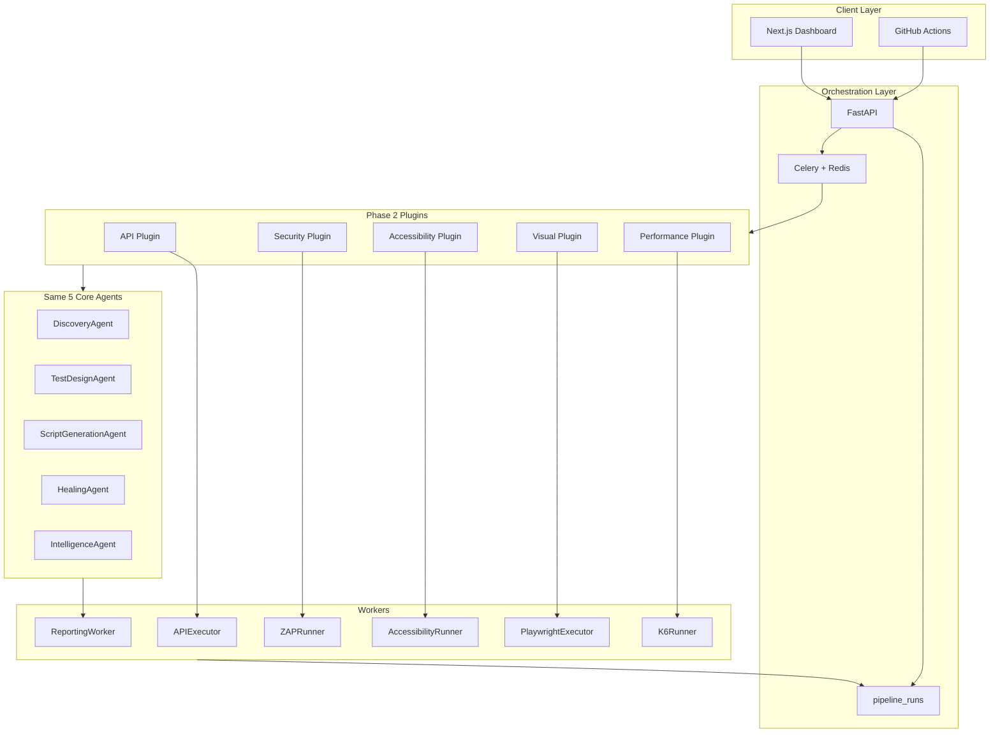
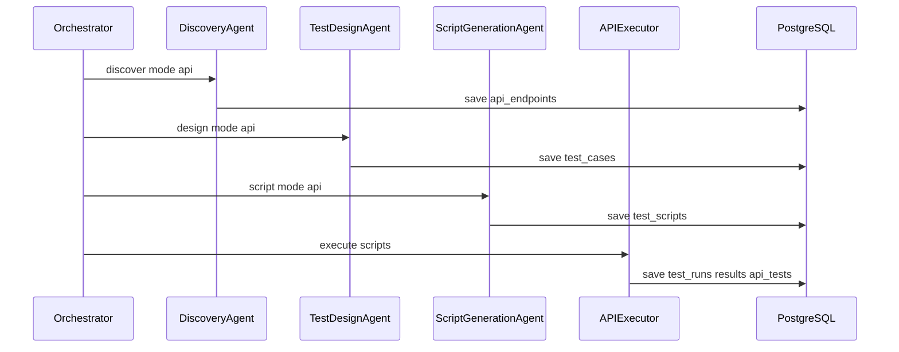

# Autonomous QA Platform — Phase 2 Specification

| Field | Value |
|-------|-------|
| **Version** | 1.0.0 |
| **Status** | Phase 2 Blueprint (Extended Testing) |
| **Parent spec** | [SPEC.md](./SPEC.md) v2.2.1 |
| **Duration** | Months 4–6 |
| **Prerequisite** | Phase 1 MVP complete ([SPEC.md §26](./SPEC.md#phase-1--core-automation-weeks-112-mvp)) |
| **Last updated** | 2026-06-15 |

---

## Table of Contents

1. [Executive Summary](#1-executive-summary)
2. [Prerequisites & Dependencies](#2-prerequisites--dependencies)
3. [Goals & Definition of Done](#3-goals--definition-of-done)
4. [Architecture](#4-architecture)
5. [Plugin Specifications](#5-plugin-specifications)
6. [Agent Mode Matrix (Phase 2)](#6-agent-mode-matrix-phase-2)
7. [Workers](#7-workers)
8. [Data Model](#8-data-model)
9. [API Specification](#9-api-specification)
10. [Validation Requirements](#10-validation-requirements)
11. [Execution & Artifacts](#11-execution--artifacts)
12. [Dashboard & Metrics](#12-dashboard--metrics)
13. [Infrastructure & Docker](#13-infrastructure--docker)
14. [Environment Variables](#14-environment-variables)
15. [Cost Controls](#15-cost-controls)
16. [Delivery Plan (Months 4–6)](#16-delivery-plan-months-46)
17. [Risks & Mitigations](#17-risks--mitigations)
18. [Implementation Checklist & References](#18-implementation-checklist--references)

---

## 1. Executive Summary

Phase 2 extends the Phase 1 **UI functional testing MVP** with **five additional testing plugins**:

| Plugin | Testing type | Primary tool |
|--------|--------------|--------------|
| **API** | Functional API / HTTP | Playwright `request` / HTTP client |
| **Security** | Dynamic application security (DAST) | OWASP ZAP |
| **Accessibility** | WCAG compliance | axe-core |
| **Visual** | Screenshot regression | Playwright snapshots |
| **Performance** | Load / stress | Grafana k6 |

**Architecture principle (unchanged from Phase 1):** Phase 2 adds **agent modes** and **workers** — it does **not** introduce new LLM agent classes. The same **5 core AI agents** (`DiscoveryAgent`, `TestDesignAgent`, `ScriptGenerationAgent`, `IntelligenceAgent`, `HealingAgent`) serve all plugins.

**Orchestration:** Clients trigger multi-plugin runs via:

```http
POST /api/v1/apps/:appId/pipeline
```

with a `plugins` array (e.g. `["ui", "api", "security", "performance"]`). Results persist to shared Phase 1 tables (`pipeline_runs`, `test_runs`, `results`, `artifacts`) plus new Phase 2 tables defined in §8.

**Job queue:** Celery + Redis with existing queues (`discover`, `design`, `generate-scripts`, `execute`, `analyze`, `report`) — see [packages/shared/src/queue/names.ts](../packages/shared/src/queue/names.ts).

---

## 2. Prerequisites & Dependencies

Phase 2 **must not begin** until Phase 1 success criteria ([SPEC.md §26](./SPEC.md#phase-1--core-automation-weeks-112-mvp)) are met:

| Prerequisite | Verification |
|--------------|--------------|
| UI pipeline end-to-end | `POST /pipeline` with `plugins: ["ui"]` completes all stages |
| 5 core agent shells | LangGraph-ready packages under `packages/agents/` |
| ValidationModule | JSON Schema + TypeScript + Playwright syntax gates ([SPEC.md §13](./SPEC.md#13-ai-validation-requirements)) |
| Celery orchestration | 6 tasks registered; API can enqueue jobs ([SPEC.md §19](./SPEC.md#19-orchestration-workflow)) |
| Shared DB tables | `applications`, `pages`, `elements`, `flows`, `test_cases`, `test_scripts`, `test_runs`, `results`, `pipeline_runs`, `artifacts` |
| PlaywrightExecutor | Real browser runs with traces, videos, retry policy ([SPEC.md §18](./SPEC.md#18-execution-reliability)) |
| ReportingWorker | Allure reports generated and stored |
| Dashboard MVP | App registration, pipeline progress (SSE), run history |

**Phase 1 metrics baseline:** Flow coverage ≥ 80%, flakiness < 5%, pass rate ≥ 90% on benchmark app (Juice Shop).

---

## 3. Goals & Definition of Done

### 3.1 Phase-Level Goals

- Enable **API, Security, Accessibility, Visual, and Performance** testing via plugin configuration
- Support **multi-plugin pipelines** with sequential plugin execution
- Persist plugin-specific results in dedicated Phase 2 tables while reusing shared orchestration tables
- Extend dashboard with plugin-specific views and **trend charts** (historical run comparison)
- Enable **Prometheus alerting** for failed runs and queue depth ([SPEC.md §22.3](./SPEC.md#223-alerting-phase-2))
- Apply **model tiering** for LLM cost optimization ([SPEC.md §32.3](./SPEC.md#323-cost-optimization-strategies))

### 3.2 Phase-Level Definition of Done

Phase 2 is **Done** when:

- [ ] All 5 Phase 2 plugins runnable via `POST /api/v1/apps/:id/pipeline`
- [ ] Multi-plugin run (`plugins: ["ui","api","security"]`) completes with aggregated report
- [ ] Phase 2 schema migrated (§8) with indexes applied
- [ ] Plugin-specific dashboard routes operational
- [ ] Trend charts display 30-day history per metric
- [ ] Prometheus alert rules deployed for `aqa_failed_runs_total` spike and `aqa_queue_depth`
- [ ] Integration test passes on Juice Shop (UI + API + security scan on staging URL)
- [ ] No credentials exposed in any Phase 2 artifact or API response

### 3.3 Per-Plugin Definition of Done

#### API Plugin — Done when

- [ ] `DiscoveryAgent` (`mode: api`) discovers endpoints from network traffic and/or OpenAPI
- [ ] Endpoints persisted to `api_endpoints` with method, path, schemas
- [ ] `TestDesignAgent` (`mode: api`) generates HTTP test scenarios
- [ ] `ScriptGenerationAgent` (`mode: api`) produces validated Playwright `request` or HTTP client scripts
- [ ] `APIExecutor` runs scripts; results in `test_runs`, `results`, `api_tests`
- [ ] Request/response logs stored as artifacts (`artifacts/api-logs/`)

#### Security Plugin — Done when

- [ ] `TestDesignAgent` (`mode: security`) generates DAST scan scenarios (OWASP Top 10 coverage)
- [ ] `ZAPRunner` completes scan against in-scope URLs only
- [ ] Findings persisted to `security_scans` with risk summary
- [ ] ZAP HTML/JSON report stored (`artifacts/security-reports/`)
- [ ] No credentials or session tokens in scan reports (masked per [SPEC.md §23](./SPEC.md#23-security-requirements))

#### Accessibility Plugin — Done when

- [ ] `TestDesignAgent` (`mode: a11y`) generates WCAG check scenarios per discovered page
- [ ] `ScriptGenerationAgent` (`mode: a11y`) produces axe-core injection scripts
- [ ] `AccessibilityRunner` executes audits on all in-scope pages
- [ ] Violations persisted to `a11y_results` with impact summary
- [ ] axe JSON reports stored (`artifacts/a11y-reports/`)

#### Visual Plugin — Done when

- [ ] `TestDesignAgent` (`mode: visual`) generates baseline comparison scenarios
- [ ] `ScriptGenerationAgent` (`mode: visual`) produces Playwright snapshot scripts
- [ ] `PlaywrightExecutor` (visual mode) captures baselines and runs diffs
- [ ] Baselines persisted to `visual_baselines`; regressions flagged when diff exceeds threshold
- [ ] Baseline and diff PNGs stored (`artifacts/visual/`)

#### Performance Plugin — Done when

- [ ] `TestDesignAgent` (`mode: performance`) generates load/stress scenario definitions
- [ ] `ScriptGenerationAgent` (`mode: k6`) produces validated k6 JavaScript scripts
- [ ] `K6Runner` executes load test within VU/duration caps
- [ ] Metrics persisted to `performance_runs` (p95 latency, error rate, thresholds)
- [ ] k6 summary JSON stored (`artifacts/performance-reports/`)

---

## 4. Architecture

### 4.1 High-Level Overview



### 4.2 Multi-Plugin Pipeline

Each enabled plugin runs the same agent chain with different **modes** and **workers**. `IntelligenceAgent` runs once after all plugin executions complete ([SPEC.md §19.2](./SPEC.md#192-full-platform-pipeline-multi-plugin)).

```
FOR EACH plugin IN pipeline.plugins:
  DiscoveryAgent(mode) → TestDesignAgent(mode) → ScriptGenerationAgent(mode) → Worker(plugin)

IntelligenceAgent(coverage) → ReportingWorker → Dashboard
```

**Orchestration contract:**

| Rule | Behavior |
|------|----------|
| Plugin order | Sequential, in array order |
| `continue_on_error: false` (default) | First plugin failure sets `pipeline_runs.status = failed` |
| `continue_on_error: true` | Log failure; continue remaining plugins; mark pipeline `completed` with warnings |
| Active pipeline guard | 409 Conflict if app has pending/running pipeline ([SPEC.md §16.3](./SPEC.md#163-post-apiv1appsappiddiscover)) |
| Stage tracking | `pipeline_runs.current_stage` updated per plugin + stage |

### 4.3 Celery Queues & Tasks

Phase 2 reuses Phase 1 queues — **no new queues required**. Plugin context is passed via task payload (`pluginId`, `mode`).

| Queue | Celery task | Used by (Phase 2) |
|-------|-------------|-------------------|
| `discover` | `aqa.tasks.discover` | API Plugin (api discovery) |
| `design` | `aqa.tasks.design` | All plugins (test/scenario design) |
| `generate-scripts` | `aqa.tasks.generate_scripts` | API, A11y, Visual, Performance |
| `execute` | `aqa.tasks.execute` | All executors (routed by `executorWorkerId` in payload) |
| `analyze` | `aqa.tasks.analyze` | IntelligenceAgent (coverage) |
| `report` | `aqa.tasks.report` | ReportingWorker (aggregated) |

Task names and routes are defined in:

- [packages/shared/src/celery/task-names.ts](../packages/shared/src/celery/task-names.ts)
- [workers/celery_app/aqa_celery/task_names.py](../workers/celery_app/aqa_celery/task_names.py)

**Execute task routing:** The `execute` queue consumer inspects `payload.executorWorkerId` (`api-executor`, `zap-runner`, `accessibility-runner`, `k6-runner`, `playwright-executor`) and delegates to the correct worker process.

### 4.4 Plugin Interface

Plugins implement `TestingPlugin` ([SPEC.md §8.4](./SPEC.md#84-plugin-architecture)):

```typescript
interface TestingPlugin {
  readonly id: 'api' | 'security' | 'accessibility' | 'visual' | 'performance';
  readonly phase: 2;

  discoverMode: DiscoverMode;
  designMode: DesignMode;
  scriptMode: ScriptMode;
  executorWorkerId: string;

  discover(ctx: DiscoverContext): Promise<DiscoverResult>;
  generate(ctx: GenerateContext): Promise<GenerateResult>;
  execute(ctx: ExecuteContext): Promise<ExecuteResult>;
  report(ctx: ReportContext): Promise<ReportResult>;
}
```

Package paths: `packages/plugins/{api,security,accessibility,visual,performance}/`

---

## 5. Plugin Specifications

### 5.1 API Plugin

| Field | Value |
|-------|-------|
| **Plugin ID** | `api` |
| **Phase** | 2 |
| **Agent modes** | `discover:api`, `design:api`, `script:api` |
| **Worker** | `APIExecutor` (`workers/api-executor/`) |
| **Executor worker ID** | `api-executor` |

**Discovery input:**

- Application `base_url`, `seed_urls`, `auth_config`
- Optional OpenAPI spec URL or file path (`openapi_url` in `pipeline_runs.config`)
- Bearer token auth supported ([SPEC.md §15.7](./SPEC.md#157-authentication-strategy))

**Discovery process:**

1. `DiscoveryAgent` (`mode: api`) instructs `DiscoveryWorker` to intercept network traffic during UI crawl **or** parse OpenAPI 3.x document
2. Endpoints normalized: `{method, path, request_schema, response_schema}`
3. Persist to `api_endpoints`; link to `app_id`

**Generation output:**

- Test cases: HTTP scenarios with expected status, headers, body assertions
- Scripts: Playwright TypeScript using `request` API or native `fetch`

**Pipeline sequence:**



**Example pipeline config:**

```json
{
  "plugins": ["ui", "api"],
  "continue_on_error": false,
  "plugin_config": {
    "api": {
      "openapi_url": "https://api.example.com/openapi.json",
      "max_endpoints": 100,
      "auth_type": "bearer"
    }
  }
}
```

---

### 5.2 Security Plugin

| Field | Value |
|-------|-------|
| **Plugin ID** | `security` |
| **Phase** | 2 |
| **Agent modes** | `discover:api` (reuse), `design:security` |
| **Worker** | `ZAPRunner` (`workers/zap-runner/`) |
| **Executor worker ID** | `zap-runner` |

**Note:** Security plugin **reuses API discovery** — no separate discover stage. Endpoints from `api_endpoints` (or UI AppMap URLs) define scan scope.

**Design process:**

1. `TestDesignAgent` (`mode: security`) generates DAST scenarios mapped to OWASP Top 10
2. Scenarios include: injection points, auth bypass checks, misconfiguration probes

**Execution:**

1. `ZAPRunner` launches OWASP ZAP (Docker) against allowlisted domains only
2. Scan policies: `baseline` (passive + spider) or `full` (active scan — staging only)
3. Findings parsed to `security_scans.findings` JSONB

**Pipeline sequence:**

```
DiscoveryAgent(api) [if not already run]
  → TestDesignAgent(security)
  → ZAPRunner
  → ReportingWorker
```

**Example plugin config:**

```json
{
  "plugin_config": {
    "security": {
      "policy": "baseline",
      "max_duration_minutes": 30,
      "exclude_paths": ["/logout", "/admin/delete"]
    }
  }
}
```

---

### 5.3 Accessibility Plugin

| Field | Value |
|-------|-------|
| **Plugin ID** | `accessibility` |
| **Phase** | 2 |
| **Agent modes** | `design:a11y`, `script:a11y` |
| **Worker** | `AccessibilityRunner` (`workers/accessibility-runner/`) |
| **Executor worker ID** | `accessibility-runner` |

**Input:** AppMap pages from Phase 1 UI discovery (`pages` table).

**Design process:**

1. `TestDesignAgent` (`mode: a11y`) generates WCAG check scenarios per page
2. Configurable WCAG level: `A`, `AA` (default), `AAA`

**Generation:**

1. `ScriptGenerationAgent` (`mode: a11y`) produces Playwright scripts that inject axe-core and run audits

**Execution:**

1. `AccessibilityRunner` navigates to each page, runs axe, collects violations
2. Results in `a11y_results` with `impact_summary` (critical, serious, moderate, minor counts)

**Example plugin config:**

```json
{
  "plugin_config": {
    "accessibility": {
      "wcag_level": "AA",
      "rules": ["wcag2a", "wcag2aa"],
      "include_iframes": true
    }
  }
}
```

---

### 5.4 Visual Plugin

| Field | Value |
|-------|-------|
| **Plugin ID** | `visual` |
| **Phase** | 2 |
| **Agent modes** | `design:visual`, `script:visual` |
| **Worker** | `PlaywrightExecutor` (visual mode) — **reuses Phase 1 worker** |
| **Executor worker ID** | `playwright-executor` |

**Input:** AppMap pages + viewport configurations.

**Design process:**

1. `TestDesignAgent` (`mode: visual`) defines snapshot scenarios (full page, component regions)
2. Viewport presets: `desktop` (1920×1080), `tablet` (768×1024), `mobile` (375×667)

**Generation:**

1. `ScriptGenerationAgent` (`mode: visual`) produces Playwright `toHaveScreenshot()` scripts

**Execution:**

1. First run (or explicit baseline request): capture baseline → `visual_baselines`
2. Subsequent runs: pixel diff against approved baseline
3. Diff threshold configurable (`VISUAL_DIFF_THRESHOLD`, default `0.01`)

**Example plugin config:**

```json
{
  "plugin_config": {
    "visual": {
      "viewports": ["desktop", "mobile"],
      "diff_threshold": 0.01,
      "update_baselines": false
    }
  }
}
```

---

### 5.5 Performance Plugin

| Field | Value |
|-------|-------|
| **Plugin ID** | `performance` |
| **Phase** | 2 |
| **Agent modes** | `design:performance`, `script:k6` |
| **Worker** | `K6Runner` (`workers/k6-runner/`) |
| **Executor worker ID** | `k6-runner` |

**Input:** Critical user flows from AppMap + optional API endpoints for load targets.

**Design process:**

1. `TestDesignAgent` (`mode: performance`) defines load scenarios (VUs, duration, ramp-up, thresholds)

**Generation:**

1. `ScriptGenerationAgent` (`mode: k6`) produces k6 JavaScript scripts

**Execution:**

1. `K6Runner` runs k6 in Docker with enforced caps:
   - Max VUs: `100` (configurable, hard cap `500`)
   - Max duration: `10m` (configurable, hard cap `30m`)
2. Metrics: p50/p95/p99 latency, error rate, requests/sec → `performance_runs`

**Example plugin config:**

```json
{
  "plugin_config": {
    "performance": {
      "vus": 50,
      "duration": "5m",
      "thresholds": {
        "p95_latency_ms": 500,
        "error_rate": 0.01
      }
    }
  }
}
```

---

## 6. Agent Mode Matrix (Phase 2)

Phase 2 modes only — Phase 3 modes (`requirements`, `analyze`, `defect`, `locator`, `retry`) excluded.

### DiscoveryAgent

| Mode | Plugin | Output |
|------|--------|--------|
| `ui` | UI (Phase 1) | Pages, elements, flows, screenshots |
| `api` | API, Security | Endpoints, methods, schemas (network + OpenAPI) |

### TestDesignAgent

| Mode | Plugin | Output |
|------|--------|--------|
| `functional` | UI (Phase 1) | Smoke, regression, CRUD, boundary tests |
| `api` | API | HTTP test scenarios, schema assertions |
| `security` | Security | DAST scan scenarios, OWASP Top 10 coverage |
| `a11y` | Accessibility | WCAG check scenarios per page |
| `visual` | Visual | Baseline comparison scenarios |
| `performance` | Performance | Load/stress scenario definitions |

### ScriptGenerationAgent

| Mode | Plugin | Output |
|------|--------|--------|
| `playwright` | UI (Phase 1) | Playwright TypeScript |
| `api` | API | Playwright `request` or HTTP client scripts |
| `a11y` | Accessibility | axe-core injection scripts |
| `visual` | Visual | Playwright snapshot scripts |
| `k6` | Performance | k6 JavaScript |

### IntelligenceAgent

| Mode | Phase | Output |
|------|-------|--------|
| `coverage` | Phase 1 (stub) | Coverage metrics, no LLM — used after all plugins complete |

### HealingAgent

| Mode | Phase | Output |
|------|-------|--------|
| `codegen` | Phase 1 | Repaired script after validation failure |

Prompt templates per mode: `packages/shared/src/prompts/{agent}/{mode}.v1.txt`

---

## 7. Workers

All Phase 2 workers are **deterministic** (no LLM). They consume the `execute` Celery queue via `executorWorkerId` routing.

### 7.1 APIExecutor

| Field | Value |
|-------|-------|
| **Package** | `workers/api-executor/` |
| **Tool** | Playwright `request` API (Node.js) |
| **Docker** | `mcr.microsoft.com/playwright:v1.x-jammy` |
| **Compose service** | `worker-api` |

**Input contract:**

```typescript
interface APIExecutePayload {
  pipelineRunId: string;
  applicationId: string;
  scriptIds: string[];
  parallelism: number;
  captureHar: boolean;
}
```

**Output contract:**

- Writes `test_runs`, `results`, `api_tests`
- Artifacts: HAR files, request/response logs → `artifacts/api-logs/{run_id}/`
- Updates `test_runs.summary` with pass/fail counts

**Retry policy:** Inherit [SPEC.md §18.1](./SPEC.md#181-retry-policy) — retry once on timeout/network failure.

---

### 7.2 ZAPRunner

| Field | Value |
|-------|-------|
| **Package** | `workers/zap-runner/` |
| **Tool** | OWASP ZAP API |
| **Docker** | `ghcr.io/zaproxy/zaproxy:stable` |
| **Compose service** | `worker-zap`, `zap` (daemon) |

**Input contract:**

```typescript
interface ZAPScanPayload {
  pipelineRunId: string;
  applicationId: string;
  targetUrls: string[];
  policy: 'baseline' | 'full';
  maxDurationMinutes: number;
}
```

**Output contract:**

- Writes `security_scans` with `findings`, `risk_summary`
- Artifacts: ZAP HTML + JSON report → `artifacts/security-reports/{scan_id}/`

**Security constraints:**

- Scan scope limited to `crawl_config.allowed_domains`
- `policy: full` requires `plugin_config.security.allow_active_scan: true`
- SSRF rules from [SPEC.md §23.3](./SPEC.md#233-network-security) enforced before scan start

---

### 7.3 AccessibilityRunner

| Field | Value |
|-------|-------|
| **Package** | `workers/accessibility-runner/` |
| **Tool** | `@axe-core/playwright` |
| **Docker** | `mcr.microsoft.com/playwright:v1.x-jammy` |
| **Compose service** | `worker-a11y` |

**Input contract:**

```typescript
interface A11yExecutePayload {
  pipelineRunId: string;
  applicationId: string;
  pageIds: string[];
  wcagLevel: 'A' | 'AA' | 'AAA';
  rules: string[];
}
```

**Output contract:**

- Writes `a11y_results` per page
- Artifacts: axe JSON → `artifacts/a11y-reports/{run_id}/`

---

### 7.4 K6Runner

| Field | Value |
|-------|-------|
| **Package** | `workers/k6-runner/` |
| **Tool** | Grafana k6 |
| **Docker** | `grafana/k6:latest` |
| **Compose service** | `worker-k6` |

**Input contract:**

```typescript
interface K6ExecutePayload {
  pipelineRunId: string;
  applicationId: string;
  scriptId: string;
  vus: number;
  duration: string;
  thresholds: Record<string, number>;
}
```

**Output contract:**

- Writes `performance_runs` with latency percentiles, error rate
- Artifacts: k6 summary JSON → `artifacts/performance-reports/{run_id}/`

**Platform limits (enforced):**

| Limit | Default | Hard cap |
|-------|---------|----------|
| VUs | 50 | 500 |
| Duration | 5m | 30m |

---

### 7.5 PlaywrightExecutor (Visual Mode)

Reuses Phase 1 `workers/playwright-executor/` with `mode: visual` in payload.

Additional behavior:

- Captures full-page PNG snapshots
- Compares against `visual_baselines` approved version
- Stores diff images when threshold exceeded

---

## 8. Data Model

Phase 2 extends Phase 1 schema. Full definitions below replace the summary in [SPEC.md §14.3](./SPEC.md#143-phase-2-schema-extensions).

### 8.1 New Enums

```prisma
enum ApiEndpointSource {
  network
  openapi
  manual
}

enum SecurityScanPolicy {
  baseline
  full
}

enum SecurityScanStatus {
  pending
  running
  completed
  failed
  cancelled
}

enum WcagLevel {
  A
  AA
  AAA
}

enum PerformanceRunStatus {
  pending
  running
  passed
  failed
  threshold_breached
}

enum VisualBaselineStatus {
  draft
  approved
  superseded
}
```

### 8.2 Extended ArtifactType Enum

Add to existing `ArtifactType` enum in `packages/aqa_shared/aqa_shared/db/models.py` (via Alembic migration):

```
api_log
zap_report
a11y_report
k6_report
visual_baseline
visual_diff
```

### 8.3 Table: `api_endpoints`

| Column | Type | Description |
|--------|------|-------------|
| `endpoint_id` | UUID PK | Unique endpoint identifier |
| `app_id` | UUID FK → `applications` | Parent application |
| `method` | VARCHAR(16) | HTTP method (GET, POST, PUT, PATCH, DELETE, …) |
| `path` | TEXT | URL path template (e.g. `/api/v1/users/{id}`) |
| `base_url` | TEXT | Base URL for this endpoint |
| `request_schema` | JSONB | OpenAPI/inferred request body schema |
| `response_schema` | JSONB | OpenAPI/inferred response schema |
| `auth_required` | BOOLEAN | Whether endpoint requires authentication |
| `discovered_at` | TIMESTAMPTZ | Discovery timestamp |
| `source` | ENUM | `network`, `openapi`, `manual` |
| `pipeline_run_id` | UUID FK (nullable) | Discovery batch linkage |

**Indexes:**

```sql
CREATE UNIQUE INDEX idx_api_endpoints_app_method_path ON api_endpoints (app_id, method, path);
CREATE INDEX idx_api_endpoints_app_id ON api_endpoints (app_id);
CREATE INDEX idx_api_endpoints_source ON api_endpoints (app_id, source);
```

---

### 8.4 Table: `api_tests`

| Column | Type | Description |
|--------|------|-------------|
| `api_test_id` | UUID PK | Unique API test metadata record |
| `testcase_id` | UUID FK → `test_cases` | Linked test case |
| `script_id` | UUID FK → `test_scripts` | Linked script |
| `endpoint_id` | UUID FK → `api_endpoints` | Target endpoint |
| `expected_status` | INT | Expected HTTP status code |
| `expected_headers` | JSONB | Header assertions |
| `expected_body_schema` | JSONB | JSON Schema for response body |
| `request_body_template` | JSONB | Template for request payload |

**Indexes:**

```sql
CREATE INDEX idx_api_tests_endpoint ON api_tests (endpoint_id);
CREATE INDEX idx_api_tests_testcase ON api_tests (testcase_id);
```

---

### 8.5 Table: `security_scans`

| Column | Type | Description |
|--------|------|-------------|
| `scan_id` | UUID PK | Unique scan identifier |
| `app_id` | UUID FK → `applications` | Target application |
| `pipeline_run_id` | UUID FK → `pipeline_runs` | Orchestration linkage |
| `tool` | VARCHAR(32) | `zap` (extensible) |
| `policy` | ENUM | `baseline`, `full` |
| `status` | ENUM | `pending`, `running`, `completed`, `failed`, `cancelled` |
| `findings` | JSONB | Array of `{ rule, risk, url, evidence, cwe_id }` |
| `risk_summary` | JSONB | `{ high, medium, low, informational }` counts |
| `started_at` | TIMESTAMPTZ | Scan start |
| `ended_at` | TIMESTAMPTZ | Scan end |
| `error_message` | TEXT | Failure reason (credentials masked) |

**Indexes:**

```sql
CREATE INDEX idx_security_scans_app ON security_scans (app_id, started_at DESC);
CREATE INDEX idx_security_scans_pipeline ON security_scans (pipeline_run_id);
CREATE INDEX idx_security_scans_status ON security_scans (app_id, status);
```

---

### 8.6 Table: `performance_runs`

| Column | Type | Description |
|--------|------|-------------|
| `perf_run_id` | UUID PK | Unique performance run identifier |
| `app_id` | UUID FK → `applications` | Target application |
| `pipeline_run_id` | UUID FK → `pipeline_runs` | Orchestration linkage |
| `script_id` | UUID FK → `test_scripts` | Executed k6 script |
| `test_run_id` | UUID FK (nullable) → `test_runs` | Optional link to shared run table |
| `status` | ENUM | `pending`, `running`, `passed`, `failed`, `threshold_breached` |
| `vus` | INT | Virtual users configured |
| `duration_seconds` | INT | Test duration |
| `p50_latency_ms` | INT | 50th percentile latency |
| `p95_latency_ms` | INT | 95th percentile latency |
| `p99_latency_ms` | INT | 99th percentile latency |
| `error_rate` | DECIMAL(7,6) | Error rate 0.0–1.0 |
| `requests_per_sec` | DECIMAL(10,2) | Throughput |
| `thresholds` | JSONB | Configured thresholds |
| `threshold_results` | JSONB | Pass/fail per threshold |
| `raw_metrics` | JSONB | Full k6 summary output |
| `started_at` | TIMESTAMPTZ | Run start |
| `ended_at` | TIMESTAMPTZ | Run end |

**Indexes:**

```sql
CREATE INDEX idx_performance_runs_app ON performance_runs (app_id, started_at DESC);
CREATE INDEX idx_performance_runs_pipeline ON performance_runs (pipeline_run_id);
CREATE INDEX idx_performance_runs_status ON performance_runs (app_id, status);
```

---

### 8.7 Table: `a11y_results`

| Column | Type | Description |
|--------|------|-------------|
| `a11y_result_id` | UUID PK | Unique result identifier |
| `page_id` | UUID FK → `pages` | Audited page |
| `run_id` | UUID FK → `test_runs` | Parent test run |
| `pipeline_run_id` | UUID FK (nullable) | Pipeline linkage |
| `wcag_level` | ENUM | `A`, `AA`, `AAA` |
| `violations` | JSONB | axe violation objects |
| `passes` | JSONB | axe pass objects |
| `incomplete` | JSONB | axe incomplete rules |
| `impact_summary` | JSONB | `{ critical, serious, moderate, minor }` counts |
| `created_at` | TIMESTAMPTZ | Audit timestamp |

**Indexes:**

```sql
CREATE INDEX idx_a11y_results_page ON a11y_results (page_id);
CREATE INDEX idx_a11y_results_run ON a11y_results (run_id);
CREATE INDEX idx_a11y_results_impact ON a11y_results (run_id) WHERE (impact_summary->>'critical')::int > 0;
```

---

### 8.8 Table: `visual_baselines`

| Column | Type | Description |
|--------|------|-------------|
| `baseline_id` | UUID PK | Unique baseline identifier |
| `page_id` | UUID FK → `pages` | Target page |
| `app_id` | UUID FK → `applications` | Parent application |
| `viewport` | VARCHAR(32) | `desktop`, `tablet`, `mobile`, or custom `WxH` |
| `screenshot_path` | TEXT | Path under `artifacts/visual/` |
| `version` | INT | Incremented on re-baseline |
| `status` | ENUM | `draft`, `approved`, `superseded` |
| `diff_threshold` | DECIMAL(5,4) | Max allowed diff ratio (default 0.01) |
| `approved_at` | TIMESTAMPTZ | When baseline was approved |
| `approved_by` | VARCHAR(128) | Approver identifier (Phase 4: user ID) |
| `pipeline_run_id` | UUID FK (nullable) | Creation pipeline run |
| `created_at` | TIMESTAMPTZ | Creation timestamp |

**Indexes:**

```sql
CREATE UNIQUE INDEX idx_visual_baselines_page_viewport_version ON visual_baselines (page_id, viewport, version);
CREATE INDEX idx_visual_baselines_app ON visual_baselines (app_id, status);
CREATE INDEX idx_visual_baselines_approved ON visual_baselines (app_id, viewport) WHERE status = 'approved';
```

---

### 8.9 Entity Relationships (Phase 2)

```
applications ──┬── api_endpoints ─── api_tests ─── test_cases / test_scripts
               ├── security_scans
               ├── performance_runs ─── test_scripts
               ├── a11y_results ─── pages
               └── visual_baselines ─── pages

pipeline_runs ──┬── security_scans
                ├── performance_runs
                └── (existing Phase 1 relations)

test_runs ─── a11y_results
artifacts ─── (all plugin report types)
```

---

## 9. API Specification

Base URL: `/api/v1` (inherits [SPEC.md §16](./SPEC.md#16-api-specification) conventions).

### 9.1 `POST /api/v1/apps/:appId/pipeline` (extended)

Triggers full or partial multi-plugin pipeline.

**Request:**

```json
{
  "plugins": ["ui", "api", "security", "accessibility", "visual", "performance"],
  "continue_on_error": false,
  "force": false,
  "plugin_config": {
    "api": {
      "openapi_url": "https://api.example.com/openapi.json",
      "max_endpoints": 100
    },
    "security": {
      "policy": "baseline",
      "max_duration_minutes": 30
    },
    "accessibility": {
      "wcag_level": "AA"
    },
    "visual": {
      "viewports": ["desktop", "mobile"],
      "diff_threshold": 0.01,
      "update_baselines": false
    },
    "performance": {
      "vus": 50,
      "duration": "5m",
      "thresholds": { "p95_latency_ms": 500, "error_rate": 0.01 }
    }
  }
}
```

**Response `202 Accepted`:**

```json
{
  "pipeline_run_id": "p1b2c3d4-e5f6-7890-abcd-ef1234567890",
  "application_id": "a1b2c3d4-e5f6-7890-abcd-ef1234567890",
  "status": "pending",
  "current_stage": "discover",
  "plugins": ["ui", "api", "security"],
  "started_at": "2026-06-15T10:00:00Z"
}
```

**Errors:** `409 Conflict` (active pipeline), `422` (missing AppMap for a11y/visual), `402` (LLM budget exceeded).

---

### 9.2 `GET /api/v1/apps/:appId/endpoints`

List discovered API endpoints.

**Response `200 OK`:**

```json
{
  "app_id": "a1b2c3d4-...",
  "endpoints": [
    {
      "endpoint_id": "e1b2c3d4-...",
      "method": "GET",
      "path": "/api/v1/products",
      "auth_required": false,
      "source": "openapi",
      "discovered_at": "2026-06-15T10:05:00Z"
    }
  ],
  "total": 42
}
```

---

### 9.3 `POST /api/v1/apps/:appId/openapi`

Register or update OpenAPI spec for API discovery.

**Request:**

```json
{
  "openapi_url": "https://api.example.com/openapi.json",
  "force_refresh": false
}
```

**Response `202 Accepted`:** Returns `pipeline_run_id` for async import.

---

### 9.4 `GET /api/v1/apps/:appId/security-scans`

**Query params:** `status`, `limit`, `offset`

**Response `200 OK`:**

```json
{
  "scans": [
    {
      "scan_id": "s1b2c3d4-...",
      "policy": "baseline",
      "status": "completed",
      "risk_summary": { "high": 2, "medium": 5, "low": 12, "informational": 8 },
      "started_at": "2026-06-15T11:00:00Z",
      "ended_at": "2026-06-15T11:25:00Z"
    }
  ]
}
```

---

### 9.5 `GET /api/v1/apps/:appId/performance-runs`

**Response `200 OK`:**

```json
{
  "runs": [
    {
      "perf_run_id": "pr1b2c3d4-...",
      "status": "passed",
      "vus": 50,
      "p95_latency_ms": 320,
      "error_rate": 0.002,
      "threshold_results": { "p95_latency_ms": "passed", "error_rate": "passed" }
    }
  ]
}
```

---

### 9.6 `GET /api/v1/apps/:appId/a11y-results`

**Query params:** `run_id`, `page_id`, `min_impact` (critical|serious|moderate|minor)

**Response `200 OK`:**

```json
{
  "results": [
    {
      "a11y_result_id": "ar1b2c3d4-...",
      "page_url": "https://app.example.com/checkout",
      "wcag_level": "AA",
      "impact_summary": { "critical": 0, "serious": 2, "moderate": 5, "minor": 12 }
    }
  ]
}
```

---

### 9.7 `GET /api/v1/apps/:appId/visual-baselines`

**Query params:** `viewport`, `status` (draft|approved|superseded)

---

### 9.8 `POST /api/v1/visual-baselines/:baselineId/approve`

Approve a visual baseline for diff comparison.

**Request:**

```json
{
  "approved_by": "qa-engineer@example.com"
}
```

**Response `200 OK`:**

```json
{
  "baseline_id": "vb1b2c3d4-...",
  "status": "approved",
  "approved_at": "2026-06-15T12:00:00Z"
}
```

---

### 9.9 Additional Phase 2 Endpoints

| Method | Endpoint | Purpose |
|--------|----------|---------|
| `GET` | `/apps/:appId/endpoints/:endpointId` | Endpoint detail + schemas |
| `GET` | `/security-scans/:scanId/findings` | Paginated findings drill-down |
| `GET` | `/performance-runs/:perfRunId/metrics` | Raw k6 metrics |
| `GET` | `/a11y-results/:a11yResultId/violations` | Violation detail |
| `GET` | `/visual-baselines/:baselineId/diff/:runId` | Diff image for run |

Error format: RFC 7807 Problem Details ([SPEC.md §16.1](./SPEC.md#161-standard-error-response)).

---

## 10. Validation Requirements

Extends [SPEC.md §13](./SPEC.md#13-ai-validation-requirements). All LLM output passes ValidationModule before persistence. Maximum **2 retries** (3 total attempts) via HealingAgent (`codegen` mode).

### 10.1 Shared Gates (all plugins)

| Check | Method |
|-------|--------|
| Test case structure | JSON Schema (`TestCaseSchema`) |
| Script syntax | `tsc --noEmit` or tool-specific linter |
| Execution plan | JSON Schema (`ExecutionPlanSchema`) |
| Domain scope | URLs within `crawl_config.allowed_domains` |

### 10.2 Plugin-Specific Validation

| Plugin | Additional validation |
|--------|----------------------|
| **API** | OpenAPI 3.x schema conformance; valid HTTP methods; `endpoint_id` references exist; response schema parseable |
| **Security** | ZAP policy file valid; scan URLs pass SSRF check; no scan of production without `allow_active_scan: true` |
| **Performance** | `k6 inspect` passes; VUs ≤ 500; duration ≤ 30m; thresholds numerically valid |
| **Accessibility** | axe rule IDs valid; WCAG level enum; page IDs exist in AppMap |
| **Visual** | Viewport dimensions match config; diff threshold 0.0–1.0; page IDs exist |

### 10.3 Validation Schemas (new)

| Schema | Path | Purpose |
|--------|------|---------|
| `APITestCaseSchema` | `packages/shared/src/validation/schemas/api-testcase.v1.json` | API test case structure |
| `SecurityScanPlanSchema` | `.../security-scan-plan.v1.json` | DAST scenario structure |
| `K6ScriptSchema` | `.../k6-script.v1.json` | k6 script metadata |
| `A11yTestCaseSchema` | `.../a11y-testcase.v1.json` | Accessibility scenario |
| `VisualTestCaseSchema` | `.../visual-testcase.v1.json` | Visual snapshot scenario |

---

## 11. Execution & Artifacts

### 11.1 Artifact Matrix

| Plugin | Artifact types | Storage path |
|--------|---------------|--------------|
| API | `api_log` | `artifacts/api-logs/{run_id}/` |
| Security | `zap_report` | `artifacts/security-reports/{scan_id}/` |
| Performance | `k6_report` | `artifacts/performance-reports/{run_id}/` |
| Accessibility | `a11y_report` | `artifacts/a11y-reports/{run_id}/` |
| Visual | `visual_baseline`, `visual_diff` | `artifacts/visual/{app_id}/{page_id}/` |

All artifacts registered in `artifacts` table with `pipeline_run_id` / `run_id` linkage.

### 11.2 Authentication (API Plugin)

Phase 2 adds bearer token support ([SPEC.md §15.7](./SPEC.md#157-authentication-strategy)):

```json
{
  "auth_config": {
    "type": "bearer",
    "token_secret_ref": "API_BEARER_TOKEN"
  }
}
```

Token resolved at worker runtime from environment — never stored in DB or logs.

### 11.3 Retry Policies

| Plugin | Timeout / network | Assertion / finding failure |
|--------|-------------------|----------------------------|
| API | Retry once (2s backoff) — [SPEC.md §18.1](./SPEC.md#181-retry-policy) | No retry; record failed result |
| Security | Retry ZAP connection once | N/A — findings recorded |
| Performance | Retry k6 start once | Threshold breach → `threshold_breached` status |
| Accessibility | Retry page load once | Violations recorded (not retried) |
| Visual | Retry snapshot once on network idle timeout | Diff failure recorded |

---

## 12. Dashboard & Metrics

### 12.1 New Routes

| Route | Purpose |
|-------|---------|
| `/apps/[id]/api` | API endpoints graph, test coverage |
| `/apps/[id]/security` | Scan history, findings by severity |
| `/apps/[id]/performance` | Load test charts, threshold trends |
| `/apps/[id]/a11y` | Violations by page, WCAG summary |
| `/apps/[id]/visual` | Baseline gallery, diff viewer |

### 12.2 New UI Components

| Component | Purpose |
|-----------|---------|
| `APIEndpointsTable` | Sortable endpoint list with method badges |
| `SecurityFindingsTable` | Filterable findings by risk level |
| `PerformanceChart` | p95 latency + error rate over time |
| `A11yViolationsList` | Grouped by impact; link to page |
| `VisualDiffViewer` | Side-by-side baseline vs current |
| `AppMapDiff` | Compare last two AppMap artifacts ([SPEC.md §33.2](./SPEC.md#332-entity-versioning-rules)) |
| `PluginPipelineLauncher` | Multi-select plugins + per-plugin config |
| `TrendChartPanel` | 30-day rolling metrics |

### 12.3 Phase 2 Metrics

Extends [SPEC.md §20](./SPEC.md#20-dashboard-metrics):

| Metric | Definition | Target |
|--------|------------|--------|
| **API Endpoint Coverage** | Endpoints with ≥1 test / total endpoints | ≥ 70% |
| **Security Risk Score** | Weighted sum of open findings by severity | Trend down |
| **Performance p95** | Latest k6 p95 latency vs threshold | Below threshold |
| **A11y Violation Rate** | Critical+serious violations / pages audited | < 5 per page avg |
| **Visual Regression Rate** | Failed diffs / total snapshots | < 2% |

### 12.4 Prometheus Metrics (new)

| Metric Name | Type | Description |
|-------------|------|-------------|
| `aqa_api_tests_total` | Counter | API tests executed by outcome |
| `aqa_api_endpoints_discovered` | Gauge | Endpoints per app |
| `aqa_security_findings_total` | Counter | Findings by severity label |
| `aqa_k6_p95_latency_ms` | Gauge | Latest p95 per app |
| `aqa_k6_error_rate` | Gauge | Latest error rate per app |
| `aqa_a11y_violations_total` | Counter | Violations by impact label |
| `aqa_visual_diffs_failed_total` | Counter | Failed visual comparisons |

### 12.5 Alerting ([SPEC.md §22.3](./SPEC.md#223-alerting-phase-2))

Prometheus alert rules (Phase 2):

```yaml
- alert: AQAFailedRunsSpike
  expr: increase(aqa_failed_runs_total[1h]) > 5
  for: 5m

- alert: AQAQueueDepthHigh
  expr: aqa_queue_depth > 50
  for: 10m

- alert: AQASecurityHighFindings
  expr: increase(aqa_security_findings_total{severity="high"}[1h]) > 0
  for: 0m
```

---

## 13. Infrastructure & Docker

### 13.0 Local development vs Docker (Phase 1 vs Phase 2)

| Environment | PostgreSQL | Redis | Docker Compose file |
|-------------|------------|-------|---------------------|
| **Phase 1 local dev** | Native (e.g. Homebrew PG 17) | **Native local Redis** on `localhost:6379` | `docker/docker-compose.yml` (empty stub — no services) |
| **Phase 2 / CI full stack** | Docker `postgres:15-alpine` | Docker `redis:7-alpine` | `docker/docker-compose.full.yml` |

Phase 1 developers run Redis on the host (`brew services start redis` or an existing install). Docker Redis is **not** used for day-to-day Phase 1 work.

**Verify local Redis:**

```bash
redis-cli ping   # PONG
# .env
REDIS_URL=redis://localhost:6379
CELERY_BROKER_URL=redis://localhost:6379/0
```

### 13.1 Docker Compose Services (Phase 2 additions)

Extends [SPEC.md §25.2](./SPEC.md#252-docker-compose-services-mvp) and `docker/docker-compose.full.yml`:

| Service | Image / Build | Ports | Purpose |
|---------|---------------|-------|---------|
| `zap` | `ghcr.io/zaproxy/zaproxy:stable` | 8080 | ZAP daemon for security scans |
| `worker-api` | build `workers/api-executor` | — | API test execution |
| `worker-zap` | build `workers/zap-runner` | — | ZAP scan orchestration |
| `worker-a11y` | build `workers/accessibility-runner` | — | axe-core audits |
| `worker-k6` | build `workers/k6-runner` | — | Load test execution |

Existing Phase 1 services in **`docker/docker-compose.full.yml`** (`postgres`, `redis`, `api`, `worker-celery`, `web`) — used for CI and integration environments, not local Phase 1 dev.

### 13.2 Network Isolation

| Service | Network | Notes |
|---------|---------|-------|
| `zap` | `scan-network` | Isolated from production; API access only via `ZAP_API_URL` |
| `worker-k6` | `default` | Rate-limited; target URL must pass SSRF check |
| All workers | `default` | Shared Redis/Postgres access |

### 13.3 Repository Structure (Phase 2 additions)

```
packages/plugins/
├── api/
├── security/
├── accessibility/
├── visual/
└── performance/

workers/
├── api-executor/
├── zap-runner/
├── accessibility-runner/
└── k6-runner/

artifacts/
├── api-logs/
├── security-reports/
├── performance-reports/
├── a11y-reports/
└── visual/

docker/
├── docker-compose.yml          # Phase 1 stub (native PG + native Redis for local dev)
├── docker-compose.full.yml     # Phase 2 / CI: postgres + redis + api + workers
├── zap/
└── k6/
```

---

## 14. Environment Variables

Phase 2 additions to [SPEC.md §29](./SPEC.md#29-environment-variables):

```env
# OWASP ZAP
ZAP_API_URL=http://zap:8080
ZAP_API_KEY=

# k6 (optional cloud)
K6_CLOUD_TOKEN=

# API discovery
OPENAPI_SPEC_PATH=              # optional default OpenAPI file path

# Visual testing
VISUAL_DIFF_THRESHOLD=0.01

# Accessibility
A11Y_WCAG_LEVEL=AA

# Performance limits
K6_MAX_VUS=500
K6_MAX_DURATION=30m

# Security
SECURITY_ALLOW_ACTIVE_SCAN=false
```

Existing Celery variables unchanged:

```env
REDIS_URL=redis://localhost:6379
CELERY_BROKER_URL=redis://localhost:6379/0
CELERY_RESULT_BACKEND=redis://localhost:6379/0
```

---

## 15. Cost Controls

Phase 2 applies **model tiering** from [SPEC.md §32.3](./SPEC.md#323-cost-optimization-strategies):

| Agent call | Model | Rationale |
|------------|-------|-----------|
| TestDesignAgent (all Phase 2 modes) | `gpt-4o-mini` | Structured scenario planning |
| ScriptGenerationAgent (api, a11y, visual, k6) | `gpt-4o` | Code generation quality |
| DiscoveryAgent (api mode) | `gpt-4o-mini` | Endpoint structuring |
| HealingAgent (codegen) | `gpt-4o` | Script repair |

**Per-plugin budget guidance** (within `LLM_BUDGET_PER_PIPELINE`):

| Plugin | Est. tokens per run | Notes |
|--------|---------------------|-------|
| API | 15,000–40,000 | Scales with endpoint count |
| Security | 5,000–10,000 | Design only; ZAP has no LLM cost |
| Accessibility | 10,000–25,000 | Scales with page count |
| Visual | 8,000–15,000 | Scales with viewport count |
| Performance | 10,000–20,000 | k6 script generation |

**AppMap cache:** API discovery hash includes endpoint list — skip regeneration when unchanged ([SPEC.md §32.4](./SPEC.md#324-appmap-cache-key)).

---

## 16. Delivery Plan (Months 4–6)

### Month 4 — API Plugin

| Week | Deliverable |
|------|-------------|
| 1 | Alembic migration: `api_endpoints`, `api_tests`; `APIEndpointSource` enum |
| 2 | `DiscoveryAgent` api mode + OpenAPI parser; `packages/plugins/api/` |
| 3 | `TestDesignAgent` + `ScriptGenerationAgent` api modes; validation schemas |
| 4 | `APIExecutor` worker; `GET /apps/:id/endpoints`; dashboard API tab |

**Exit criteria:** Juice Shop API endpoints discovered; 10+ API tests generated and executed; results in dashboard.

### Month 5 — Security + Accessibility

| Week | Deliverable |
|------|-------------|
| 1 | Alembic migration: `security_scans`; ZAP Docker service |
| 2 | `ZAPRunner` worker; `packages/plugins/security/` |
| 3 | Alembic migration: `a11y_results`; `AccessibilityRunner` worker |
| 4 | `packages/plugins/accessibility/`; dashboard security + a11y tabs |

**Exit criteria:** Baseline ZAP scan on staging Juice Shop; axe audit on all discovered pages; findings visible in dashboard.

### Month 6 — Visual + Performance + Integration

| Week | Deliverable |
|------|-------------|
| 1 | Alembic migration: `visual_baselines`, `performance_runs` |
| 2 | Visual plugin + PlaywrightExecutor visual mode; baseline approval API |
| 3 | Performance plugin + `K6Runner`; k6 validation |
| 4 | Multi-plugin pipeline; trend charts; Prometheus alerting; CI workflow update |

**Exit criteria:** Full pipeline `plugins: ["ui","api","security","a11y","visual","performance"]` completes on benchmark app; 30-day trend charts operational.

---

## 17. Risks & Mitigations

| Risk | Impact | Mitigation |
|------|--------|------------|
| ZAP scans production | Outage, data corruption | Domain allowlist; `SECURITY_ALLOW_ACTIVE_SCAN=false` default; staging-only docs |
| k6 overloads target | DDoS-like load on app under test | VU/duration hard caps; require explicit approval for >100 VUs |
| OpenAPI spec drift | Stale API tests | Re-discover on `config_version` change; OpenAPI hash in pipeline config |
| False-positive security findings | Alert fatigue | Severity filtering; human triage UI; suppress known false positives |
| Visual test flakiness | Unreliable regressions | Configurable diff threshold; wait for network idle; retry once |
| axe rule changes between versions | Inconsistent a11y results | Pin `@axe-core/playwright` version in worker |
| LLM cost spike (multi-plugin) | Budget overrun | Model tiering; per-plugin token caps; skip unchanged AppMap/API maps |
| Credential leakage in ZAP/HAR | Security breach | Pino redaction; strip auth headers from artifacts; audit logging |
| Plugin failure blocks pipeline | Incomplete coverage | `continue_on_error: true` option; per-plugin status in report |

---

## 18. Implementation Checklist & References

### 18.1 Phase 2 Implementation Checklist

**Data layer**

- [ ] Alembic migration: Phase 2 enums + 6 tables (§8)
- [ ] Extended `ArtifactType` enum
- [ ] Phase 2 indexes applied
- [ ] `pnpm verify:db` updated for new tables

**Plugins**

- [ ] `packages/plugins/api/`
- [ ] `packages/plugins/security/`
- [ ] `packages/plugins/accessibility/`
- [ ] `packages/plugins/visual/`
- [ ] `packages/plugins/performance/`
- [ ] Plugin registry at API startup

**Agents (mode extensions only)**

- [ ] `DiscoveryAgent` api mode + prompts
- [ ] `TestDesignAgent` api, security, a11y, visual, performance modes + prompts
- [ ] `ScriptGenerationAgent` api, a11y, visual, k6 modes + prompts
- [ ] ValidationModule: 5 new JSON schemas (§10.3)

**Workers**

- [ ] `workers/api-executor/`
- [ ] `workers/zap-runner/`
- [ ] `workers/accessibility-runner/`
- [ ] `workers/k6-runner/`
- [ ] PlaywrightExecutor visual mode flag
- [ ] Execute queue router by `executorWorkerId`

**API**

- [ ] Extended `POST /pipeline` with `plugins[]` + `plugin_config`
- [ ] `GET /apps/:id/endpoints`
- [ ] `POST /apps/:id/openapi`
- [ ] `GET /apps/:id/security-scans`
- [ ] `GET /apps/:id/performance-runs`
- [ ] `GET /apps/:id/a11y-results`
- [ ] `GET /apps/:id/visual-baselines`
- [ ] `POST /visual-baselines/:id/approve`

**Dashboard**

- [ ] 5 new app sub-routes (§12.1)
- [ ] 8 new UI components (§12.2)
- [ ] Trend charts (30-day history)
- [ ] Multi-plugin pipeline launcher

**Infrastructure**

- [ ] Docker Compose: `zap`, `worker-api`, `worker-zap`, `worker-a11y`, `worker-k6`
- [ ] Artifact folders: `api-logs/`, `security-reports/`, etc.
- [ ] Phase 2 env vars documented in `.env.example`
- [ ] Prometheus metrics + alert rules (§12.4–12.5)

**CI / QA**

- [ ] GitHub Actions: multi-plugin workflow
- [ ] Juice Shop benchmark: UI + API + security integration test
- [ ] Phase 2 Definition of Done verified (§3)

### 18.2 Explicit Exclusions (Phase 3+)

Not in Phase 2 scope — see [SPEC.md §4](./SPEC.md#4-explicit-non-goals-mvp) and [SPEC.md §26 Phase 3](./SPEC.md#phase-3--intelligent-agents-months-7-12):

- IntelligenceAgent LLM modes (`analyze`, `defect`, `testdata`, `optimize`)
- HealingAgent runtime locator healing (`locator`, `retry` modes)
- Self-healing locators, defect intelligence, SAST/code analysis
- SSO, multi-tenancy, Kubernetes
- Bearer token is in Phase 2; OAuth flow remains Phase 2+ workaround only

### 18.3 Parent Spec Cross-References

| Topic | SPEC.md section |
|-------|-----------------|
| Plugin architecture | §8.4 |
| Phase 2 roadmap summary | §26 |
| Agent mode matrix (full) | §31.2 |
| Full platform worker stack | §31.4 |
| Multi-plugin pipeline | §19.2 |
| AI validation (base) | §13 |
| Security requirements | §23 |
| Cost controls (base) | §32 |
| Versioning / AppMap diff | §33.2 |
| Index strategy (base) | §34 |

### 18.4 Codebase Cross-References

| Asset | Path |
|-------|------|
| Celery queue names | [packages/shared/src/queue/names.ts](../packages/shared/src/queue/names.ts) |
| Celery task names + routes | [packages/shared/src/celery/task-names.ts](../packages/shared/src/celery/task-names.ts) |
| Python task sync | [workers/celery_app/aqa_celery/task_names.py](../workers/celery_app/aqa_celery/task_names.py) |
| Agent types | [packages/shared/src/types/agent.ts](../packages/shared/src/types/agent.ts) |
| Phase 1 schema | `packages/aqa_shared/aqa_shared/db/models.py` + `alembic/versions/` |
| Week 1–2 scaffold guide | [WEEK-01-02-SCAFFOLD-GUIDE.md](./WEEK-01-02-SCAFFOLD-GUIDE.md) |

---

*End of Phase 2 Specification v1.0.0*
