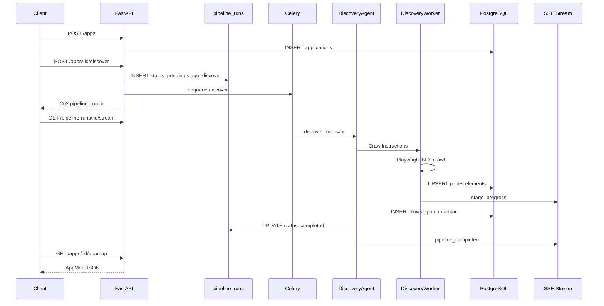

# Week 3–4 Scaffold Guide — Day-by-Day Implementation Playbook

| Field | Value |
|-------|-------|
| **Phase** | Phase 1, Weeks 3–4 |
| **Goal** | Real discovery pipeline: Application APIs, Playwright crawl, AppMap persistence, SSE progress |
| **Reference spec** | [SPEC.md](./SPEC.md) v2.3.0 — §15, §16, §17.1, §19, §23, §31 |
| **Prerequisite** | [WEEK-01-02-SCAFFOLD-GUIDE.md](./WEEK-01-02-SCAFFOLD-GUIDE.md) complete (Days 1–10) |
| **Status** | Planning document — **do not treat as completed work** |
| **Duration** | 10 working days (2 weeks) — **Days 11–20** |

---

## 1. What this sprint delivers

> **Stack (unchanged):** Python 3.11+, FastAPI, SQLAlchemy + Alembic, Celery + Redis, LangGraph agents, native PostgreSQL + native Redis for local dev.

By end of Day 20 you should have:

- **Application APIs** — register, list, and retrieve applications (SPEC §16.2, §16.7)
- **`POST /api/v1/apps/:appId/discover`** — creates `pipeline_runs`, enqueues `discover` task, returns `202`
- **`GET /api/v1/apps/:appId/appmap`** — pages, elements, flows as JSON graph
- **`GET /api/v1/pipeline-runs/:id`** + **`GET /api/v1/pipeline-runs/:id/stream`** — status + SSE live progress
- **DiscoveryWorker** — headless Playwright crawl (no LLM) with SPEC §15 crawl rules
- **DiscoveryAgent** (`mode: ui`) — structures crawl output into flows; persists AppMap to DB + artifact
- **Security basics** — `auth_config` encrypted at rest (§23.1), SSRF URL blocking (§23.3), credential audit log
- **Exit verification:** register Juice Shop → discover → AppMap in DB → SSE events → `pnpm verify:smoke-discovery`

**Explicitly NOT in this sprint:** Test generation (`generate-tests`), script generation, Playwright test execution, dashboard UI, LLM for TestDesign/ScriptGeneration (Week 5–6), API plugin (`mode: api`) — Phase 2.

---

## 2. Tooling reference (install before Day 11)

### 2.1 New tools (in addition to Week 1–2)

| Tool | Minimum version | Purpose | Install (macOS) | Official docs |
|------|-----------------|---------|-----------------|---------------|
| **Playwright** | 1.40+ | Headless browser crawl | `pnpm playwright:install` (see Day 15) | https://playwright.dev/python/ |
| **OpenAI SDK** | 1.x | DiscoveryAgent flow structuring (optional Day 19 stub-first) | `pip install openai` | https://platform.openai.com/docs |

Week 1–2 tools (Python, pnpm, Git, PostgreSQL, Redis) remain required — see [WEEK-01-02-SCAFFOLD-GUIDE.md §2](./WEEK-01-02-SCAFFOLD-GUIDE.md#2-tooling-reference-install-before-day-1).

### 2.2 Verify installations (run on Day 11)

```bash
python3 --version          # 3.11+
redis-cli ping             # PONG
pnpm verify:smoke          # Week 1–2 gate still passes
playwright --version       # after Day 15 install
```

### 2.3 New Python packages (add to `requirements.txt` during sprint)

| Package | Used in | Purpose |
|---------|---------|---------|
| `playwright` | `workers/discovery_worker` | Headless crawl (SPEC §17.1) |
| `openai` | `packages/agents` | DiscoveryAgent LLM (Day 19; stub-first OK) |
| `cryptography` | `packages/aqa_shared` | AES-256-GCM for `auth_config` (§23.1) |
| `httpx` | `workers/discovery_worker` | robots.txt fetch (optional) |
| `sse-starlette` | `apps/api` | SSE stream endpoint (or FastAPI `StreamingResponse`) |

### 2.4 Additional environment variables

Add to `.env.example` (some keys already present):

```env
# Encryption (required Week 3+)
ENCRYPTION_KEY=                          # 32-byte hex — generate: openssl rand -hex 32

# Target app credentials (referenced by auth_config.credentials_secret_ref)
JUICE_SHOP_TEST_USER={"email":"admin@juice-sh.op","password":"admin123"}

# Discovery defaults (override per-app via crawl_config)
CRAWL_MAX_DEPTH=5
CRAWL_MAX_PAGES=100
CRAWL_PAGE_TIMEOUT_MS=30000

# LLM (DiscoveryAgent flow structuring — Day 19)
OPENAI_API_KEY=
OPENAI_MODEL=gpt-4o-mini
```

---

## 3. Target folder structure (end of Day 20)

```
AI Autonomous QA Platform/
├── docs/
│   ├── SPEC.md
│   ├── WEEK-01-02-SCAFFOLD-GUIDE.md
│   └── WEEK-03-04-SCAFFOLD-GUIDE.md          # this document
├── apps/
│   └── api/
│       └── aqa_api/
│           ├── main.py
│           ├── config.py
│           ├── routers/
│           │   ├── health.py
│           │   ├── metrics.py
│           │   ├── queues.py
│           │   ├── apps.py                   # Day 11+
│           │   └── pipeline_runs.py          # Day 13–14
│           ├── schemas/
│           │   ├── apps.py                   # Pydantic request/response
│           │   ├── pipeline_runs.py
│           │   ├── appmap.py
│           │   └── errors.py                 # RFC 7807 Problem Details
│           └── services/
│               ├── celery_enqueue.py
│               ├── applications.py           # CRUD + sanitization
│               ├── pipeline_runs.py        # create, active check, stage updates
│               ├── sse.py                    # event broadcaster
│               └── discovery_orchestrator.py # discover endpoint logic
├── packages/
│   ├── aqa_shared/
│   │   └── aqa_shared/
│   │       ├── crypto/
│   │       │   └── auth_config.py            # encrypt/decrypt
│   │       ├── security/
│   │       │   └── url_validator.py          # SSRF + domain checks
│   │       └── validation/                   # (Week 1–2)
│   └── agents/
│       └── aqa_agents/
│           └── discovery/
│               ├── agent.py                  # real run() — Day 19
│               ├── graph.py                  # LangGraph: crawl → structure flows
│               ├── models.py
│               └── prompts/
│                   └── flow-structure.v1.txt
├── workers/
│   ├── celery_app/
│   │   └── aqa_celery/
│   │       ├── agent_runner.py               # extended for discovery worker call
│   │       └── tasks/__init__.py
│   └── discovery_worker/                     # NEW — Playwright crawl (no LLM)
│       ├── pyproject.toml
│       └── aqa_discovery/
│           ├── __init__.py
│           ├── crawler.py                      # BFS, limits, exclusions
│           ├── auth.py                         # form login, cookie inject
│           ├── extractors.py                   # elements, links, screenshots
│           ├── persist.py                      # pages/elements/flows → DB
│           └── types.py
├── scripts/
│   ├── verify_apps_api.py                    # Day 11
│   ├── verify_pipeline_runs.py               # Day 13
│   ├── verify_sse.py                         # Day 14
│   ├── verify_discovery_worker.py            # Day 15–18
│   ├── verify_appmap.py                      # Day 20
│   └── verify_smoke_discovery.py             # Day 20 integration gate
├── artifacts/
│   ├── appmaps/                                # AppMap JSON snapshots
│   └── screenshots/                            # crawl screenshots
├── package.json                                # new verify:* scripts
└── README.md                                   # updated Week 3–4 section
```

---

## 4. Day-by-day plan

### Day 11 — Application API foundation

**Objective:** Register and retrieve applications via REST; no discovery yet.

| Step | Action | Tools |
|------|--------|-------|
| 1 | Create `aqa_api/schemas/apps.py` — `CreateApplicationRequest`, `ApplicationResponse` | Pydantic |
| 2 | Create `aqa_api/schemas/errors.py` — RFC 7807 `ProblemDetail` | Pydantic |
| 3 | Create `aqa_api/services/applications.py` — SQLAlchemy CRUD | SQLAlchemy |
| 4 | Create `aqa_api/routers/apps.py` | FastAPI |
| 5 | Implement `POST /api/v1/apps` → `201` (SPEC §16.2) | FastAPI |
| 6 | Implement `GET /api/v1/apps`, `GET /api/v1/apps/{app_id}` | FastAPI |
| 7 | Strip secrets from responses: `auth_config` → `{ configured, type }` only | Python |
| 8 | Add `scripts/verify_apps_api.py` + `pnpm verify:apps` | Script |

**Request validation rules:**

| Field | Rule |
|-------|------|
| `name` | Required, 1–255 chars |
| `base_url` | Valid HTTP(S) URL; hostname required |
| `seed_urls` | Optional array; each must share allowed domain with `base_url` |
| `crawl_config.max_depth` | Default `5`, max `10` |
| `crawl_config.max_pages` | Default `100`, max `500` |

**End-of-day check:**
- [x] `POST /api/v1/apps` creates row in `applications`
- [x] Response never includes raw `auth_config` secrets
- [x] `pnpm verify:apps` passes

---

### Day 12 — URL security + auth_config encryption

**Objective:** SSRF protection and encrypted credential storage (SPEC §23).

| Step | Action | Tools |
|------|--------|-------|
| 1 | `aqa_shared/security/url_validator.py` — block private/reserved IPs (§23.3) | Python |
| 2 | Validate `base_url` + `seed_urls` on create/update | FastAPI |
| 3 | `aqa_shared/crypto/auth_config.py` — AES-256-GCM encrypt/decrypt | cryptography |
| 4 | Encrypt `auth_config` before DB write; decrypt only in workers | SQLAlchemy |
| 5 | Reject `POST /apps` when `ENCRYPTION_KEY` missing in non-dev (warn in dev) | config |
| 6 | Extend `verify_apps_api.py` — SSRF rejection test case | Script |

**SSRF block list (minimum):**

| Range | Reason |
|-------|--------|
| `127.0.0.0/8`, `10.0.0.0/8`, `172.16.0.0/12`, `192.168.0.0/16` | Private networks |
| `169.254.0.0/16` | Link-local |
| `0.0.0.0`, `::1` | Localhost |

**End-of-day check:**
- [x] `base_url=http://127.0.0.1` → `400` Problem Details
- [x] Encrypted blob stored in `applications.auth_config`
- [x] API response still shows `{ configured: true, type: "form" }`

---

### Day 13 — Pipeline runs + discover endpoint

**Objective:** Orchestration record before enqueue; start discovery job.

| Step | Action | Tools |
|------|--------|-------|
| 1 | `aqa_api/services/pipeline_runs.py` — create, get, update stage/status | SQLAlchemy |
| 2 | Active pipeline guard — partial index `idx_pipeline_runs_active` (§34) | SQLAlchemy |
| 3 | `POST /api/v1/apps/{app_id}/discover` → `202` (SPEC §16.3) | FastAPI |
| 4 | On discover: INSERT `pipeline_runs` (`status=pending`, `current_stage=discover`) | SQLAlchemy |
| 5 | Enqueue `aqa.tasks.discover` with extended payload (app id, pipeline run id, crawl overrides) | Celery |
| 6 | Return `409 Conflict` when active pipeline exists | FastAPI |
| 7 | `GET /api/v1/pipeline-runs/{id}` — status snapshot | FastAPI |
| 8 | Add `scripts/verify_pipeline_runs.py` + `pnpm verify:pipeline` | Script |

**Discover response shape:**

```json
{
  "pipeline_run_id": "p1b2c3d4-e5f6-7890-abcd-ef1234567890",
  "application_id": "a1b2c3d4-e5f6-7890-abcd-ef1234567890",
  "status": "pending",
  "current_stage": "discover",
  "started_at": "2026-06-12T10:05:00Z"
}
```

**End-of-day check:**
- [x] Discover creates `pipeline_runs` row before Celery enqueue
- [x] Second concurrent discover → `409`
- [x] Celery task payload includes `pipelineRunId` + `applicationId`
- [x] `pnpm verify:pipeline` passes

---

### Day 14 — SSE live progress

**Objective:** Stream pipeline stage events to clients (SPEC §16.7).

| Step | Action | Tools |
|------|--------|-------|
| 1 | `aqa_api/services/sse.py` — publish/subscribe (Redis pub/sub or in-memory for dev) | Redis / Python |
| 2 | `GET /api/v1/pipeline-runs/{id}/stream` — `text/event-stream` | FastAPI SSE |
| 3 | Define event payload schema for 5 event types | Pydantic |
| 4 | Worker/agent hooks publish events on stage start/progress/complete/fail | Python |
| 5 | Add `scripts/verify_sse.py` — connect, receive `stage_started` | Script |

**SSE event types (SPEC §16.7):**

| Event | When | Example payload field |
|-------|------|------------------------|
| `stage_started` | Stage begins | `{ "stage": "discover" }` |
| `stage_progress` | Crawl progress | `{ "pages_discovered": 12, "max_pages": 100 }` |
| `stage_completed` | Stage success | `{ "stage": "discover", "duration_ms": 45000 }` |
| `stage_failed` | Stage error | `{ "error": "CAPTCHA detected" }` |
| `pipeline_completed` | All stages done | `{ "status": "completed" }` |

**End-of-day check:**
- [x] SSE client receives events after `POST .../discover`
- [x] Events include `pipeline_run_id` and ISO timestamp
- [x] `pnpm verify:sse` passes

---

### Day 15 — DiscoveryWorker scaffold + Playwright install

**Objective:** New worker package; browser launches; fetch one page.

| Step | Action | Tools |
|------|--------|-------|
| 1 | Create `workers/discovery_worker/` package (`aqa-discovery`) | setuptools |
| 2 | Add `playwright` dependency; root script `pnpm playwright:install` | Playwright |
| 3 | `aqa_discovery/crawler.py` — `CrawlSession` context manager (browser lifecycle) | Playwright |
| 4 | Implement `fetch_page(url) -> PageSnapshot` (title, url, status, html length) | Playwright |
| 5 | Wire package into Celery worker path (import from `agent_runner` or discover task) | Python |
| 6 | Add `scripts/verify_discovery_worker.py` — launch browser, fetch example.com | Script |

**Playwright install (reference):**

```bash
pnpm playwright:install
# → .venv/bin/playwright install chromium
```

**Worker rule (unchanged):** DiscoveryWorker **must not** call OpenAI or any LLM.

**End-of-day check:**
- [x] `playwright install chromium` succeeds
- [x] `fetch_page("https://example.com")` returns snapshot
- [x] Browser closes cleanly after session
- [x] `pnpm verify:discovery` passes (smoke fetch)

---

### Day 16 — Crawl engine: BFS + scope limits

**Objective:** Multi-page crawl with SPEC §15.1 scope limits.

| Step | Action | Tools |
|------|--------|-------|
| 1 | BFS queue from `base_url` + `seed_urls` (depth 0) | Python |
| 2 | Enforce `max_depth`, `max_pages`, `allowed_domains` | Python |
| 3 | Apply `excluded_urls` glob patterns | fnmatch / regex |
| 4 | Per-page timeout (`page_timeout_ms`, default 30s) | Playwright |
| 5 | Normalize URLs (strip fragments for dedupe except hash-SPA — §15.3) | Python |
| 6 | Track visited set; skip duplicates | Python |
| 7 | Extend verify script — crawl static site subset (≤5 pages) | Script |

**Crawl config defaults (SPEC §15.1):**

| Key | Default |
|-----|---------|
| `max_depth` | `5` |
| `max_pages` | `100` |
| `allowed_domains` | hostname of `base_url` |
| `page_timeout_ms` | `30000` |
| `respect_robots_txt` | `true` |

**End-of-day check:**
- [x] Crawl stops at `max_pages`
- [x] Off-domain links not followed
- [x] Excluded URL patterns skipped

---

### Day 17 — Safety exclusions + robots.txt + SPA basics

**Objective:** Safe crawl behavior (SPEC §15.2–15.6).

| Step | Action | Tools |
|------|--------|-------|
| 1 | Hard exclusions: logout/delete URLs and button heuristics (§15.2) | Python |
| 2 | Optional robots.txt fetch + disallow rules when `respect_robots_txt: true` | httpx |
| 3 | SPA: wait for `networkidle` or configurable selector before extract | Playwright |
| 4 | Hash-route tracking for SPAs (Juice Shop `#/...`) | Playwright |
| 5 | Infinite scroll cap: `max_scroll_iterations` default 10 (§15.4) | Playwright |
| 6 | CAPTCHA/MFA detection → halt with actionable error (§15.8–15.9) | Playwright |

**End-of-day check:**
- [ ] Logout links not clicked
- [ ] robots.txt disallowed paths skipped (when enabled)
- [ ] Juice Shop hash routes discovered as separate pages

---

### Day 18 — Authentication + credential audit

**Objective:** Crawl authenticated apps safely (SPEC §15.7, §23.1).

| Step | Action | Tools |
|------|--------|-------|
| 1 | `aqa_discovery/auth.py` — resolve `credentials_secret_ref` from env | Python |
| 2 | Form login flow: fill email/password/submit selectors | Playwright |
| 3 | Cookie injection path: `auth_config.cookies[]` before navigation | Playwright |
| 4 | Write `credential_access_audit` on decrypt/inject (§23.1) | SQLAlchemy |
| 5 | Never log decrypted credentials — redact in worker logs | logging |
| 6 | Verify with Juice Shop login (env `JUICE_SHOP_TEST_USER`) | Manual / script |

**End-of-day check:**
- [ ] Authenticated crawl reaches post-login pages
- [ ] Audit row written on credential access
- [ ] Logs contain no passwords

---

### Day 19 — Element extraction + DB persistence

**Objective:** Persist crawl results to `pages`, `elements`, `artifacts`.

| Step | Action | Tools |
|------|--------|-------|
| 1 | `aqa_discovery/extractors.py` — interactive elements, links, forms | Playwright |
| 2 | Locator priority: role → label → text → testid → CSS (§12) | Playwright |
| 3 | Screenshot per page → `artifacts/screenshots/` + `artifacts` row | Filesystem |
| 4 | `aqa_discovery/persist.py` — upsert pages/elements (unique `app_id+url`) | SQLAlchemy |
| 5 | Update `applications.last_crawl_at` on success | SQLAlchemy |
| 6 | Update `pipeline_runs` stage/status; publish SSE progress | SQLAlchemy, SSE |
| 7 | Wire `discover` Celery task: DiscoveryAgent → DiscoveryWorker → persist | Celery |

**Pages/elements minimum fields:**

| Table | Required fields |
|-------|-----------------|
| `pages` | `url`, `title`, `app_id`, `discovered_at`, `pipeline_run_id` |
| `elements` | `page_id`, `tag`, `semantic_selector`, `xpath_fallback`, `text_content` |

**End-of-day check:**
- [ ] Discover job writes rows to `pages` and `elements`
- [ ] Screenshot artifacts registered in `artifacts`
- [ ] `pipeline_runs.status` → `running` → `completed` (or `failed`)

---

### Day 20 — DiscoveryAgent flows + AppMap API + integration gate

**Objective:** LLM (or rule-based) flow structuring; AppMap endpoint; sprint exit smoke test.

| Step | Action | Tools |
|------|--------|-------|
| 1 | Replace DiscoveryAgent stub — ingest crawl results, emit flows | LangGraph |
| 2 | Persist `flows` table (`source=crawler|llm`, `steps` JSONB) | SQLAlchemy |
| 3 | Write AppMap JSON snapshot → `artifacts/appmaps/{pipeline_run_id}.json` | Filesystem |
| 4 | `GET /api/v1/apps/{app_id}/appmap` — graph JSON (§16.7) | FastAPI |
| 5 | Record `aqa_crawl_time_seconds` histogram on `/metrics` (§22.2) | prometheus-client |
| 6 | `scripts/verify_appmap.py` — pages/elements/flows counts | Script |
| 7 | `scripts/verify_smoke_discovery.py` — full discover E2E | Script |
| 8 | Update `README.md` Week 3–4 section; SPEC Appendix B | Markdown |

**DiscoveryAgent MVP strategy (pick one for Day 20):**

| Approach | When to use |
|----------|-------------|
| **Rule-based flows** | Default — group pages by URL path segments; no API key needed |
| **LLM flow structuring** | If `OPENAI_API_KEY` set — prompt `prompts/flow-structure.v1.txt` |

**AppMap response shape (minimum):**

```json
{
  "application_id": "a1b2c3d4-...",
  "last_crawl_at": "2026-06-16T12:00:00Z",
  "pages": [{ "page_id": "...", "url": "...", "title": "..." }],
  "elements": [{ "element_id": "...", "page_id": "...", "semantic_selector": "..." }],
  "flows": [{ "flow_id": "...", "name": "Login flow", "steps": [] }],
  "stats": { "page_count": 42, "element_count": 380, "flow_count": 8 }
}
```

**End-of-day check (sprint exit criteria):**
- [ ] All Week 1–2 verify scripts still pass
- [ ] `pnpm verify:apps`, `verify:pipeline`, `verify:sse`, `verify:discovery`, `verify:appmap` pass
- [ ] `pnpm verify:smoke-discovery` — register app → discover → AppMap returned
- [ ] SSE stream shows discover progress
- [ ] Ready for Week 5–6 (TestDesignAgent + ScriptGenerationAgent)

---

## 5. Discovery pipeline flow (reference)



---

## 6. API endpoint checklist (Week 3–4 scope)

| Method | Endpoint | Day | Status target |
|--------|----------|-----|---------------|
| `POST` | `/api/v1/apps` | 11 | `201` |
| `GET` | `/api/v1/apps` | 11 | `200` |
| `GET` | `/api/v1/apps/{app_id}` | 11 | `200` |
| `POST` | `/api/v1/apps/{app_id}/discover` | 13 | `202` |
| `GET` | `/api/v1/pipeline-runs/{id}` | 13 | `200` |
| `GET` | `/api/v1/pipeline-runs/{id}/stream` | 14 | SSE |
| `GET` | `/api/v1/apps/{app_id}/appmap` | 20 | `200` |
| `GET` | `/health` | (Week 1–2) | `200` |
| `GET` | `/metrics` | (Week 1–2) | Prometheus text |

**Deferred to Week 5+:** `generate-tests`, `execute`, `pipeline`, artifact proxy, Jira sync.

---

## 7. Integration smoke test (Day 20)

Run after all services are up:

```bash
# Terminal 1 — infrastructure
brew services start postgresql@17
brew services start redis
redis-cli ping   # PONG

# Terminal 2 — API
pnpm dev:api

# Terminal 3 — Celery worker (discovery queues)
pnpm dev:worker:discovery

# One-time Playwright browsers
pnpm playwright:install

# Automated gate
pnpm verify:smoke-discovery
```

**Manual happy path (Juice Shop):**

```bash
# 1. Register app
curl -s -X POST http://localhost:3001/api/v1/apps \
  -H "Content-Type: application/json" \
  -d '{
    "name": "Juice Shop",
    "base_url": "https://juice-shop.herokuapp.com",
    "seed_urls": ["https://juice-shop.herokuapp.com/#/login"],
    "auth_config": {
      "type": "form",
      "login_url": "/#/login",
      "email_selector": "input[name=email]",
      "password_selector": "input[name=password]",
      "submit_selector": "#loginButton",
      "credentials_secret_ref": "JUICE_SHOP_TEST_USER"
    },
    "crawl_config": { "max_pages": 20, "max_depth": 3 }
  }'

# 2. Start discover (use app_id from step 1)
curl -s -X POST http://localhost:3001/api/v1/apps/{app_id}/discover

# 3. Stream progress
curl -N http://localhost:3001/api/v1/pipeline-runs/{pipeline_run_id}/stream

# 4. Fetch AppMap
curl -s http://localhost:3001/api/v1/apps/{app_id}/appmap | jq '.stats'
```

**Expected results:**

| Check | Expected |
|-------|----------|
| `POST /apps` | `201`, secrets stripped from response |
| `POST .../discover` | `202`, `pipeline_run_id` returned |
| SSE stream | `stage_started`, `stage_progress`, `stage_completed` |
| `GET .../appmap` | `page_count > 0`, flows present |
| DB | Rows in `pages`, `elements`, `flows`, `artifacts` |
| Worker logs | No credentials in log output |

---

## 8. Root `package.json` scripts (target)

| Script | Command | When |
|--------|---------|------|
| `playwright:install` | `.venv/bin/playwright install chromium` | Day 15+ |
| `verify:apps` | `.venv/bin/python scripts/verify_apps_api.py` | Day 11+ |
| `verify:pipeline` | `.venv/bin/python scripts/verify_pipeline_runs.py` | Day 13+ |
| `verify:sse` | `.venv/bin/python scripts/verify_sse.py` | Day 14+ |
| `verify:discovery` | `.venv/bin/python scripts/verify_discovery_worker.py` | Day 15+ |
| `verify:appmap` | `.venv/bin/python scripts/verify_appmap.py` | Day 20 |
| `verify:smoke-discovery` | `.venv/bin/python scripts/verify_smoke_discovery.py` | Day 20 |
| *(existing)* | `verify:smoke`, `dev:api`, `dev:worker:discovery`, etc. | Week 1–2 |

---

## 9. Risks and mitigations (Week 3–4)

| Risk | Mitigation |
|------|------------|
| Playwright browser download size / CI | Cache browsers in CI; document `playwright:install` |
| Juice Shop rate limits / CAPTCHA | Use `max_pages` cap; cookie injection; test env credentials |
| SSRF via user-supplied URL | `url_validator.py` + domain allowlist (Day 12) |
| Encrypted credentials debugging | Dev-only decrypt helper; never log plaintext |
| SSE connection drops | Client reconnect with `Last-Event-ID`; persist final state in `pipeline_runs` |
| Hash-SPA dedupe bugs | Track normalized URL + hash route separately (§15.3) |
| Scope creep into test generation | Do not implement `generate-tests` until Week 5–6 |
| LLM cost on discovery | Rule-based flows default; LLM optional behind flag |

---

## 10. Handoff to Week 5–6

When this sprint is complete, the next sprint implements:

1. **`POST /api/v1/apps/:appId/generate-tests`** — enqueue design + script generation
2. **TestDesignAgent** — rule templates + LLM gap-fill → `ValidationModule`
3. **ScriptGenerationAgent** — Playwright script emit + HealingAgent on validation fail
4. **ValidationModule** — real `tsc`, Playwright AST, locator policy (§13.2)

AppMap from Week 3–4 is the required input for test generation (`422` if missing).

---

## 11. Document changelog

| Date | Change |
|------|--------|
| 2026-06-16 | Initial Week 3–4 day-wise scaffold guide created |
