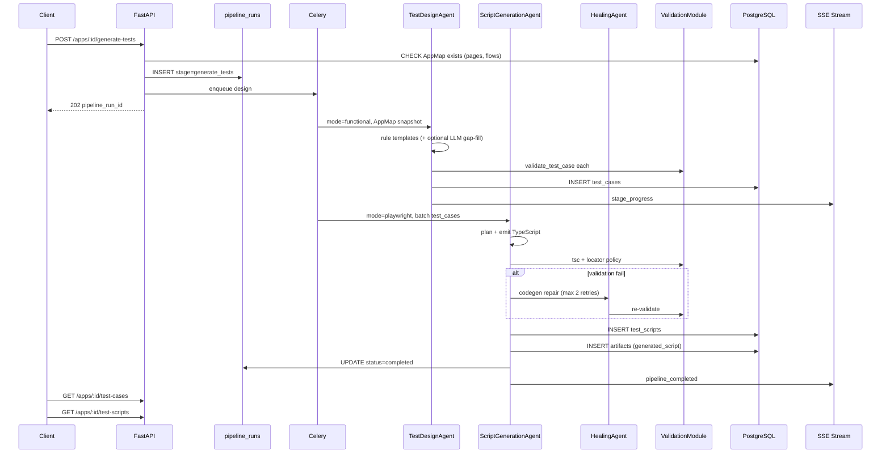

# Week 5–6 Scaffold Guide — Day-by-Day Implementation Playbook

| Field | Value |
|-------|-------|
| **Phase** | Phase 1, Weeks 5–6 |
| **Goal** | Test generation pipeline: AppMap → test cases → validated Playwright scripts |
| **Reference spec** | [SPEC.md](./SPEC.md) v2.3.0 — §12, §13, §16.4, §17.2–17.3, §31–32 |
| **Prerequisite** | [WEEK-03-04-SCAFFOLD-GUIDE.md](./WEEK-03-04-SCAFFOLD-GUIDE.md) complete (Days 11–20) |
| **Status** | Planning document — **do not treat as completed work** |
| **Duration** | 10 working days (2 weeks) — **Days 21–30** |

---

## 1. What this sprint delivers

> **Stack (unchanged):** Python 3.11+, FastAPI, SQLAlchemy + Alembic, Celery + Redis, LangGraph agents, native PostgreSQL + native Redis for local dev.

By end of Day 30 you should have:

- **`POST /api/v1/apps/:appId/generate-tests`** — creates `pipeline_runs`, enqueues `design` + `generate_scripts`, returns `202`
- **`GET /api/v1/apps/:appId/test-cases`** — list generated test cases with steps and priority
- **`GET /api/v1/apps/:appId/test-scripts`** — list validated Playwright scripts linked to test cases
- **TestDesignAgent** (`mode: functional`) — rule-based templates from AppMap flows → `test_cases`
- **ScriptGenerationAgent** (`mode: playwright`) — Playwright TypeScript from test cases + AppMap selectors
- **ValidationModule (real)** — `TestCaseSchema`, `tsc --noEmit`, Playwright AST lint, locator policy (§12)
- **HealingAgent** (`mode: codegen`) — repair failed script generation (max 2 retries per §13.4)
- **Artifacts** — `generated_script` files under `artifacts/generated-scripts/`
- **SSE progress** — `stage_progress` during design and script generation
- **Exit verification:** OrangeHRM or example.com AppMap → generate-tests → test cases + scripts in DB → `pnpm verify:smoke-generation`

**Explicitly NOT in this sprint:** Playwright test **execution** (`POST .../execute`), Allure reporting, dashboard UI (Week 7–8+), API/security/a11y plugin modes (Phase 2), locator healing at runtime (Phase 3), full pipeline orchestration (`POST .../pipeline`).

---

## 2. Tooling reference (install before Day 21)

### 2.1 New tools (in addition to Week 1–4)

| Tool | Minimum version | Purpose | Install (macOS) | Official docs |
|------|-----------------|---------|-----------------|---------------|
| **Node.js** | 20 LTS | `tsc --noEmit` validation gate | `brew install node` | https://nodejs.org/ |
| **TypeScript** | 5.x | Compile-check generated scripts | `npm install -g typescript` or project-local | https://www.typescriptlang.org/ |
| **@playwright/test** | 1.40+ | Types + AST reference for lint rules | `npm init -y && npm i -D @playwright/test typescript` in `packages/validation-ts/` | https://playwright.dev/docs/intro |
| **OpenAI SDK** | 1.x | TestDesign + ScriptGeneration + Healing LLM calls | `pip install openai` (likely already installed) | https://platform.openai.com/docs |

Week 1–4 tools (Python, pnpm, PostgreSQL, Redis, Playwright browsers for discovery) remain required.

### 2.2 Verify installations (run on Day 21)

```bash
python3 --version          # 3.11+
node --version             # 20+
npx tsc --version          # 5.x
redis-cli ping             # PONG
pnpm verify:smoke-discovery  # Week 3–4 gate still passes
```

### 2.3 New Python packages (add to `requirements.txt` during sprint)

| Package | Used in | Purpose |
|---------|---------|---------|
| `openai` | `packages/agents` | TestDesignAgent, ScriptGenerationAgent, HealingAgent |
| `jsonschema` | `packages/aqa_shared` | Already present — `TestCaseSchema` validation |
| `tree-sitter` / `esprima` (optional) | `packages/aqa_shared` | Playwright AST lint (Day 27); start with regex/heuristic if needed |

### 2.4 Additional environment variables

Add to `.env.example`:

```env
# LLM (required for Week 5–6 test + script generation)
OPENAI_API_KEY=
OPENAI_MODEL=gpt-4o-mini
LLM_BUDGET_PER_PIPELINE=2.00
LLM_BUDGET_PER_APP_DAILY=10.00

# Script validation (Day 27)
TSC_PATH=npx tsc
VALIDATION_TS_PROJECT=packages/validation-ts/tsconfig.json

# Generation defaults
GENERATE_TESTS_MAX_TESTS=50
GENERATE_TESTS_DEFAULT_PRIORITIES=critical,high
GENERATE_TESTS_USE_LLM=true
GENERATE_SCRIPTS_BATCH_SIZE=5
```

---

## 3. Target folder structure (end of Day 30)

```
AI Autonomous QA Platform/
├── docs/
│   ├── SPEC.md
│   ├── WEEK-01-02-SCAFFOLD-GUIDE.md
│   ├── WEEK-03-04-SCAFFOLD-GUIDE.md
│   └── WEEK-05-06-SCAFFOLD-GUIDE.md          # this document
├── apps/
│   └── api/
│       └── aqa_api/
│           ├── routers/
│           │   ├── apps.py                   # + generate-tests, test-cases, test-scripts
│           │   └── pipeline_runs.py
│           ├── schemas/
│           │   ├── test_cases.py             # Day 24
│           │   ├── test_scripts.py           # Day 29
│           │   └── generate_tests.py         # Day 21
│           └── services/
│               ├── test_generation.py        # orchestrate design + script stages
│               ├── test_cases.py             # CRUD read
│               └── test_scripts.py           # CRUD read
├── packages/
│   ├── aqa_shared/
│   │   └── aqa_shared/
│   │       ├── validation/
│   │       │   ├── validate_test_case.py     # real schema gate (Day 23)
│   │       │   ├── validate_script.py        # real tsc (Day 27)
│   │       │   ├── validate_locators.py      # §12 policy (Day 27)
│   │       │   └── schemas/test-case.schema.json
│   │       └── metrics.py                    # + aqa_generation_* metrics (Day 30)
│   ├── agents/
│   │   └── aqa_agents/
│   │       ├── test_design/
│   │       │   ├── agent.py                  # real run() — Day 22–23
│   │       │   ├── graph.py                  # templates → optional LLM gap-fill
│   │       │   ├── models.py
│   │       │   ├── templates.py              # rule-based scenarios per flow
│   │       │   └── prompts/
│   │       │       └── test-design.v1.txt
│   │       ├── script_generation/
│   │       │   ├── agent.py                  # real run() — Day 25–26
│   │       │   ├── graph.py                  # plan → generate → validate hook
│   │       │   ├── models.py
│   │       │   ├── emitters/
│   │       │   │   └── playwright_ts.py      # TypeScript code builder
│   │       │   └── prompts/
│   │       │       └── script-generation.v1.txt
│   │       └── healing/
│   │           ├── agent.py                  # codegen repair — Day 28
│   │           └── prompts/
│   │               └── healing-codegen.v1.txt
│   └── validation-ts/                        # NEW — minimal TS project for tsc gate
│       ├── package.json
│       ├── tsconfig.json
│       └── stubs/playwright.d.ts
├── workers/
│   └── celery_app/
│       └── aqa_celery/
│           └── agent_runner.py               # run_design, run_generate_scripts wired
├── scripts/
│   ├── verify_test_design.py                 # Day 23
│   ├── verify_script_generation.py           # Day 26
│   ├── verify_validation_real.py             # Day 27
│   ├── verify_healing.py                     # Day 28
│   ├── verify_test_cases_api.py              # Day 24
│   └── verify_smoke_generation.py            # Day 30 integration gate
├── artifacts/
│   └── generated-scripts/                    # {app_id}/{script_id}.spec.ts
├── package.json                                # new verify:* scripts
└── README.md                                   # updated Week 5–6 section
```

---

## 4. Day-by-day plan

### Day 21 — `generate-tests` API + pipeline orchestration

**Objective:** Enqueue test design and script generation; guard on AppMap precondition (SPEC §16.4).

| Step | Action | Tools |
|------|--------|-------|
| 1 | `schemas/generate_tests.py` — `GenerateTestsRequest`, `GenerateTestsResponse` | Pydantic |
| 2 | `services/test_generation.py` — `start_generate_tests()`, AppMap precondition check | SQLAlchemy |
| 3 | `POST /api/v1/apps/{app_id}/generate-tests` → `202` | FastAPI |
| 4 | Create `pipeline_runs` with `current_stage=generate_tests` | SQLAlchemy |
| 5 | Enqueue `aqa.tasks.design` then chain `aqa.tasks.generate_scripts` (or sequential in runner) | Celery |
| 6 | Return `422` if no pages/flows (`last_crawl_at` null or empty AppMap) | FastAPI |
| 7 | SSE `stage_started` for `generate_tests` | Redis |
| 8 | `scripts/verify_generate_tests_api.py` + `pnpm verify:generate-tests` | Script |

**Request defaults:**

| Field | Default | Rule |
|-------|---------|------|
| `priorities` | `["critical", "high"]` | Subset of enum |
| `max_tests` | `50` | 1–200 |
| `use_llm` | `true` | If false, rule-based only |
| `generate_scripts` | `true` | If false, test cases only |

**End-of-day check:**
- [ ] `POST .../generate-tests` returns `202` when AppMap exists
- [ ] `POST .../generate-tests` returns `422` when no discovery data
- [ ] `pipeline_runs.current_stage` = `generate_tests`
- [ ] `pnpm verify:generate-tests` passes

---

### Day 22 — TestDesignAgent rule-based templates

**Objective:** Convert AppMap flows + elements into draft test cases without LLM (SPEC §17.2, §32.3).

| Step | Action | Tools |
|------|--------|-------|
| 1 | `test_design/templates.py` — template registry per flow type | Python |
| 2 | Template: **smoke** — navigate each flow step, assert page reachable | Python |
| 3 | Template: **navigation** — click nav link elements (`role=link`) | Python |
| 4 | Template: **form-interaction** — fill `textbox` + click `button` on pages with inputs | Python |
| 5 | Map `element.semantic_selector` into step `target` fields | Python |
| 6 | Attach `flow_id` from matching flow; set `priority` heuristics | Python |
| 7 | Update `TestDesignAgent.run()` — load AppMap from DB via `ctx.application_id` | SQLAlchemy |
| 8 | Unit test: OrangeHRM PIM flow → ≥1 test case with valid steps | Script |

**Test case step shape (pre-validation):**

```json
{
  "name": "PIM — smoke navigate employee list",
  "priority": "high",
  "flow_id": "<uuid>",
  "steps": [
    { "action": "navigate", "target": "https://.../pim/viewEmployeeList" },
    { "action": "assertVisible", "target": "getByRole('link', { name: 'PIM' })" }
  ]
}
```

**End-of-day check:**
- [ ] Rule templates produce test cases from OrangeHRM AppMap (no LLM)
- [ ] Each step has `action` + `target`
- [ ] Test cases reference real `flow_id` and page/element selectors

---

### Day 23 — TestDesignAgent LLM gap-fill + validation gate

**Objective:** Optional LLM expands coverage; only valid cases persist (SPEC §13.1).

| Step | Action | Tools |
|------|--------|-------|
| 1 | `prompts/test-design.v1.txt` — structured JSON output contract | Markdown |
| 2 | LangGraph node: `gap_fill` when `use_llm=true` and budget allows | LangGraph, OpenAI |
| 3 | Merge rule-based + LLM cases; dedupe by `name` | Python |
| 4 | `validate_test_case()` — enforce `TestCaseSchema` (already stubbed Day 10) | jsonschema |
| 5 | Reject invalid LLM output (do not persist) | Python |
| 6 | Track `tokens_used` on `AgentResult` | Python |
| 7 | `scripts/verify_test_design.py` + `pnpm verify:test-design` | Script |

**Dedup rules:**

| Rule | Action |
|------|--------|
| Same `name` (case-insensitive) | Keep higher priority; skip duplicate |
| Empty `steps` | Reject |
| `target` not in AppMap selectors/URLs | Reject or downgrade to `navigate` only |

**End-of-day check:**
- [ ] `validate_test_case` rejects malformed cases
- [ ] LLM path skipped when `OPENAI_API_KEY` unset (rule-only fallback)
- [ ] `pnpm verify:test-design` passes

---

### Day 24 — Persist `test_cases` + read API

**Objective:** Write validated test cases to DB; expose read endpoint.

| Step | Action | Tools |
|------|--------|-------|
| 1 | `test_design/persist.py` — insert `test_cases` with `pipeline_run_id` | SQLAlchemy |
| 2 | Archive/replace prior `draft` cases for same app+pipeline (§33) | SQLAlchemy |
| 3 | Update `pipeline_runs.current_stage` → `generate_scripts` on design complete | SQLAlchemy |
| 4 | SSE `stage_completed` for `generate_tests` (design phase) | Redis |
| 5 | `GET /api/v1/apps/{app_id}/test-cases` — filter by `status`, `priority` | FastAPI |
| 6 | `schemas/test_cases.py` — `TestCaseResponse`, list wrapper | Pydantic |
| 7 | `scripts/verify_test_cases_api.py` + `pnpm verify:test-cases` | Script |

**`test_cases` minimum fields:**

| Table | Required fields |
|-------|-----------------|
| `test_cases` | `name`, `steps`, `priority`, `app_id`, `flow_id`, `pipeline_run_id`, `status=draft` |

**End-of-day check:**
- [ ] Generate-tests job writes rows to `test_cases`
- [ ] `GET .../test-cases` returns persisted cases
- [ ] `pnpm verify:test-cases` passes

---

### Day 25 — ScriptGenerationAgent scaffold + plan step

**Objective:** LangGraph pipeline: load test case + AppMap selectors → execution plan (SPEC §17.3).

| Step | Action | Tools |
|------|--------|-------|
| 1 | `script_generation/graph.py` — nodes: `load_context`, `plan`, `generate`, `validate` | LangGraph |
| 2 | `prompts/script-generation.v1.txt` — Playwright TS output contract | Markdown |
| 3 | Plan step: map abstract steps → Playwright actions using §12 locator order | Python |
| 4 | Batch size: 5 test cases per agent invocation (§32) | Python |
| 5 | Wire `run_design()` in `agent_runner.py` to call real TestDesignAgent | Celery |
| 6 | Pass `appMap` snapshot on `AgentContext` to avoid re-query | Python |

**Plan output (internal):**

```json
{
  "testcase_id": "...",
  "planned_steps": [
    { "playwright": "await page.goto('...')", "locator_policy": "n/a" },
    { "playwright": "await page.getByRole('link', { name: 'PIM' }).click()", "locator_policy": "getByRole" }
  ]
}
```

**End-of-day check:**
- [ ] `aqa.tasks.design` produces non-empty `test_cases` in task result
- [ ] ScriptGenerationAgent plan step runs without LLM (deterministic mapping OK)

---

### Day 26 — Playwright TypeScript emit

**Objective:** Generate executable `.spec.ts` content from plan + AppMap selectors.

| Step | Action | Tools |
|------|--------|-------|
| 1 | `emitters/playwright_ts.py` — build test file string | Python |
| 2 | Import boilerplate: `@playwright/test`, `test.describe`, `test.beforeEach` (auth hook stub) | Python |
| 3 | Use `semantic_selector` from elements; never bare xpath primary (§12) | Python |
| 4 | Write artifact: `artifacts/generated-scripts/{app_id}/{script_id}.spec.ts` | Filesystem |
| 5 | Update `ScriptGenerationAgent.run()` to return `{ code, script_id }` | Python |
| 6 | `scripts/verify_script_generation.py` + `pnpm verify:script-gen` | Script |

**Generated script minimum shape:**

```typescript
import { test, expect } from '@playwright/test';

test('PIM — smoke navigate employee list', async ({ page }) => {
  await page.goto('https://.../pim/viewEmployeeList');
  await expect(page.getByRole('link', { name: 'PIM' })).toBeVisible();
});
```

**End-of-day check:**
- [ ] Script emitted for ≥1 OrangeHRM test case
- [ ] Code uses `getByRole` / `getByLabel` before CSS/XPath
- [ ] `pnpm verify:script-gen` passes

---

### Day 27 — ValidationModule (real gates)

**Objective:** Replace stubs with `tsc`, Playwright syntax lint, locator policy (SPEC §13.2, §12).

| Step | Action | Tools |
|------|--------|-------|
| 1 | Create `packages/validation-ts/` minimal project with `@playwright/test` types | npm |
| 2 | `validate_script(code)` — write temp file, run `tsc --noEmit` | subprocess |
| 3 | `validate_locators(code)` — static analysis for §12 method order | Python |
| 4 | Playwright syntax check — `test()`, `expect()`, valid imports | Python |
| 5 | Fail fast with structured `ValidationResult.errors[]` | Python |
| 6 | `scripts/verify_validation_real.py` + extend `pnpm verify:validation` | Script |

**Locator policy checks (minimum):**

| Priority | Method | Flag if primary |
|----------|--------|-----------------|
| 1–5 | `getByRole`, `getByLabel`, `getByPlaceholder`, `getByText`, `getByTestId` | OK |
| 6 | `locator('css=...')` | Warning |
| 7 | `locator('xpath=...')` | Error unless commented justification |

**End-of-day check:**
- [ ] Valid generated script passes all gates
- [ ] Script with bare xpath primary fails `validate_locators`
- [ ] `pnpm verify:validation` passes (real + stub cases)

---

### Day 28 — HealingAgent codegen loop

**Objective:** On validation failure, repair script and retry (SPEC §13.4, §31.6).

| Step | Action | Tools |
|------|--------|-------|
| 1 | `healing/prompts/healing-codegen.v1.txt` — fix TS/locator errors only | Markdown |
| 2 | `HealingAgent.run()` — input: `{ code, validation_errors }` | Python |
| 3 | Wire `ScriptGenerationAgent` → validate → fail → HealingAgent → re-validate | LangGraph |
| 4 | Max 2 retries (3 total attempts); then skip script | Python |
| 5 | Log rejected scripts to `pipeline_runs.config.generation_rejects` | SQLAlchemy |
| 6 | `scripts/verify_healing.py` + `pnpm verify:healing` | Script |

**End-of-day check:**
- [ ] Invalid script triggers healing attempt
- [ ] After 3 failures, script not persisted
- [ ] `pnpm verify:healing` passes

---

### Day 29 — Persist `test_scripts` + wire Celery pipeline

**Objective:** Save validated scripts; complete generate-tests pipeline stage.

| Step | Action | Tools |
|------|--------|-------|
| 1 | Insert `test_scripts` with `version=1`, `validated_at` timestamp | SQLAlchemy |
| 2 | Register `artifacts` row (`type=generated_script`) | SQLAlchemy |
| 3 | `GET /api/v1/apps/{app_id}/test-scripts` — list scripts (code optional/redacted) | FastAPI |
| 4 | Wire `run_generate_scripts()` in `agent_runner.py` | Celery |
| 5 | Update `pipeline_runs.status` → `completed`; `current_stage` → `generate_scripts` done | SQLAlchemy |
| 6 | SSE `stage_progress` during script batching; `pipeline_completed` at end | Redis |
| 7 | Record `aqa_scripts_generated_total` counter on `/metrics` | prometheus-client |

**`test_scripts` minimum fields:**

| Table | Required fields |
|-------|-----------------|
| `test_scripts` | `testcase_id`, `code`, `language=typescript`, `framework=playwright`, `version`, `validated_at` |

**End-of-day check:**
- [ ] Valid scripts in `test_scripts` table
- [ ] `generated_script` artifacts on disk
- [ ] `pnpm verify:script-gen` + `verify:healing` still pass

---

### Day 30 — Integration gate + documentation

**Objective:** Sprint exit smoke test; docs updated (SPEC Appendix D).

| Step | Action | Tools |
|------|--------|-------|
| 1 | `scripts/verify_smoke_generation.py` — discover → generate-tests → cases + scripts | Script |
| 2 | OrangeHRM path: PIM flow → ≥1 test case → ≥1 validated script | Manual / CI |
| 3 | Confirm Week 3–4 verify scripts still pass | pnpm |
| 4 | Update `README.md` Week 5–6 section | Markdown |
| 5 | Update `SPEC.md` Appendix D progress table | Markdown |
| 6 | Update `docs/CELERY-TASK-REGISTRY.md` if task chaining changes | Markdown |

**Smoke test flow:**

```
POST /apps          (or use existing OrangeHRM app)
POST /discover      (skip if AppMap already present)
POST /generate-tests
GET  /test-cases    → count > 0
GET  /test-scripts  → count > 0, validated_at set
```

**End-of-day check (sprint exit criteria):**
- [ ] All Week 1–4 verify scripts still pass
- [ ] `pnpm verify:generate-tests`, `verify:test-design`, `verify:test-cases`, `verify:script-gen`, `verify:validation`, `verify:healing` pass
- [ ] `pnpm verify:smoke-generation` — AppMap → test cases → scripts
- [ ] Ready for Week 7–8 (Playwright execution + reporting)

---

## 5. Test generation pipeline flow (reference)



---

## 6. API endpoint checklist (Week 5–6 scope)

| Method | Endpoint | Day | Status target |
|--------|----------|-----|---------------|
| `POST` | `/api/v1/apps/{app_id}/generate-tests` | 21 | `202` |
| `GET` | `/api/v1/apps/{app_id}/test-cases` | 24 | `200` |
| `GET` | `/api/v1/apps/{app_id}/test-scripts` | 29 | `200` |
| `GET` | `/api/v1/apps/{app_id}/appmap` | (Week 3–4) | `200` prerequisite |
| `POST` | `/api/v1/apps/{app_id}/discover` | (Week 3–4) | `202` prerequisite |
| `GET` | `/api/v1/pipeline-runs/{id}/stream` | (Week 3–4) | SSE |

**Deferred to Week 7+:** `POST .../execute`, `GET .../runs/:id/report`, full `POST .../pipeline`, artifact proxy.

---

## 7. Integration smoke test (Day 30)

Run after all services are up:

```bash
# Terminal 1 — infrastructure
brew services start postgresql@17
brew services start redis

# Terminal 2 — API
pnpm dev:api

# Terminal 3 — Celery worker (design + generate-scripts queues)
pnpm dev:worker:discovery

# Validation TS deps (one-time)
cd packages/validation-ts && npm install && cd ../..

# Automated gate
pnpm verify:smoke-generation
```

**Manual happy path (OrangeHRM):**

```bash
# Prerequisites: AppMap already exists (Week 3–4 discover complete)
# App ID: 30b005f1-baee-4e01-9ae6-6886c7b44022

# 1. Generate tests + scripts
curl -s -X POST http://localhost:3001/api/v1/apps/30b005f1-baee-4e01-9ae6-6886c7b44022/generate-tests \
  -H "Content-Type: application/json" \
  -d '{"max_tests": 20, "use_llm": false, "generate_scripts": true}'

# 2. Stream progress
curl -N http://localhost:3001/api/v1/pipeline-runs/{pipeline_run_id}/stream

# 3. List test cases
curl -s http://localhost:3001/api/v1/apps/30b005f1-baee-4e01-9ae6-6886c7b44022/test-cases | jq '.total'

# 4. List scripts
curl -s http://localhost:3001/api/v1/apps/30b005f1-baee-4e01-9ae6-6886c7b44022/test-scripts | jq '.total'
```

**Expected results:**

| Check | Expected |
|-------|----------|
| `POST .../generate-tests` | `202` when AppMap present |
| `POST .../generate-tests` (no discover) | `422` AppMap Required |
| `GET .../test-cases` | `total > 0`, steps with `action` + `target` |
| `GET .../test-scripts` | `total > 0`, `validated_at` set |
| DB | Rows in `test_cases`, `test_scripts`, `artifacts` |
| Artifacts | `.spec.ts` files under `artifacts/generated-scripts/` |
| Locator policy | Primary locators use `getByRole` / `getByLabel` where possible |

---

## 8. Root `package.json` scripts (target)

| Script | Command | When |
|--------|---------|------|
| `verify:generate-tests` | `.venv/bin/python scripts/verify_generate_tests_api.py` | Day 21+ |
| `verify:test-design` | `.venv/bin/python scripts/verify_test_design.py` | Day 23+ |
| `verify:test-cases` | `.venv/bin/python scripts/verify_test_cases_api.py` | Day 24+ |
| `verify:script-gen` | `.venv/bin/python scripts/verify_script_generation.py` | Day 26+ |
| `verify:healing` | `.venv/bin/python scripts/verify_healing.py` | Day 28+ |
| `verify:smoke-generation` | `.venv/bin/python scripts/verify_smoke_generation.py` | Day 30 |
| *(existing)* | `verify:smoke-discovery`, `verify:appmap`, `dev:api`, etc. | Week 3–4 |

---

## 9. Flow → test case mapping (reference)

Day 20 flows are **navigation skeletons**. Week 5–6 enriches them into test cases:

| Day 20 flow step | Week 5–6 test case step |
|------------------|-------------------------|
| `{ "action": "navigate", "url": "..." }` | `{ "action": "navigate", "target": "<url>" }` |
| *(none)* | `{ "action": "click", "target": "getByRole('link', { name: 'PIM' })" }` |
| *(none)* | `{ "action": "fill", "target": "getByPlaceholder('Search')", "value": "Admin" }` |
| *(none)* | `{ "action": "assertVisible", "target": "getByText('Employee List')" }` |

| OrangeHRM flow | Example test cases generated |
|----------------|------------------------------|
| **Pim flow** (12 pages) | Smoke all PIM pages; search employee; view personal details |
| **Admin flow** | Open system users; verify table loads |
| **Leave flow** | Open leave list; assert page title |
| **Dashboard flow** | Load dashboard widgets |

One flow → **multiple** test cases (smoke, functional, negative).

---

## 10. Risks and mitigations (Week 5–6)

| Risk | Mitigation |
|------|------------|
| LLM outputs invalid JSON | Schema validation; reject; rule-based fallback |
| LLM cost overrun | `tokenBudgetRemaining` on `AgentContext`; `use_llm: false` option |
| `tsc` not installed | Document `packages/validation-ts` setup; verify in CI |
| OrangeHRM custom dropdowns missing selectors | Generate navigate-only smoke tests; document gap for Phase 2 |
| XPath-only elements (603 on OrangeHRM) | Prefer semantic selectors; healing rewrites on validation fail |
| Script/auth for login | Stub `test.beforeEach` with cookie inject comment; full auth in Week 7 execute |
| Scope creep into execution | Do not implement `POST .../execute` until Week 7–8 |
| Duplicate test cases | Dedupe by name; cap `max_tests` |

---

## 11. Handoff to Week 7–8

When this sprint is complete, the next sprint implements:

1. **`POST /api/v1/apps/:appId/execute`** — run validated Playwright scripts in isolated browser
2. **PlaywrightExecutor worker** — traces, videos, screenshots on failure (§18)
3. **ReportingWorker** — Allure report generation
4. **`GET /api/v1/runs/:runId/report`** — report retrieval
5. **Retry policy** — timeout/network retry once (§18.1)

Generated scripts from Week 5–6 are the required input for execution (`422` if no validated scripts).

---

## 12. Document changelog

| Date | Change |
|------|--------|
| 2026-06-17 | Initial Week 5–6 day-wise scaffold guide created |
